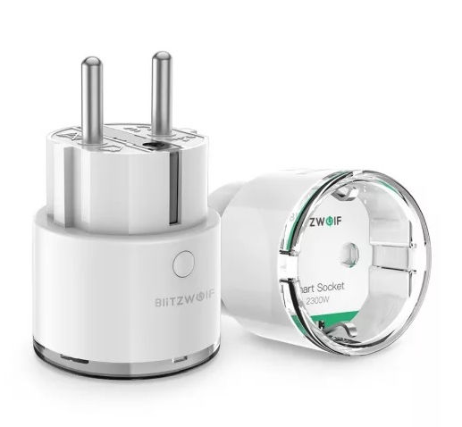

1. TOC
{:toc}

## General Notes

Model reference: BW-SHP6

Manufacturer: [BlitzWolf](https://www.blitzwolfeurope.com/3840W-EU-WIFI-Smart-Socket-BlitzWolf-BW-SHP2-Wifi)

There are two versions of this plug, a 10A version and a 15A version. The pinout seems to be the same.



## GPIO Pinout

| Pin    | Function (<2020)           | Function (>2020)           |
|--------|----------------------------|----------------------------|
| GPIO0  | Red LED (inverted)         | Red LED (inverted)         |
| GPIO2  | Blue LED (inverted)        | Blue LED (inverted)        |
| GPIO4  |                            | HLW8012 - CF1              |
| GPIO5  | HLW8012 - CF               | HLW8012 - CF               |
| GPIO12 | HLW8012 - SEL              | HLW8012 - SEL              |
| GPIO13 | Button (inverted)          | Button (inverted)          |
| GPIO14 | HLW8012 - CF1              |                            |
| GPIO15 | Relay                      | Relay                      |

## HLW8012 Calibration Values

| Value   | <2020   | >2020   |
|---------|---------|---------|
| Current | 0.00290 | 0.00117 |
| Voltage | 940     | 755     |

## Basic Config

The configuration has some default sensors for wifi reporting, etc.

```yaml
substitutions:
  device_name: shp6
  # Higher value gives lower watt readout
  current_res: '0.00290'
  # Lower value gives lower voltage readout
  voltage_div: '940'
  # Max Power is 3450W for 15A and 2300W for 10A
  max_power: '3450'
  # 2020 model uses GPIO4 for CF1
  cf1_pin: GPIO14
  # BW-SHP6, outlet with powermonitoring.
  # One button for the relay, and one red led for the relay, as well as a blue status led
  # Static IP is configured, and fast_connect is enabled, as the SSID is hidden
  # Webserver is active and pw protected, and the OTA is password protected

esphome:
  name: '${device_name}'
  platform: ESP8266
  board: esp8285
  on_boot:
    then:
      - switch.turn_on: relay
      - output.turn_on: led

wifi:
  ssid: !secret wifissid
  password: !secret wifipw

logger:
  baud_rate: 0

api:

ota:
  password: !secret otapw

# Button configuration
binary_sensor:
  - platform: gpio
    name: "${device_name} button"
    id: button
    pin:
      number: GPIO13
      inverted: true
    on_press:
      then:
        - switch.toggle: relay

# Setup of LED's used in displaying Switch status
output:
  - platform: gpio
    pin: GPIO0
    inverted: true
    id: led

# Config for switch
switch:
  - platform: gpio
    pin: GPIO15
    restore_mode: RESTORE_DEFAULT_OFF
    id: relay
    name: '${device_name} Relay'
    on_turn_on:
      - output.turn_on: led
    on_turn_off:
      - output.turn_off: led

# Status LED for connection
status_led:
  pin:
    number: GPIO2
    inverted: true

# Sensors for Voltage (V), Current (A), Power (W), Daily energy usage (kWh)
sensor:
  - platform: hlw8012
    sel_pin:
      number: GPIO12
      inverted: true
    cf_pin: GPIO5
    cf1_pin: ${cf1_pin}
    current_resistor: ${current_res}
    voltage_divider: ${voltage_div}
    current:
      name: '${device_name} Current'
      unit_of_measurement: 'A'
      accuracy_decimals: 3
      icon: mdi:flash-outline
    voltage:
      name: '${device_name} Voltage'
      unit_of_measurement: 'V'
      icon: mdi:flash-outline
    power:
      name: '${device_name} Power'
      unit_of_measurement: 'W'
      id: power
      icon: mdi:flash-outline
      on_value_range:
        - above: ${max_power}
          then:
            - output.turn_off: led
            - switch.turn_off: relay
    change_mode_every: 4
    update_interval: 10s
  - platform: total_daily_energy
    name: '${device_name} daily energy'
    power_id: power
    unit_of_measurement: 'kWh'
    accuracy_decimals: 5
    filters:
      - multiply: 0.001
```

## Advanced config additions

Starting with ESPHome v1.16.1 the `hlw8012` platform sensor now supports energy, so we can add the following to the `hlw8012` platform sensor and get rid of the `total_daily_energy` platform sensor and the `homeassistant` time sensor:

```yaml
sensor:
  - platform: hlw8012
    energy:
      name: "${device_name} Energy"
      unit_of_measurement: "Wh"
      icon: mdi:flash-outline
```

Under wifi this can be added, this will set up static IP, allow the device to connect to a hidden SSID (fast_connect) and create a backup AP

```yaml
wifi:
  reboot_timeout: 60min
  manual_ip:
    static_ip: 192.168.1.100
    gateway: 192.168.1.1
    subnet: 255.255.255.0
  fast_connect: true

# Enable fallback hotspot (captive portal) in case wifi connection fails
  ap:
    ssid: "${device_name} Hotspot"
    password: !secret appw
```

This will activate the internal webserver with password protection

```yaml
web_server:
  port: 80
  auth:
    username: !secret webuser
    password: !secret webpw
```

To set time locally to the same as on the HomeAssistant (better logging)

```yaml
# Sets time from Homeassistant
time:
  - platform: homeassistant
    id: homeassistant_time
```

Send a notification to Home Assistant when max power is exceeded.

```yaml
sensor:
  - platform: hlw8012
...
    power:
      name: '${device_name} Power'
      unit_of_measurement: 'W'
      id: power
      icon: mdi:flash-outline
      on_value_range:
        - above: ${max_power}
          then:
            - output.turn_off: led
            - switch.turn_off: relay
            - homeassistant.service:
                service: persistent_notification.create
                data:
                  title: Message from ${device_name}
                data_template:
                  message: Switch turned off because power exceeded ${max_power}W
```

To have different data shown for the device (ESPHome version) and the wifi. Will appear as sensors in HA.

```yaml
# Sensors for ESP version and WIFI information
text_sensor:
  - platform: version
    name: "${device_name} ESPHome Version"
  - platform: wifi_info
    ip_address:
      name: "${device_name} ip"
    ssid:
      name: "${device_name} ssid"
```

This will create sensors so that you can track wifi coverage for the devices, and also note the uptime for the devices.

```yaml
sensors:
  - platform: wifi_signal
    name: '${device_name} WiFi Signal'
    update_interval: 60s
    accuracy_decimals: 0
  - platform: uptime
    name: '${device_name} Uptime'
    unit_of_measurement: days
    update_interval: 300s
    accuracy_decimals: 1
    filters:
      - multiply: 0.000011574
```
