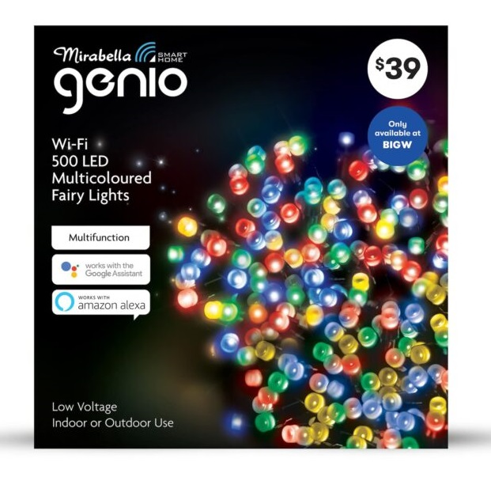

1. TOC
{:toc}

## General Notes

This is for [Mirabella Genio Wi-Fi 500 LED Mulitcoloured Fairy Lights](https://www.mirabellagenio.com.au/product-range/mirabella-genio-wi-fi-500-led-mulitcoloured-fairy-lights/).



## GPIO Pinout

| Pin     | Function                           |
|---------|------------------------------------|
| GPIO4   | Button LED                         |
| GPIO5   | Button                             |
| GPIO12  | H-Bridge Pin A                     |
| GPIO14  | H-Bridge Pin B                     |

## Basic Configuration

```yaml
esphome:
  name: fairy_lights
  platform: ESP8266
  board: esp8285


wifi:
  ssid: 'ssid'
  password: 'wifi_password'

  # Enable fallback hotspot (captive portal) in case wifi connection fails
  ap:
    ssid: "fairy light"
    password: "ap_password"

captive_portal:

# Enable logging
logger:

# Enable Home Assistant API
api:
  password: 'api_password'

ota:
  password: 'ota_password'


output:
# Specify the two pins of the h-bridge as PWM pins
  - platform: esp8266_pwm
    id: pina
    pin: GPIO12
  - platform: esp8266_pwm
    id: pinb
    pin: GPIO14

# Specify the pin for the button LED
  - platform: gpio
    id: status_led
    pin: GPIO4

light:
# Create a light using the hbridge
  - platform: hbridge
    id: mainlight
    name: "Fairy Lights"
    pin_a: pina
    pin_b: pinb

# Create a light using the LED
  - platform: binary
    name: "LED"
    internal: true
    output: status_led


#Flash the LED Light until WiFi is connected.
interval:
  - interval: 1s
    then:
      if:
        condition:
          wifi.connected:
        then:
          - output.turn_on: status_led
        else:
          - output.turn_off: status_led
          - delay: 500ms
          - output.turn_on: status_led


# Use the button as a sensor.
binary_sensor:
  - platform: gpio
    pin:
      number: GPIO5
      mode: INPUT_PULLUP
      inverted: true
    name: "Button"
    #internal: true
```
