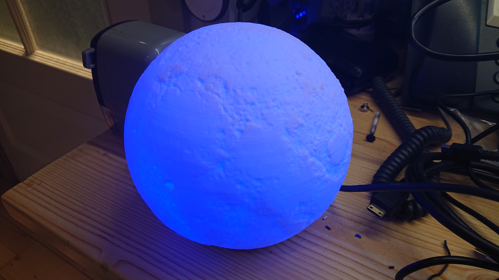

  
  
  
  

Model reference: Moonlamp

The moonlamp has both RGB and Cold / Warm white handled by three groups of three leds.

Manufacturer: [Zemismart](https://www.zemismart.com/products/christmas-gift-led-remote-control-light-compatible-with-alexa-google-home-3d-printing-children-bedroom-colorful-moon-lamp-app-121)

## How to flash

1. Open

   There are 3 screws.
  
  
2. Unmount circuit from the box

   5 more screws
  

3. Pins

   There are pads for RX, TX, 3.3v, GND and I00 nicely marked on the board.
  

There is only 1 MB on the onboard esp8266, so the code has every thing 'extra' removed to keep it small, and being able to do OTA.
The WW and CW temperature values are unknown, so purely guesses.
