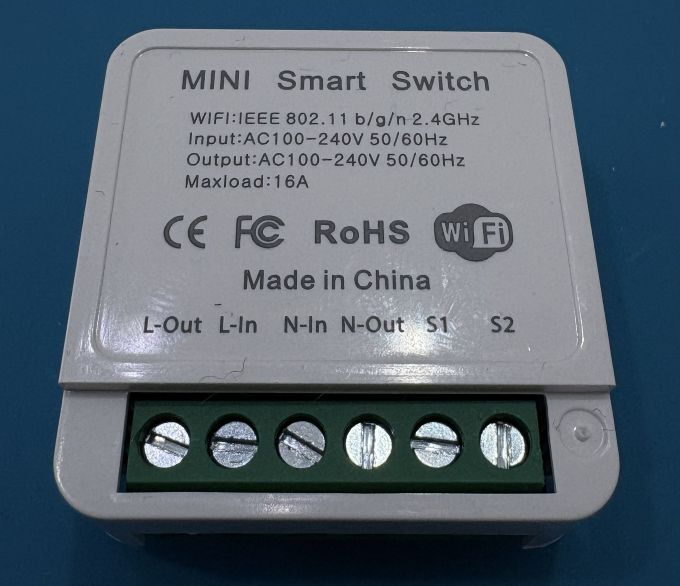
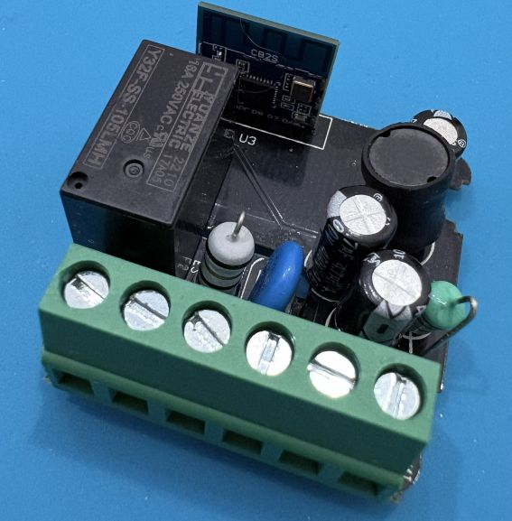
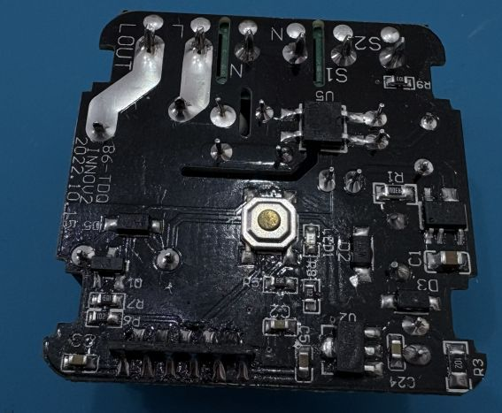
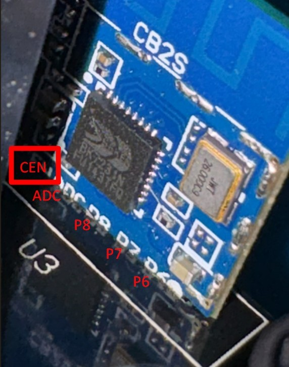
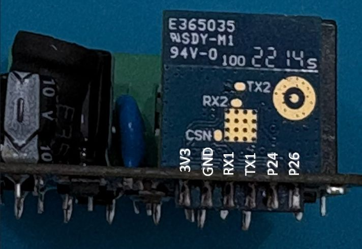

Maker: [https://aubess.net/](https://aubess.net/)

Also on Aliexpress.

## GPIO Pinout

|Pin|Function|
|-|-|
|P10|Button|
|P26|External Switch|
|P8|Relay|
|P7|Status Led|

## Internals



## UART Pinout

VERY IMPORTANT INFO:
Before programing, you must desolder the pin RX1 from the main board (is not necessary to desold all the CB2S board)





## Basic Configuration

```yaml
esphome:
  name: Wifi-Switch
  friendly_name: Wifi Switch

bk72xx:
  board: cb2s

# Enable logging
logger:

# Enable Home Assistant API
api:

ota:

wifi:
  ssid: !secret wifi_ssid
  password: !secret wifi_password

# Enable fallback hotspot (captive portal) in case wifi connection fails
  ap:

captive_portal:

## -----------------------##
## Substitution Variables ##
## -----------------------##
substitutions:
  device_friendly_name: Wifi Switch
  device_icon: "mdi:power"

## ---------------- ##
##    Status LED    ##
## ---------------- ##

light:
  - platform: status_led
    name: "Switch state"
    id: led
    pin:
      number: P7
      inverted: true

## ---------------- ##
##  Binary Sensors  ##
## ---------------- ##
binary_sensor:
  # Button 1
  - platform: gpio
    id: button_back
    pin:
      number: P10
      inverted: true
      mode: INPUT_PULLUP
    on_press:
      then:
        - switch.toggle: relay
    filters:
      - delayed_on_off: 50ms
  # Rocker switch
  - platform: gpio
    name: "${device_friendly_name} Switch S1-S2"
    pin: P26
    on_press:
      then:
        - switch.toggle: relay
    filters:
      - delayed_on_off: 50ms

## ---------------- ##
##      Switch      ##
## ---------------- ##
switch:
  #Relay
  - platform: output
    name: "${device_friendly_name} Relay"
    icon: ${device_icon}
    output: relayoutput
    id: relay
    on_turn_on:
      - light.turn_on: led
    on_turn_off:
      - light.turn_off: led
    restore_mode: ALWAYS_OFF

## ---------------- ##
##      Relays      ##
## ---------------- ##
output:
  # Relay
  - platform: gpio
    id: relayoutput
    pin: P8
#    inverted: true

time:
  - platform: homeassistant
    id: homeassistant_time

text_sensor:
  - platform: wifi_info
    ip_address:
      name: "IP Address"
    ssid:
      name: "Connected SSID"
```
