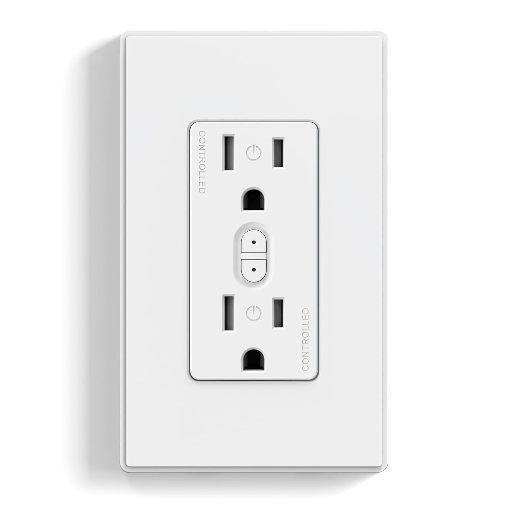
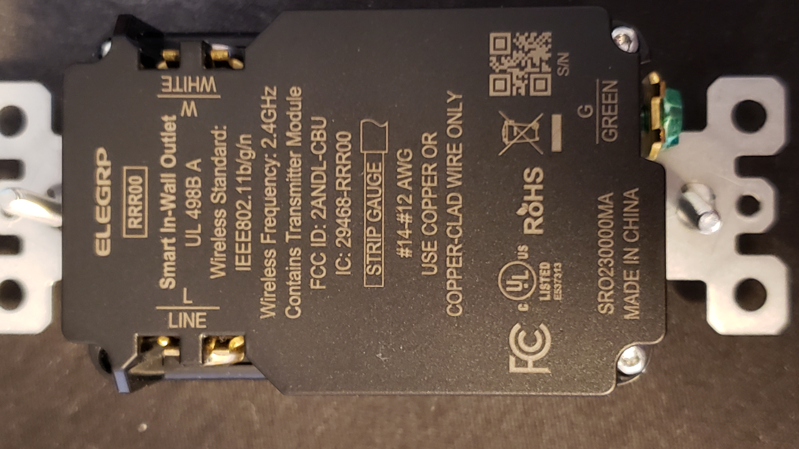
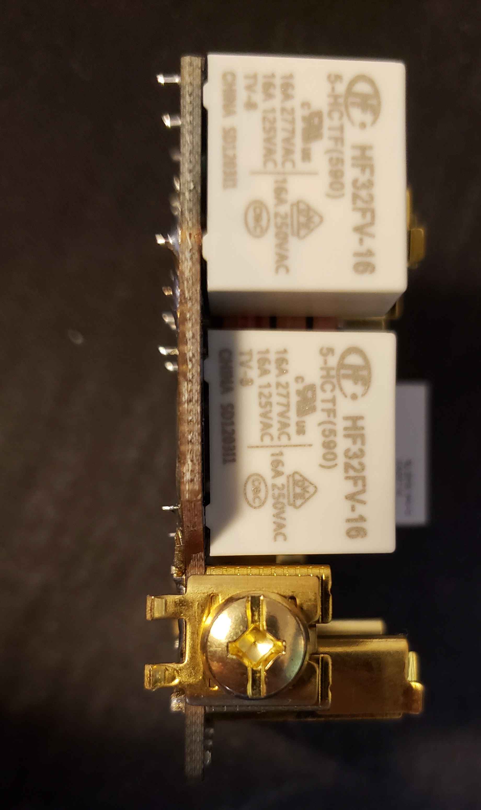
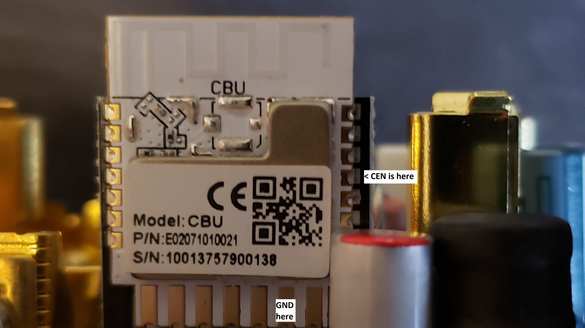

[Amazon Link](https://www.amazon.com/dp/B0CBBMVV5F)

## Elegrp RRR00 Smart In-Wall Outlet with Energy Monitoring

The front has a button for each individually-switched outlet.





The relays are individual, 16A relays. Nice!



Inside is a CBU module, which has a Beken BK7231N:
[https://fccid.io/2ANDL-CBU/User-Manual/CBU-User-Manual-updated-5064101.pdf](https://fccid.io/2ANDL-CBU/User-Manual/CBU-User-Manual-updated-5064101.pdf)

## Pinout

The PCB on my outlet had some wrong labels for pins. This confused me until I ohmed straight from the base PCB to the
CBU module.
Below are the correct labels, in case it helps you.

| CBU module Pin | Function       | Use on outlet                                             | Label on ELEGRP PCB (mostly incorrect) |
| -------------- | -------------- | --------------------------------------------------------- | -------------------------------------- |
| 3              | P20, SCL1, TCK | RED LED (LED3) active high                                | CEN (incorrect)                        |
| 8              | P8, PWM2       | Lower switch button active low (SW2)                      | ADC (incorrect)                        |
| 10             | P6, PWM0       | Upper switch button active low (SW1)                      | P8 (incorrect)                         |
| 1              | P14, SCK       | Upper white LED (LED1) active high                        | P7 (incorrect)                         |
| 19             | P9, PWM3       | Active high upper outlet enable (R15, Q1)                 | P6 (incorrect)                         |
| 17             | P28            | Lower white LED (LED2) active high                        | P26 (incorrect)                        |
| 9              | P7, PWM1       | Active high lower outlet enable (R16, Q2)                 | P24 (incorrect)                        |
| 15             | P11, TX1       | Programming and TX to BL0942 energy monitor               | TX1                                    |
| 16             | P10, TX1       | Programming and RX from BL0942 energy monitor             | RX1                                    |
| 13             | GND            | Module GND. Connect to programmer ground when programming | GND                                    |
| 14             | 3V3            | 3.3V supply to CBU module. Power when programming         | 3.3V                                   |

See this pinout for more detail on the CBU side: [https://docs.libretiny.eu/boards/cbu/cbu.svg](https://docs.libretiny.eu/boards/cbu/cbu.svg)


## Disassembly and Initial Flash Procedure

Run the Line and WHITE scresws all the way in. Remove the 4 T7 Torx screws on the back, and remove cover.
Cover comes out with module. Remove module from cover.
Solder a Sparkfun FTDI Basic's wires to 3.3V, GND, TX, and RX pins.
Run esphome with the yaml below, select the COM port.
When ESPHome prompts to reset by driving CEN low, use a male-male dupont wire or similar to connect CEN to GND.
CEN is the fourth down on the right of the module, GND is second from right on bottom row:


Watch ESPHome for some sign of a flash starting, then release CEN. (as of Nov 2024)
Once flashed and on your network, remove soldered wires and re-assemble!

## Basic Configuration

```yaml
substitutions:
  device_name: "elegrp-rrr00"
  friendly_name: "Elegrp RRR00 Power Monitoring Outlet"

esphome:
  name: ${device_name}
  friendly_name: ${friendly_name}
  name_add_mac_suffix: true
  project:
    name: Elegrp.RRR00
    version: 1.0.0

bk72xx:
  board: cbu

# CRITICAL: UART logging MUST be disabled for BL0942 to work
logger:
  baud_rate: 0

api:

ota:
  - platform: esphome

wifi:
  ap: {}

captive_portal:

time:
  - platform: homeassistant
    id: homeassistant_time

# Status LED - Red LED (P20, incorrectly labeled CEN on PCB)
status_led:
  pin:
    number: P20
    inverted: false

uart:
  rx_pin: RX1
  tx_pin: TX1
  baud_rate: 4800
  stop_bits: 1

binary_sensor:
  # Upper switch button (P6, incorrectly labeled P8 on PCB)
  - platform: gpio
    id: button_1
    pin:
      number: P6
      mode:
        input: true
        pullup: true
      inverted: true
    name: "Button 1"
    on_press:
      - switch.toggle: relay_1
    filters:
      - delayed_on: 50ms

  # Lower switch button (P8, incorrectly labeled ADC on PCB)
  - platform: gpio
    id: button_2
    pin:
      number: P8
      mode:
        input: true
        pullup: true
      inverted: true
    name: "Button 2"
    on_press:
      - switch.toggle: relay_2
    filters:
      - delayed_on: 50ms

output:
  # Upper white LED (P14, incorrectly labeled P7 on PCB)
  - platform: gpio
    pin: P14
    inverted: false
    id: upper_white_led

  # Lower white LED (P28, incorrectly labeled P26 on PCB)
  - platform: gpio
    pin: P28
    inverted: false
    id: lower_white_led

light:
  - platform: binary
    output: upper_white_led
    id: light_upper_white
    internal: true

  - platform: binary
    output: lower_white_led
    id: light_lower_white
    internal: true

switch:
  # Upper relay (P9, incorrectly labeled P6 on PCB)
  - platform: gpio
    name: "Relay 1"
    pin: P9
    id: relay_1
    restore_mode: RESTORE_DEFAULT_OFF
    on_turn_on:
      - light.turn_on: light_upper_white
    on_turn_off:
      - light.turn_off: light_upper_white

  # Lower relay (P7, incorrectly labeled P24 on PCB)
  - platform: gpio
    name: "Relay 2"
    pin: P7
    id: relay_2
    restore_mode: RESTORE_DEFAULT_OFF
    on_turn_on:
      - light.turn_on: light_lower_white
    on_turn_off:
      - light.turn_off: light_lower_white

button:
  - platform: restart
    id: restart_button
    name: "Restart"
  - platform: factory_reset
    id: factory_reset_button
    name: "Factory Reset"
    disabled_by_default: true
    entity_category: config
    icon: mdi:restart-alert

sensor:
  - platform: wifi_signal
    name: "WiFi Signal"
    update_interval: 60s
  - platform: uptime
    name: "Uptime"
    update_interval: 60s
  - platform: bl0942
    voltage:
      name: "Outlet Voltage"
      accuracy_decimals: 3
      filters:
        - sliding_window_moving_average:
            window_size: 64
            send_every: 64
            send_first_at: 64
    frequency:
      name: "Outlet Frequency"
      accuracy_decimals: 3
      filters:
        - sliding_window_moving_average:
            window_size: 64
            send_every: 64
            send_first_at: 64
    current:
      name: "Outlet Total Current"
      accuracy_decimals: 3
      filters:
        - sliding_window_moving_average:
            window_size: 64
            send_every: 64
            send_first_at: 64
    power:
      name: "Outlet Total Power"
      id: power_monitor
      accuracy_decimals: 3
    energy:
      name: "Outlet Total Energy"
      accuracy_decimals: 3
  - platform: total_daily_energy
    name: "Total Daily Energy"
    power_id: power_monitor
    unit_of_measurement: "kWh"
    state_class: total_increasing
    device_class: energy
    accuracy_decimals: 3
    filters:
      - multiply: 0.001

text_sensor:
  - platform: wifi_info
    ip_address:
      name: "IP Address"
    ssid:
      name: "SSID"
  - platform: libretiny
    version:
      name: "LibreTiny Version"
```
