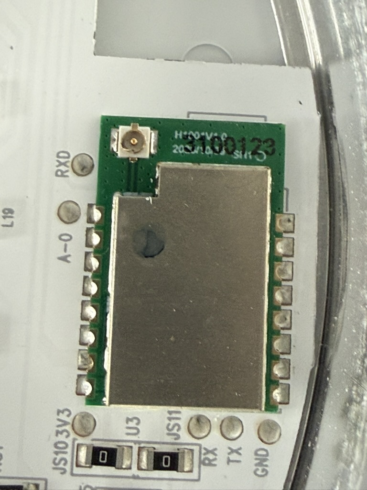
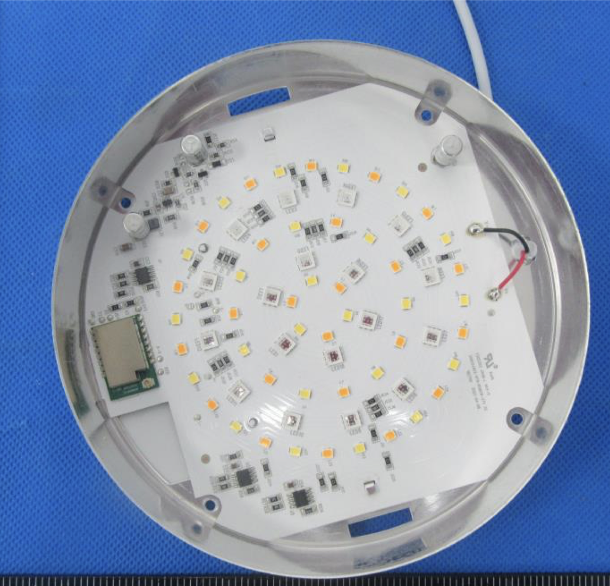

Uses a custom module, similar to a WBR3. CPU is RTL8720CF.


Opening the light is relatively easy. First you have to pull the spring clips out of the body.
Using pliers, pull each tab up and out of the main body; they can be rather stubborn to remove.

Next remove the four Phillips screws from the back of the case. At this point the front half
(with the lens) will separate from the metal back case. The main PCB is retained in the metal
case by two small metal tabs that extend through the PCB and are bent over to lock it in place.
You _may_ be able to leave the main PCB in the metal housing, but I found that I was unable to
either solder or make reasonable contact with all the pads to program the module without
releasing it from the housing. I _did not_ have to desolder the main power leads, or remove the
main power lead from its retainer; being able to tip the PCB up to gain better access to the
control module was enough in my case.



To flash the module, you'll have to use ltchiptool. I found that I was unable to flash them at
a baud rate other than 115200. I also found making a flash backup took ~30 minutes.

Govee was kind, and exposed all the connections you need to flash the module as test points
along the outside of the module:

## Flash Pinout

| Pin    | Function                       |
| ------ | ------------------------------ |
| A-0    | Download Mode -> Pull High     |
| TXD    | Download Mode -> Pull High     |
| 3V3    | 3.3V Supply                    |
| RX     | Log UART TX -> RX Serial 2 USB |
| TX     | Log UART RX -> TX Serial 2 USB |
| GND    | Module Ground                  |

I did not have to use the CEN pin to reboot the module in download mode, instead I was able to
connect A-0 and TXD to 3.3V before powering up the module.

## GPIO Pinout

| Pin    | Function          |
| ------ | ----------------- |
| PA03   | Red Output        |
| PA18   | Blue Output       |
| PA02   | Green Output      |
| PA19   | Cold White Output |
| PA04   | Warm White Output |

I found that after flashing with ESPHome, the lights, when set to 100%, were significantly
brighter than the stock firmware. To try to limit the heat produced by the light, I set the max
power for each of the LED PWM channels to 80%.

## Basic Configuration

```yaml
substitutions:
  devicename: govee-recessed-light

esphome:
  name: $devicename

rtl87xx:
  board: generic-rtl8720cf-2mb-992k

# Enable logging
logger:

# Enable Home Assistant API
api:

ota:

wifi:
  ssid: !secret wifi_ssid
  password: !secret wifi_password

# Output pins
output:
  - platform: libretiny_pwm
    pin: PA02
    id: green_pwm_output
    max_power: 80%
  - platform: libretiny_pwm
    pin: PA03
    id: red_pwm_output
    max_power: 80%
  - platform: libretiny_pwm
    pin: PA18
    id: blue_pwm_output
    max_power: 80%
  - platform: libretiny_pwm
    pin: PA04
    id: warm_pwm_output
    max_power: 80%
  - platform: libretiny_pwm
    pin: PA19
    id: cool_pwm_output
    max_power: 80%

light:
  - platform: rgbww
    name: "Light"
    red: red_pwm_output
    green: green_pwm_output
    blue: blue_pwm_output
    cold_white: cool_pwm_output
    warm_white: warm_pwm_output
    cold_white_color_temperature: 6350 K
    warm_white_color_temperature: 3000 K
    color_interlock: True
```
