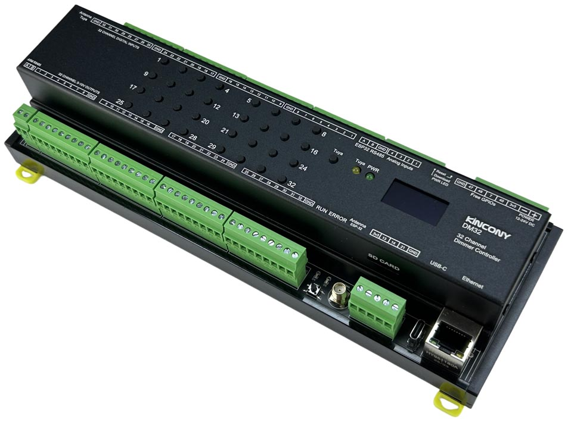

## Resources

- [ESP32 pin define details](https://www.kincony.com/forum/showthread.php?tid=9019)

## ESPHome Configuration

Here is an example YAML configuration for the KinCony DM32 ESP32-S3 dimmer board.

```yaml
esphome:
  name: dm32
  friendly_name: dm32

esp32:
  board: esp32-s3-devkitc-1
  framework:
    type: arduino

# Enable logging
logger:

# Enable Home Assistant API
api:

ethernet:
  type: W5500
  clk_pin: GPIO1
  mosi_pin: GPIO2
  miso_pin: GPIO41
  cs_pin: GPIO42
  interrupt_pin: GPIO43
  reset_pin: GPIO44

uart:
  - id: uart_1 # RS485
    baud_rate: 9600
    debug:
      direction: BOTH
      dummy_receiver: true
      after:
        timeout: 10ms
    tx_pin: 39
    rx_pin: 38

  - id: dac_uart
    rx_pin: 4
    tx_pin: 6
    baud_rate: 115200
    stop_bits: 1
    data_bits: 8
    parity: NONE
    debug:

modbus:
  uart_id: dac_uart

modbus_controller:
  - address: 1
    update_interval: 5s

i2c:
  - id: bus_a
    sda: 8
    scl: 18
    scan: true
    frequency: 400kHz

text_sensor:
  - platform: ethernet_info
    ip_address:
      name: ESP IP Address
      id: eth_ip
      address_0:
        name: ESP IP Address 0
      address_1:
        name: ESP IP Address 1
      address_2:
        name: ESP IP Address 2
      address_3:
        name: ESP IP Address 3
      address_4:
        name: ESP IP Address 4
    dns_address:
      name: ESP DNS Address
    mac_address:
      name: ESP MAC Address

font:
  - file: "gfonts://Roboto"
    id: roboto
    size: 15

display:
  - platform: ssd1306_i2c
    model: "SSD1306 128x64"
    address: 0x3C
    lambda: |-
      it.printf(0, 15, id(roboto), "IP: %s", id(eth_ip).state.c_str());

output:
  # CH1 (0x0FA0 / 4000)
  - platform: modbus_controller
    id: dac_ch1_out
    address: 0x0FA0
    value_type: U_WORD
    write_lambda: |-
      // state = 0.0 ~ 1.0 → 0 ~ 4095
      uint16_t reg = (uint16_t) round(x * 4095.0);
      return reg;

  # CH2 (0x0FA1 / 4001)
  - platform: modbus_controller
    id: dac_ch2_out
    address: 0x0FA1
    value_type: U_WORD
    write_lambda: |-
      uint16_t reg = (uint16_t) round(x * 4095.0);
      return reg;

  # CH3
  - platform: modbus_controller
    id: dac_ch3_out
    address: 0x0FA2
    value_type: U_WORD
    write_lambda: |-
      uint16_t reg = (uint16_t) round(x * 4095.0);
      return reg;

  # CH4
  - platform: modbus_controller
    id: dac_ch4_out
    address: 0x0FA3
    value_type: U_WORD
    write_lambda: |-
      uint16_t reg = (uint16_t) round(x * 4095.0);
      return reg;

  # CH5
  - platform: modbus_controller
    id: dac_ch5_out
    address: 0x0FA4
    value_type: U_WORD
    write_lambda: |-
      uint16_t reg = (uint16_t) round(x * 4095.0);
      return reg;

  # CH6
  - platform: modbus_controller
    id: dac_ch6_out
    address: 0x0FA5
    value_type: U_WORD
    write_lambda: |-
      uint16_t reg = (uint16_t) round(x * 4095.0);
      return reg;

  # CH7
  - platform: modbus_controller
    id: dac_ch7_out
    address: 0x0FA6
    value_type: U_WORD
    write_lambda: |-
      uint16_t reg = (uint16_t) round(x * 4095.0);
      return reg;

  # CH8
  - platform: modbus_controller
    id: dac_ch8_out
    address: 0x0FA7
    value_type: U_WORD
    write_lambda: |-
      uint16_t reg = (uint16_t) round(x * 4095.0);
      return reg;

  # CH9
  - platform: modbus_controller
    id: dac_ch9_out
    address: 0x0FA8
    value_type: U_WORD
    write_lambda: |-
      uint16_t reg = (uint16_t) round(x * 4095.0);
      return reg;

  # CH10
  - platform: modbus_controller
    id: dac_ch10_out
    address: 0x0FA9
    value_type: U_WORD
    write_lambda: |-
      uint16_t reg = (uint16_t) round(x * 4095.0);
      return reg;

  # CH11
  - platform: modbus_controller
    id: dac_ch11_out
    address: 0x0FAA
    value_type: U_WORD
    write_lambda: |-
      uint16_t reg = (uint16_t) round(x * 4095.0);
      return reg;

  # CH12
  - platform: modbus_controller
    id: dac_ch12_out
    address: 0x0FAB
    value_type: U_WORD
    write_lambda: |-
      uint16_t reg = (uint16_t) round(x * 4095.0);
      return reg;

  # CH13
  - platform: modbus_controller
    id: dac_ch13_out
    address: 0x0FAC
    value_type: U_WORD
    write_lambda: |-
      uint16_t reg = (uint16_t) round(x * 4095.0);
      return reg;

  # CH14
  - platform: modbus_controller
    id: dac_ch14_out
    address: 0x0FAD
    value_type: U_WORD
    write_lambda: |-
      uint16_t reg = (uint16_t) round(x * 4095.0);
      return reg;

  # CH15
  - platform: modbus_controller
    id: dac_ch15_out
    address: 0x0FAE
    value_type: U_WORD
    write_lambda: |-
      uint16_t reg = (uint16_t) round(x * 4095.0);
      return reg;

  # CH16
  - platform: modbus_controller
    id: dac_ch16_out
    address: 0x0FAF
    value_type: U_WORD
    write_lambda: |-
      uint16_t reg = (uint16_t) round(x * 4095.0);
      return reg;

  # CH17 (0x0FB0 / 4016)
  - platform: modbus_controller
    id: dac_ch17_out
    address: 0x0FB0
    value_type: U_WORD
    write_lambda: |-
      uint16_t reg = (uint16_t) round(x * 4095.0);
      return reg;

  # CH18
  - platform: modbus_controller
    id: dac_ch18_out
    address: 0x0FB1
    value_type: U_WORD
    write_lambda: |-
      uint16_t reg = (uint16_t) round(x * 4095.0);
      return reg;

  # CH19
  - platform: modbus_controller
    id: dac_ch19_out
    address: 0x0FB2
    value_type: U_WORD
    write_lambda: |-
      uint16_t reg = (uint16_t) round(x * 4095.0);
      return reg;

  # CH20
  - platform: modbus_controller
    id: dac_ch20_out
    address: 0x0FB3
    value_type: U_WORD
    write_lambda: |-
      uint16_t reg = (uint16_t) round(x * 4095.0);
      return reg;

  # CH21
  - platform: modbus_controller
    id: dac_ch21_out
    address: 0x0FB4
    value_type: U_WORD
    write_lambda: |-
      uint16_t reg = (uint16_t) round(x * 4095.0);
      return reg;

  # CH22
  - platform: modbus_controller
    id: dac_ch22_out
    address: 0x0FB5
    value_type: U_WORD
    write_lambda: |-
      uint16_t reg = (uint16_t) round(x * 4095.0);
      return reg;

  # CH23
  - platform: modbus_controller
    id: dac_ch23_out
    address: 0x0FB6
    value_type: U_WORD
    write_lambda: |-
      uint16_t reg = (uint16_t) round(x * 4095.0);
      return reg;

  # CH24
  - platform: modbus_controller
    id: dac_ch24_out
    address: 0x0FB7
    value_type: U_WORD
    write_lambda: |-
      uint16_t reg = (uint16_t) round(x * 4095.0);
      return reg;

  # CH25
  - platform: modbus_controller
    id: dac_ch25_out
    address: 0x0FB8
    value_type: U_WORD
    write_lambda: |-
      uint16_t reg = (uint16_t) round(x * 4095.0);
      return reg;

  # CH26
  - platform: modbus_controller
    id: dac_ch26_out
    address: 0x0FB9
    value_type: U_WORD
    write_lambda: |-
      uint16_t reg = (uint16_t) round(x * 4095.0);
      return reg;

  # CH27
  - platform: modbus_controller
    id: dac_ch27_out
    address: 0x0FBA
    value_type: U_WORD
    write_lambda: |-
      uint16_t reg = (uint16_t) round(x * 4095.0);
      return reg;

  # CH28
  - platform: modbus_controller
    id: dac_ch28_out
    address: 0x0FBB
    value_type: U_WORD
    write_lambda: |-
      uint16_t reg = (uint16_t) round(x * 4095.0);
      return reg;

  # CH29
  - platform: modbus_controller
    id: dac_ch29_out
    address: 0x0FBC
    value_type: U_WORD
    write_lambda: |-
      uint16_t reg = (uint16_t) round(x * 4095.0);
      return reg;

  # CH30
  - platform: modbus_controller
    id: dac_ch30_out
    address: 0x0FBD
    value_type: U_WORD
    write_lambda: |-
      uint16_t reg = (uint16_t) round(x * 4095.0);
      return reg;

  # CH31
  - platform: modbus_controller
    id: dac_ch31_out
    address: 0x0FBE
    value_type: U_WORD
    write_lambda: |-
      uint16_t reg = (uint16_t) round(x * 4095.0);
      return reg;

  # CH32 (0x0FBF / 4031)
  - platform: modbus_controller
    id: dac_ch32_out
    address: 0x0FBF
    value_type: U_WORD
    write_lambda: |-
      uint16_t reg = (uint16_t) round(x * 4095.0);
      return reg;

light:
  - platform: monochromatic
    name: "DAC CH1"
    output: dac_ch1_out
    default_transition_length: 0s

  - platform: monochromatic
    name: "DAC CH2"
    output: dac_ch2_out
    default_transition_length: 0s

  - platform: monochromatic
    name: "DAC CH3"
    output: dac_ch3_out
    default_transition_length: 0s

  - platform: monochromatic
    name: "DAC CH4"
    output: dac_ch4_out
    default_transition_length: 0s

  - platform: monochromatic
    name: "DAC CH5"
    output: dac_ch5_out
    default_transition_length: 0s

  - platform: monochromatic
    name: "DAC CH6"
    output: dac_ch6_out
    default_transition_length: 0s

  - platform: monochromatic
    name: "DAC CH7"
    output: dac_ch7_out
    default_transition_length: 0s

  - platform: monochromatic
    name: "DAC CH8"
    output: dac_ch8_out
    default_transition_length: 0s

  - platform: monochromatic
    name: "DAC CH9"
    output: dac_ch9_out
    default_transition_length: 0s

  - platform: monochromatic
    name: "DAC CH10"
    output: dac_ch10_out
    default_transition_length: 0s

  - platform: monochromatic
    name: "DAC CH11"
    output: dac_ch11_out
    default_transition_length: 0s

  - platform: monochromatic
    name: "DAC CH12"
    output: dac_ch12_out
    default_transition_length: 0s

  - platform: monochromatic
    name: "DAC CH13"
    output: dac_ch13_out
    default_transition_length: 0s

  - platform: monochromatic
    name: "DAC CH14"
    output: dac_ch14_out
    default_transition_length: 0s

  - platform: monochromatic
    name: "DAC CH15"
    output: dac_ch15_out
    default_transition_length: 0s

  - platform: monochromatic
    name: "DAC CH16"
    output: dac_ch16_out
    default_transition_length: 0s

  - platform: monochromatic
    name: "DAC CH17"
    output: dac_ch17_out
    default_transition_length: 0s

  - platform: monochromatic
    name: "DAC CH18"
    output: dac_ch18_out
    default_transition_length: 0s

  - platform: monochromatic
    name: "DAC CH19"
    output: dac_ch19_out
    default_transition_length: 0s

  - platform: monochromatic
    name: "DAC CH20"
    output: dac_ch20_out
    default_transition_length: 0s

  - platform: monochromatic
    name: "DAC CH21"
    output: dac_ch21_out
    default_transition_length: 0s

  - platform: monochromatic
    name: "DAC CH22"
    output: dac_ch22_out
    default_transition_length: 0s

  - platform: monochromatic
    name: "DAC CH23"
    output: dac_ch23_out
    default_transition_length: 0s

  - platform: monochromatic
    name: "DAC CH24"
    output: dac_ch24_out
    default_transition_length: 0s

  - platform: monochromatic
    name: "DAC CH25"
    output: dac_ch25_out
    default_transition_length: 0s

  - platform: monochromatic
    name: "DAC CH26"
    output: dac_ch26_out
    default_transition_length: 0s

  - platform: monochromatic
    name: "DAC CH27"
    output: dac_ch27_out
    default_transition_length: 0s

  - platform: monochromatic
    name: "DAC CH28"
    output: dac_ch28_out
    default_transition_length: 0s

  - platform: monochromatic
    name: "DAC CH29"
    output: dac_ch29_out
    default_transition_length: 0s

  - platform: monochromatic
    name: "DAC CH30"
    output: dac_ch30_out
    default_transition_length: 0s

  - platform: monochromatic
    name: "DAC CH31"
    output: dac_ch31_out
    default_transition_length: 0s

  - platform: monochromatic
    name: "DAC CH32"
    output: dac_ch32_out
    default_transition_length: 0s

pcf8574:
  - id: pcf8574_hub_1 # for input channel 1-16
    i2c_id: bus_a
    address: 0x22
    pcf8575: true

  - id: pcf8574_hub_2 # for input channel 17-32
    i2c_id: bus_a
    address: 0x24
    pcf8575: true

switch:
  - platform: uart
    uart_id: uart_1
    name: "RS485 Button"
    data: [0x11, 0x22, 0x33, 0x44, 0x55]

binary_sensor:
  - platform: gpio
    name: "dm32-input01"
    id: dm32_input01
    pin:
      pcf8574: pcf8574_hub_1
      number: 8
      mode: INPUT
      inverted: true

  - platform: gpio
    name: "dm32-input02"
    id: dm32_input02
    pin:
      pcf8574: pcf8574_hub_1
      number: 9
      mode: INPUT
      inverted: true

  - platform: gpio
    name: "dm32-input03"
    id: dm32_input03
    pin:
      pcf8574: pcf8574_hub_1
      number: 10
      mode: INPUT
      inverted: true

  - platform: gpio
    name: "dm32-input04"
    id: dm32_input04
    pin:
      pcf8574: pcf8574_hub_1
      number: 11
      mode: INPUT
      inverted: true

  - platform: gpio
    name: "dm32-input05"
    id: dm32_input05
    pin:
      pcf8574: pcf8574_hub_1
      number: 12
      mode: INPUT
      inverted: true

  - platform: gpio
    name: "dm32-input06"
    id: dm32_input06
    pin:
      pcf8574: pcf8574_hub_1
      number: 13
      mode: INPUT
      inverted: true

  - platform: gpio
    name: "dm32-input07"
    id: dm32_input07
    pin:
      pcf8574: pcf8574_hub_1
      number: 14
      mode: INPUT
      inverted: true

  - platform: gpio
    name: "dm32-input08"
    id: dm32_input08
    pin:
      pcf8574: pcf8574_hub_1
      number: 15
      mode: INPUT
      inverted: true

  - platform: gpio
    name: "dm32-input09"
    id: dm32_input09
    pin:
      pcf8574: pcf8574_hub_1
      number: 0
      mode: INPUT
      inverted: true

  - platform: gpio
    name: "dm32-input10"
    id: dm32_input10
    pin:
      pcf8574: pcf8574_hub_1
      number: 1
      mode: INPUT
      inverted: true

  - platform: gpio
    name: "dm32-input11"
    id: dm32_input11
    pin:
      pcf8574: pcf8574_hub_1
      number: 2
      mode: INPUT
      inverted: true

  - platform: gpio
    name: "dm32-input12"
    id: dm32_input12
    pin:
      pcf8574: pcf8574_hub_1
      number: 3
      mode: INPUT
      inverted: true

  - platform: gpio
    name: "dm32-input13"
    id: dm32_input13
    pin:
      pcf8574: pcf8574_hub_1
      number: 4
      mode: INPUT
      inverted: true

  - platform: gpio
    name: "dm32-input14"
    id: dm32_input14
    pin:
      pcf8574: pcf8574_hub_1
      number: 5
      mode: INPUT
      inverted: true

  - platform: gpio
    name: "dm32-input15"
    id: dm32_input15
    pin:
      pcf8574: pcf8574_hub_1
      number: 6
      mode: INPUT
      inverted: true

  - platform: gpio
    name: "dm32-input16"
    id: dm32_input16
    pin:
      pcf8574: pcf8574_hub_1
      number: 7
      mode: INPUT
      inverted: true

  - platform: gpio
    name: "dm32-input17"
    id: dm32_input17
    pin:
      pcf8574: pcf8574_hub_2
      number: 0
      mode: INPUT
      inverted: true

  - platform: gpio
    name: "dm32-input18"
    id: dm32_input18
    pin:
      pcf8574: pcf8574_hub_2
      number: 1
      mode: INPUT
      inverted: true

  - platform: gpio
    name: "dm32-input19"
    id: dm32_input19
    pin:
      pcf8574: pcf8574_hub_2
      number: 2
      mode: INPUT
      inverted: true

  - platform: gpio
    name: "dm32-input20"
    id: dm32_input20
    pin:
      pcf8574: pcf8574_hub_2
      number: 3
      mode: INPUT
      inverted: true

  - platform: gpio
    name: "dm32-input21"
    id: dm32_input21
    pin:
      pcf8574: pcf8574_hub_2
      number: 4
      mode: INPUT
      inverted: true

  - platform: gpio
    name: "dm32-input22"
    id: dm32_input22
    pin:
      pcf8574: pcf8574_hub_2
      number: 5
      mode: INPUT
      inverted: true

  - platform: gpio
    name: "dm32-input23"
    id: dm32_input23
    pin:
      pcf8574: pcf8574_hub_2
      number: 6
      mode: INPUT
      inverted: true

  - platform: gpio
    name: "dm32-input24"
    id: dm32_input24
    pin:
      pcf8574: pcf8574_hub_2
      number: 7
      mode: INPUT
      inverted: true

  - platform: gpio
    name: "dm32-input25"
    id: dm32_input25
    pin:
      pcf8574: pcf8574_hub_2
      number: 8
      mode: INPUT
      inverted: true

  - platform: gpio
    name: "dm32-input26"
    id: dm32_input26
    pin:
      pcf8574: pcf8574_hub_2
      number: 9
      mode: INPUT
      inverted: true

  - platform: gpio
    name: "dm32-input27"
    id: dm32_input27
    pin:
      pcf8574: pcf8574_hub_2
      number: 10
      mode: INPUT
      inverted: true

  - platform: gpio
    name: "dm32-input28"
    id: dm32_input28
    pin:
      pcf8574: pcf8574_hub_2
      number: 11
      mode: INPUT
      inverted: true

  - platform: gpio
    name: "dm32-input29"
    id: dm32_input29
    pin:
      pcf8574: pcf8574_hub_2
      number: 12
      mode: INPUT
      inverted: true

  - platform: gpio
    name: "dm32-input30"
    id: dm32_input30
    pin:
      pcf8574: pcf8574_hub_2
      number: 13
      mode: INPUT
      inverted: true

  - platform: gpio
    name: "dm32-input31"
    id: dm32_input31
    pin:
      pcf8574: pcf8574_hub_2
      number: 14
      mode: INPUT
      inverted: true

  - platform: gpio
    name: "dm32-input32"
    id: dm32_input32
    pin:
      pcf8574: pcf8574_hub_2
      number: 15
      mode: INPUT
      inverted: true

  ## pull-up resistance on PCB
  - platform: gpio
    name: "dm32-W1-io47"
    pin:
      number: 47
      inverted: true

  - platform: gpio
    name: "dm32-W1-io48"
    pin:
      number: 48
      inverted: true

  - platform: gpio
    name: "dm32-W1-io7"
    pin:
      number: 7
      inverted: true

  - platform: gpio
    name: "dm32-W1-io40"
    pin:
      number: 40
      inverted: true

  ## without resistance on PCB
  - platform: gpio
    name: "dm32-W1-io13"
    pin:
      number: 13
      inverted: false

  - platform: gpio
    name: "dm32-W1-io14"
    pin:
      number: 14
      inverted: false

  - platform: gpio
    name: "dm32-W1-io21"
    pin:
      number: 21
      inverted: false

ads1115:
  - address: 0x48

sensor:
  - platform: ads1115
    multiplexer: 'A0_GND'
    gain: 6.144
    resolution: 16_BITS
    name: "ADS1115 Channel A0-GND"
    update_interval: 5s

  - platform: ads1115
    multiplexer: 'A1_GND'
    gain: 6.144
    name: "ADS1115 Channel A1-GND"
    update_interval: 5s

  - platform: ads1115
    multiplexer: 'A2_GND'
    gain: 6.144
    name: "ADS1115 Channel A2-GND"
    update_interval: 5s

  - platform: ads1115
    multiplexer: 'A3_GND'
    gain: 6.144
    name: "ADS1115 Channel A3-GND"
    update_interval: 5s

web_server:
  port: 80
```
