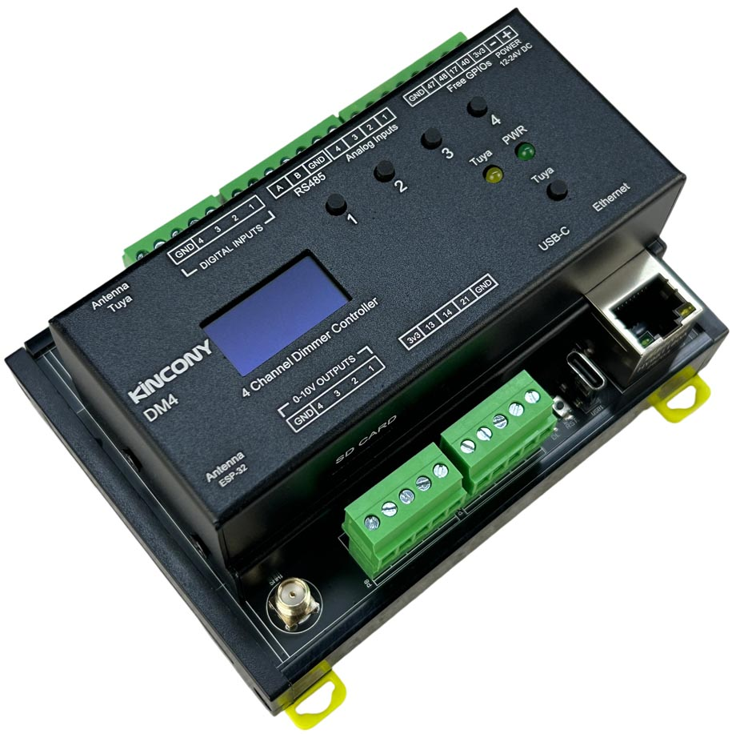

## Resources

- [ESP32 pin define details](https://www.kincony.com/forum/showthread.php?tid=8993)

## ESPHome Configuration

Here is an example YAML configuration for the KinCony DM4 ESP32-S3 dimmer board.

```yaml
esphome:
  name: dm4
  friendly_name: dm4

esp32:
  board: esp32-s3-devkitc-1
  framework:
    type: arduino

# Enable logging
logger:

# Enable Home Assistant API
api:

ota:
  platform: esphome

web_server:
  port: 80

ethernet:
  type: W5500
  clk_pin: GPIO1
  mosi_pin: GPIO2
  miso_pin: GPIO41
  cs_pin: GPIO42
  interrupt_pin: GPIO43
  reset_pin: GPIO44

i2c:
   - id: bus_a
     sda: 8
     scl: 18
     scan: true
     frequency: 400kHz

text_sensor:
  - platform: ethernet_info
    ip_address:
      name: ESP IP Address
      id: eth_ip
      address_0:
        name: ESP IP Address 0
      address_1:
        name: ESP IP Address 1
      address_2:
        name: ESP IP Address 2
      address_3:
        name: ESP IP Address 3
      address_4:
        name: ESP IP Address 4
    dns_address:
      name: ESP DNS Address
    mac_address:
      name: ESP MAC Address

font:
  - file: "gfonts://Roboto"
    id: roboto
    size: 15

display:
  - platform: ssd1306_i2c
    model: "SSD1306 128x64"
    address: 0x3C
    lambda: |-
      it.printf(0, 15, id(roboto), "IP: %s", id(eth_ip).state.c_str());
uart:
  - id: uart_1    #RS485
    baud_rate: 9600
    debug:
      direction: BOTH
      dummy_receiver: true
      after:
        timeout: 10ms
    tx_pin: 38
    rx_pin: 39

switch:
  - platform: uart
    uart_id: uart_1
    name: "RS485 Button"
    data: [0x11, 0x22, 0x33, 0x44, 0x55]


pcf8574:
  - id: 'pcf8574_hub_in_1'  # for input channel 1-16
    i2c_id: bus_a
    address: 0x24
    pcf8575: false

binary_sensor:
  - platform: gpio
    name: "dm4-input01"
    pin:
      pcf8574: pcf8574_hub_in_1
      number: 0
      mode: INPUT
      inverted: true

  - platform: gpio
    name: "dm4-input02"
    pin:
      pcf8574: pcf8574_hub_in_1
      number: 1
      mode: INPUT
      inverted: true

  - platform: gpio
    name: "dm4-input03"
    pin:
      pcf8574: pcf8574_hub_in_1
      number: 2
      mode: INPUT
      inverted: true

  - platform: gpio
    name: "dm4-input04"
    pin:
      pcf8574: pcf8574_hub_in_1
      number: 3
      mode: INPUT
      inverted: true

##pull-up resistance on PCB
  - platform: gpio
    name: "dm4-W1-io48"
    pin: 
      number: 48
      inverted: true

  - platform: gpio
    name: "dm4-W1-io47"
    pin: 
      number: 47
      inverted: true

  - platform: gpio
    name: "dm4-W1-io40"
    pin: 
      number: 40
      inverted: true

  - platform: gpio
    name: "dm4-W1-io17"
    pin: 
      number: 17
      inverted: true
## without resistance on PCB
  - platform: gpio
    name: "dm4-io13"
    pin: 
      number: 13
      inverted: false

  - platform: gpio
    name: "dm4-io14"
    pin: 
      number: 14
      inverted:  false

  - platform: gpio
    name: "dm4-21"
    pin: 
      number: 21
      inverted:  false

  - platform: gpio
    name: "dm4-0"
    pin: 
      number: 0
      inverted:  false

ads1115:
  - address: 0x48
sensor:
  - platform: ads1115
    multiplexer: 'A0_GND'
    gain: 6.144
    resolution: 16_BITS
    name: "ADS1115 Channel A0-GND"
    update_interval: 5s
  - platform: ads1115
    multiplexer: 'A1_GND'
    gain: 6.144
    name: "ADS1115 Channel A1-GND"
    update_interval: 5s
  - platform: ads1115
    multiplexer: 'A2_GND'
    gain: 6.144
    name: "ADS1115 Channel A2-GND"
    update_interval: 5s
  - platform: ads1115
    multiplexer: 'A3_GND'
    gain: 6.144
    name: "ADS1115 Channel A3-GND"
    update_interval: 5s

mcp4728:
  - id: dac_output

output:
- platform: mcp4728
  id: ac_dimmer_1
  mcp4728_id: dac_output
  channel: A
  vref: internal

- platform: mcp4728
  id: ac_dimmer_2
  mcp4728_id: dac_output
  channel: B
  vref: internal

- platform: mcp4728
  id: ac_dimmer_3
  channel: C
  vref: internal

- platform: mcp4728
  id: ac_dimmer_4
  channel: D
  vref: internal

light:
  - platform: monochromatic
    name: "DM4 DAC-1"
    id: dm4_dac_1
    output: ac_dimmer_1
    gamma_correct: 1.0

  - platform: monochromatic
    name: "DM4 DAC-2"
    id: dm4_dac_2
    output: ac_dimmer_2
    gamma_correct: 1.0

  - platform: monochromatic
    name: "DM4 DAC-3"
    id: dm4_dac_3
    output: ac_dimmer_3
    gamma_correct: 1.0

  - platform: monochromatic
    name: "DM4 DAC-4"
    id: dm4_dac_4
    output: ac_dimmer_4
    gamma_correct: 1.0
```
