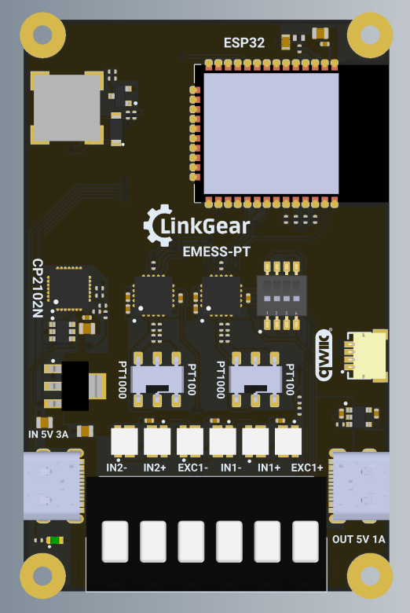

The LinkGear EMESS-PT is an ESPHome-ready RTD sensor board for PT100 and PT1000 probes.
It supports either two 2-wire probes, or one 2-wire probe together with one 3-wire or 4-wire probe.
DIP switches select PT100/PT1000 and 2-wire/3-wire/4-wire operation without soldering.
If you want to learn more, please check [our manual and instructions page](https://docs.linkgear.net/books/lg-emept1/page/manual-safety).

## Features

- 2 MAX31865 channels for PT100/PT1000 probes
- Supports 2 x 2-wire RTDs or 1 x 2-wire plus 1 x 3-wire/4-wire RTD
- 6 individually addressable SK6812 LEDs
- Default LED configuration can be used to show hot/cold state per sensor
- USB-C power passthrough and screwless spring clamp terminals
- Passive buzzer for configurable alarms

## Flashing

Boards come pre-flashed, but can be re-flashed at [flash.linkgear.net](https://flash.linkgear.net/).
Select `LinkGear EMESS-PT` in the LinkGear web flasher.

## Pinout

| uC Pin | Function |
|--------|----------|
| GPIO22 | I2C SCL |
| GPIO21 | I2C SDA |
| GPIO23 | SPI MOSI |
| GPIO19 | SPI MISO |
| GPIO18 | SPI SCK |
| GPIO5  | MAX31865 right side CS |
| GPIO4  | MAX31865 left side CS |
| GPIO17 | SK6812 LED data |
| GPIO25 | Buzzer |

## Basic Configuration

The configuration is available on
[the GitHub page.](https://github.com/performeon/LinkGearMisc/tree/main/products/lg-emept)
