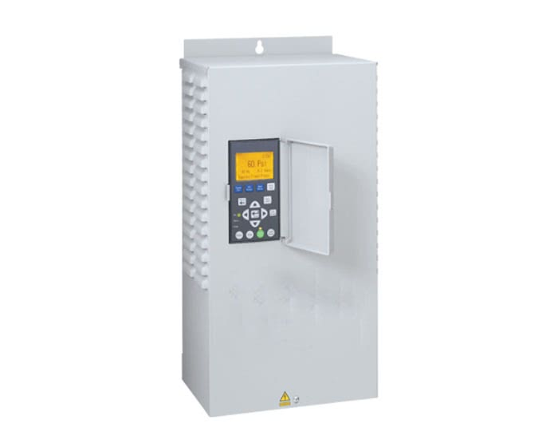

Data can be gathered from your Pentair Pentek Intellidrive PID Variable Frequency Pump Controller over Modbus. Tested
with a PID10 Device.

The Intellidrive provides a 2-wire RS485 interface. Wire up a an RS485 transceiver like MAX485 to an ESP32 to interface
with the device using Esphome's [Modbus Component](https://esphome.io/components/modbus.html)

## Modbus Interface Notes

The Intellidrive Modbus interface is poorly documented. Most interesting registers should be provided below, but there
may be more to discover.
See the [Unofficial Modbus Docs](https://github.com/ryan-lang/pentek-intellidrive-modbus-docs) for more information on
known or suspected registers.

## Configuration example

``` yaml
esphome:
  name: well-pump-controller
  friendly_name: "Well Pump Controller"
  comment: "Pentek Intellidrive PID10"

esp32:
  variant: esp32

wifi:
  ssid: YOUR_SSID
  password: YOUR_PW
  power_save_mode: none

ota:

api:

web_server:
  port: 80

time:
  - platform: sntp
    id: sntp_time
    timezone: America/Los_Angeles

# Example UART configuration
uart:
  id: mod_bus
  tx_pin: GPIO16
  rx_pin: GPIO17
  baud_rate: 19200
  data_bits: 8
  parity: NONE
  stop_bits: 1

modbus:
  id: modbus1

modbus_controller:
  - id: modctrl1
    address: 0x1
    modbus_id: modbus1
    setup_priority: -10
    update_interval: 10s
  - id: modctrl2
    address: 0x2
    modbus_id: modbus1
    setup_priority: -10
    update_interval: 10s

select:
  - platform: modbus_controller
    modbus_controller_id: modctrl2
    name: "Setpoint Int"
    id: setpoint_int
    address: 0x00DA
    value_type: U_WORD
    optimistic: True
    optionsmap:
      "15 PSI": 103
      "16 PSI": 110
      "17 PSI": 117
      "18 PSI": 124
      "19 PSI": 131
      "20 PSI": 138
      "21 PSI": 145
      "22 PSI": 152
      "23 PSI": 159
      "24 PSI": 165
      "25 PSI": 172
      "26 PSI": 179
      "27 PSI": 186
      "28 PSI": 193
      "29 PSI": 200
      "30 PSI": 207
      "31 PSI": 214
      "32 PSI": 221
      "33 PSI": 228
      "34 PSI": 234
      "35 PSI": 241
      "36 PSI": 248
      "37 PSI": 255
      "38 PSI": 262
      "39 PSI": 269
      "40 PSI": 276
      "41 PSI": 283
      "42 PSI": 290
      "43 PSI": 296
      "44 PSI": 303
      "45 PSI": 310
      "46 PSI": 317
      "47 PSI": 324
      "48 PSI": 331
      "49 PSI": 338
      "50 PSI": 345
      "51 PSI": 352
      "52 PSI": 359
      "53 PSI": 365
      "54 PSI": 372
      "55 PSI": 379
      "56 PSI": 386
      "57 PSI": 393
      "58 PSI": 400
      "59 PSI": 407
      "60 PSI": 414
      "61 PSI": 421
      "62 PSI": 427
      "63 PSI": 434
      "64 PSI": 441
      "65 PSI": 448
      "66 PSI": 455
      "67 PSI": 462
      "68 PSI": 469
      "69 PSI": 476
      "70 PSI": 483
      "71 PSI": 490
      "72 PSI": 496
      "73 PSI": 503
      "74 PSI": 510
      "75 PSI": 517
      "76 PSI": 524
      "77 PSI": 531
      "78 PSI": 538
      "79 PSI": 545
      "80 PSI": 552
      "81 PSI": 558
      "82 PSI": 565
      "83 PSI": 572
      "84 PSI": 579
      "85 PSI": 586

  - platform: modbus_controller
    modbus_controller_id: modctrl2
    address: 0x00E5
    name: "Setpoint Ext"
    id: setpoint_ext
    value_type: U_WORD
    optimistic: True
    optionsmap:
      "15 PSI": 103
      "16 PSI": 110
      "17 PSI": 117
      "18 PSI": 124
      "19 PSI": 131
      "20 PSI": 138
      "21 PSI": 145
      "22 PSI": 152
      "23 PSI": 159
      "24 PSI": 165
      "25 PSI": 172
      "26 PSI": 179
      "27 PSI": 186
      "28 PSI": 193
      "29 PSI": 200
      "30 PSI": 207
      "31 PSI": 214
      "32 PSI": 221
      "33 PSI": 228
      "34 PSI": 234
      "35 PSI": 241
      "36 PSI": 248
      "37 PSI": 255
      "38 PSI": 262
      "39 PSI": 269
      "40 PSI": 276
      "41 PSI": 283
      "42 PSI": 290
      "43 PSI": 296
      "44 PSI": 303
      "45 PSI": 310
      "46 PSI": 317
      "47 PSI": 324
      "48 PSI": 331
      "49 PSI": 338
      "50 PSI": 345
      "51 PSI": 352
      "52 PSI": 359
      "53 PSI": 365
      "54 PSI": 372
      "55 PSI": 379
      "56 PSI": 386
      "57 PSI": 393
      "58 PSI": 400
      "59 PSI": 407
      "60 PSI": 414
      "61 PSI": 421
      "62 PSI": 427
      "63 PSI": 434
      "64 PSI": 441
      "65 PSI": 448
      "66 PSI": 455
      "67 PSI": 462
      "68 PSI": 469
      "69 PSI": 476
      "70 PSI": 483
      "71 PSI": 490
      "72 PSI": 496
      "73 PSI": 503
      "74 PSI": 510
      "75 PSI": 517
      "76 PSI": 524
      "77 PSI": 531
      "78 PSI": 538
      "79 PSI": 545
      "80 PSI": 552
      "81 PSI": 558
      "82 PSI": 565
      "83 PSI": 572
      "84 PSI": 579
      "85 PSI": 586

sensor:
  # PID control settings
  - platform: modbus_controller
    modbus_controller_id: modctrl2
    address: 0x00D0
    name: "PID P-Gain"
    register_type: holding
    value_type: U_WORD
  - platform: modbus_controller
    modbus_controller_id: modctrl2
    address: 0x00D1
    name: "PID I-Time"
    device_class: duration
    unit_of_measurement: "ms"
    register_type: holding
    value_type: U_WORD
  - platform: modbus_controller
    modbus_controller_id: modctrl2
    address: 0x00D2
    name: "PID D-Time"
    device_class: duration
    unit_of_measurement: "ms"
    register_type: holding
    value_type: U_WORD
  - platform: modbus_controller
    modbus_controller_id: modctrl2
    address: 0x00D3
    name: "PID D-Limit"
    register_type: holding
    value_type: U_WORD

  # SLEEP settings
  - platform: modbus_controller
    modbus_controller_id: modctrl2
    address: 0x00FC
    name: "Sleep Boost Differential"
    unit_of_measurement: "psi"
    device_class: "pressure"
    register_type: holding
    value_type: U_WORD
    filters:
      - multiply: 0.1450
  - platform: modbus_controller
    modbus_controller_id: modctrl2
    address: 0x00FB
    name: "Sleep Boost Delay"
    unit_of_measurement: "s"
    device_class: duration
    register_type: holding
    value_type: U_WORD
  - platform: modbus_controller
    modbus_controller_id: modctrl2
    address: 0x00F9
    name: "Sleep Wake Up Differential"
    unit_of_measurement: "psi"
    device_class: "pressure"
    register_type: holding
    value_type: U_WORD
    filters:
      - multiply: 0.1450
  - platform: modbus_controller
    modbus_controller_id: modctrl2
    address: 0x00FA
    name: "Sleep Wake Delay"
    unit_of_measurement: "s"
    device_class: duration
    register_type: holding
    value_type: U_WORD

  # PASSWORD settings
  - platform: modbus_controller
    modbus_controller_id: modctrl2
    address: 0x00EE
    name: "Password Lock Time"
    unit_of_measurement: "min"
    device_class: duration
    register_type: holding
    value_type: U_WORD
  - platform: modbus_controller
    modbus_controller_id: modctrl2
    address: 0x00EC
    name: "App Password"
    register_type: holding
    value_type: U_WORD
    internal: True
    on_value:
      then:
        - lambda: |-
            id(app_password).publish_state(std::to_string((uint16_t)x));

  # MOTOR settings
  - platform: modbus_controller
    modbus_controller_id: modctrl2
    address: 0x1452
    name: "3PH Motor Type ID"
    register_type: holding
    value_type: U_WORD
    internal: true
    on_value:
      then:
        - lambda: |-
            if (x == 0) {
                id(ph3_motor_type).publish_state("Submersible");
            } else if (x == 1) {
                id(ph3_motor_type).publish_state("Above-Ground");
            } else {
              std::string mode_str = "Unknown Motor Type: " + std::to_string(x);
              id(ph3_motor_type).publish_state(mode_str.c_str());
            }
  - platform: modbus_controller
    modbus_controller_id: modctrl2
    address: 0x1450
    name: "Motor Service Factor Amps"
    unit_of_measurement: "A"
    device_class: current
    register_type: holding
    value_type: FP32
  - platform: modbus_controller
    modbus_controller_id: modctrl2
    address: 0x00E9
    name: "Motor Max Frequency"
    register_type: holding
    value_type: U_WORD
    unit_of_measurement: "Hz"
    device_class: "frequency"
  - platform: modbus_controller
    modbus_controller_id: modctrl2
    address: 0x00EA
    name: "Motor Min Frequency"
    register_type: holding
    value_type: U_WORD
    unit_of_measurement: "Hz"
    device_class: "frequency"

  # SENSOR settings
  - platform: modbus_controller
    modbus_controller_id: modctrl2
    address: 0x00DC
    name: "Sensor Max Pressure"
    unit_of_measurement: "psi"
    device_class: "pressure"
    register_type: holding
    value_type: U_WORD
    filters:
      - multiply: 0.1450

  # EX RUNTIME SETTINGS
  - platform: modbus_controller
    modbus_controller_id: modctrl2
    address: 0x00EF
    name: "Excessive Runtime Hours"
    unit_of_measurement: "h"
    device_class: "duration"
    register_type: holding
    value_type: U_WORD

  # DRY RUN settings
  - platform: modbus_controller
    modbus_controller_id: modctrl2
    address: 0x00E1
    name: "Dry Run Auto Restart Delay"
    unit_of_measurement: "s"
    device_class: "duration"
    register_type: holding
    value_type: U_WORD
  - platform: modbus_controller
    modbus_controller_id: modctrl2
    address: 0x00E0
    name: "Dry Run Number of Resets"
    register_type: holding
    value_type: U_WORD
  - platform: modbus_controller
    modbus_controller_id: modctrl2
    address: 0x00DF
    name: "Dry Run Detection Time"
    register_type: holding
    value_type: U_WORD
    unit_of_measurement: "s"
    device_class: "duration"
  - platform: modbus_controller
    modbus_controller_id: modctrl2
    address: 0x00E4
    name: "Dry Run Fill Time"
    register_type: holding
    value_type: U_WORD
    unit_of_measurement: "s"
    device_class: "duration"

  # I/O Settings
  - platform: modbus_controller
    modbus_controller_id: modctrl2
    address: 0x00E6
    name: "I/O Input 1 Mode ID"
    register_type: holding
    value_type: U_WORD
    internal: true
    on_value:
      then:
        - lambda: |-
            if (x == 0) {
                id(io_input_1_mode).publish_state("Unused");
            } else if (x == 1) {
                id(io_input_1_mode).publish_state("Run Enable");
            } else if (x == 2) {
                id(io_input_1_mode).publish_state("Ext Fault");
            } else if (x == 3) {
                id(io_input_1_mode).publish_state("Ext Setpoint");
            } else {
              std::string mode_str = "Unknown Input Mode: " + std::to_string(x);
              id(io_input_1_mode).publish_state(mode_str.c_str());
            }
  - platform: modbus_controller
    modbus_controller_id: modctrl2
    address: 0x00E7
    name: "I/O Input 2 Mode ID"
    register_type: holding
    value_type: U_WORD
    internal: true
    on_value:
      then:
        - lambda: |-
            if (x == 0) {
                id(io_input_2_mode).publish_state("Unused");
            } else if (x == 1) {
                id(io_input_2_mode).publish_state("Run Enable");
            } else if (x == 2) {
                id(io_input_2_mode).publish_state("Ext Fault");
            } else if (x == 3) {
                id(io_input_2_mode).publish_state("Ext Setpoint");
            } else {
              std::string mode_str = "Unknown Input Mode: " + std::to_string(x);
              id(io_input_2_mode).publish_state(mode_str.c_str());
            }
  - platform: modbus_controller
    modbus_controller_id: modctrl2
    address: 0x00FE
    name: "I/O Output Mode ID"
    register_type: holding
    value_type: U_WORD
    internal: true
    on_value:
      then:
        - lambda: |-
            if (x == 0) {
                id(io_output_mode).publish_state("Unused");
            } else if (x == 1) {
                id(io_output_mode).publish_state("Run");
            } else if (x == 2) {
                id(io_output_mode).publish_state("Fault");
            } else {
              std::string mode_str = "Unknown Output Mode: " + std::to_string(x);
              id(io_output_mode).publish_state(mode_str.c_str());
            }

  # Over Pressure
  - platform: modbus_controller
    modbus_controller_id: modctrl2
    address: 0x0101
    name: "Over Pressure Setpoint"
    unit_of_measurement: "psi"
    device_class: "pressure"
    register_type: holding
    value_type: U_WORD
    filters:
      - multiply: 0.1450

  # MONITORING PARAMS --------------

  - platform: modbus_controller
    modbus_controller_id: modctrl2
    address: 0x141D
    name: "Motor Power Consumption"
    id: "motor_power_consumption"
    unit_of_measurement: "W"
    state_class: measurement
    device_class: power
    register_type: holding
    value_type: U_DWORD

  - platform: modbus_controller
    modbus_controller_id: modctrl2
    address: 0x141F
    name: "Motor Phase A Current"
    id: "phase_a_current"
    unit_of_measurement: "A"
    state_class: measurement
    device_class: current
    register_type: holding
    value_type: FP32
    filters:
      - clamp:
          min_value: 0
          max_value: 20

  - platform: modbus_controller
    modbus_controller_id: modctrl2
    address: 0x1421
    name: "Motor Phase B Current"
    id: "phase_b_current"
    unit_of_measurement: "A"
    state_class: measurement
    device_class: current
    register_type: holding
    value_type: FP32
    filters:
      - clamp:
          min_value: 0
          max_value: 20

  - platform: modbus_controller
    modbus_controller_id: modctrl2
    address: 0x1423
    name: "Motor Phase C Current"
    id: "phase_c_current"
    unit_of_measurement: "A"
    state_class: measurement
    device_class: current
    register_type: holding
    value_type: FP32
    filters:
      - clamp:
          min_value: 0
          max_value: 20

  - platform: modbus_controller
    modbus_controller_id: modctrl2
    address: 0x1425
    name: "Motor Phase Voltage"
    id: "motor_phase_voltage"
    unit_of_measurement: "V"
    state_class: measurement
    device_class: voltage
    register_type: holding
    value_type: FP32

  - platform: modbus_controller
    modbus_controller_id: modctrl2
    address: 0x1453
    name: "Supply Voltage"
    id: "supply_voltage"
    unit_of_measurement: "V"
    state_class: measurement
    device_class: voltage
    register_type: holding
    value_type: U_DWORD

  - platform: modbus_controller
    modbus_controller_id: modctrl2
    address: 0x1416
    name: "Motor Speed Actual"
    unit_of_measurement: "Hz"
    device_class: "frequency"
    state_class: measurement
    register_type: holding
    value_type: FP32

  - platform: modbus_controller
    modbus_controller_id: modctrl2
    address: 0x001E
    name: "Fault Code"
    register_type: holding
    value_type: U_DWORD
    internal: true
    on_value:
      then:
        - lambda: |-
            if (x == 0 || x == 1) {
                id(fault_state).publish_state("None");
            } else if (x == 8192) {
                id(fault_state).publish_state("Open Transducer");
            } else if (x == 16384) {
                id(fault_state).publish_state("Short Transducer");
            } else if (x == 65536) {
                id(fault_state).publish_state("Under Voltage");
            } else if (x == 64) {
                id(fault_state).publish_state("Can Not Start Motor");
            } else if (x == 32) {
                id(fault_state).publish_state("Dry Run");
            } else if (x == 2048) {
                id(fault_state).publish_state("Ground Fault");
            } else if (x == 4096) {
                id(fault_state).publish_state("System Not Grounded");
            } else if (x == 256) {
                id(fault_state).publish_state("Over Current");
            } else if (x == 32768) {
                id(fault_state).publish_state("Low Amps");
            } else {
                std::string mode_str = "Unknown Fault: " + std::to_string(x);
                id(fault_state).publish_state(mode_str.c_str());
            }

  - platform: modbus_controller
    modbus_controller_id: modctrl2
    address: 0x0029
    name: "Run Mode ID"
    register_type: holding
    value_type: U_WORD
    internal: true
    on_value:
      then:
        - lambda: |-
            if (x == 0) {
                id(run_mode).publish_state("Stop");
            } else if (x == 1) {
                id(run_mode).publish_state("Pump Out");
            } else if (x == 2) {
                id(run_mode).publish_state("Auto Start");
            } else {
              std::string mode_str = "Unknown Mode: " + std::to_string(x);
              id(run_mode).publish_state(mode_str.c_str());
            }

  - platform: modbus_controller
    modbus_controller_id: modctrl2
    address: 0x1452
    name: "Motor Type ID"
    register_type: holding
    value_type: U_WORD
    internal: true
    on_value:
      then:
        - lambda: |-
            if (x == 0) {
                id(motor_type).publish_state("3-Phase");
            } else if (x == 1) {
                id(motor_type).publish_state("1-Phase, 2-Wire");
            } else if (x == 2) {
                id(motor_type).publish_state("1-Phase, 3-Wire");
            } else {
              std::string mode_str = "Unknown Motor Type: " + std::to_string(x);
              id(motor_type).publish_state(mode_str.c_str());
            }

  # MONITORING PARAMS (UNDOCUMENTED) --------------

  - platform: modbus_controller
    modbus_controller_id: modctrl1
    address: 0x1419
    name: "Motor Speed"
    unit_of_measurement: "Hz"
    device_class: "frequency"
    state_class: measurement
    register_type: holding
    value_type: FP32

  - platform: modbus_controller
    modbus_controller_id: modctrl1
    address: 0x1455
    name: "IGBT Temp"
    unit_of_measurement: "°C"
    state_class: measurement
    register_type: holding
    value_type: FP32

  - platform: modbus_controller
    modbus_controller_id: modctrl2
    address: 0x00DD
    name: "Current Pressure"
    unit_of_measurement: "psi"
    device_class: "pressure"
    state_class: measurement
    register_type: holding
    value_type: U_WORD
    filters:
      - multiply: 0.1450

  # DERIVED SENSORS --------------
  - platform: integration
    name: "Motor Energy Consumption"
    sensor: motor_power_consumption
    time_unit: h
    unit_of_measurement: "kWh"
    device_class: energy
    state_class: total_increasing

binary_sensor:
  # MOTOR settings
  - platform: modbus_controller
    modbus_controller_id: modctrl2
    address: 0x157B
    name: "Motor Above Ground"
    register_type: holding
  # EX RUNTIME settings
  - platform: modbus_controller
    modbus_controller_id: modctrl2
    address: 0x00F0
    name: "Excessive Runtime Detection"
    register_type: holding
  # No GROUND settings
  - platform: modbus_controller
    modbus_controller_id: modctrl2
    address: 0x15E1
    name: "No Ground Detection"
    register_type: holding

text_sensor:
    # software version is a string, low-byte first
  - platform: modbus_controller
    modbus_controller_id: modctrl2
    address: 0x0000
    name: "AOC Software Version"
    entity_category: diagnostic
    register_type: holding
    register_count: 10
    lambda: |-
      if (data.size() < item->offset + 20) return {""};
      std::string temp;
      std::string result;
      bool found_dot = false;

      for (int i = 0; i < 20; i+=2) {
        char chars[] = {
          static_cast<char>(data[item->offset + i]),      // low byte
          static_cast<char>(data[item->offset + i + 1]),  // high byte
        };
        for (char c : chars) {
          temp += c;
        }
      }
      for (auto it = temp.rbegin(); it != temp.rend(); ++it) {
          char c = *it;
          if (c == '.' && !found_dot) {
              result += c; found_dot = true;
          } else if (c >= '0' && c <= '9') {
              result += c;
          }
      }
      return result;

  - platform: modbus_controller
    modbus_controller_id: modctrl2
    address: 0x13EC
    name: "MOC Software Version"
    register_type: holding
    entity_category: diagnostic
    register_count: 10
    lambda: |-
      if (data.size() < item->offset + 20) return {""};
      std::string temp;
      std::string result;
      bool found_dot = false;

      for (int i = 0; i < 20; i+=2) {
        char chars[] = {
          static_cast<char>(data[item->offset + i]),      // low byte
          static_cast<char>(data[item->offset + i + 1]),  // high byte
        };
        for (char c : chars) {
          temp += c;
        }
      }
      for (auto it = temp.rbegin(); it != temp.rend(); ++it) {
          char c = *it;
          if (c == '.' && !found_dot) {
              result += c; found_dot = true;
          } else if (c >= '0' && c <= '9') {
              result += c;
          }
      }
      return result;

- platform: template
    name: "Run Mode"
    id: run_mode
  - platform: template
    name: "Fault"
    id: fault_state
  - platform: template
    name: "Motor Type"
    id: motor_type
  - platform: template
    name: "3PH Motor Type"
    id: ph3_motor_type
  - platform: template
    name: "I/O Input 1 Mode"
    id: io_input_1_mode
  - platform: template
    name: "I/O Input 2 Mode"
    id: io_input_2_mode
  - platform: template
    name: "I/O Output Mode"
    id: io_output_mode
  - platform: template
    name: "App Password"
    id: app_password

number:
  - platform: modbus_controller
    modbus_controller_id: modctrl2
    address: 999
    register_type: holding
    id: run_mode_setter
    value_type: U_WORD
    internal: True
    min_value: 1
    max_value: 2

button:
  - platform: template
    name: "Mode: Stop"
    on_press:
      - lambda: |-
          auto call = id(run_mode_setter)->make_call();
          call.set_value(2);
          call.perform();

          id(run_mode).publish_state("Stop");

  - platform: template
    name: "Mode: Auto"
    on_press:
      - lambda: |-
          auto call = id(run_mode_setter)->make_call();
          call.set_value(1);
          call.perform();

          id(run_mode).publish_state("Auto Start");
```
