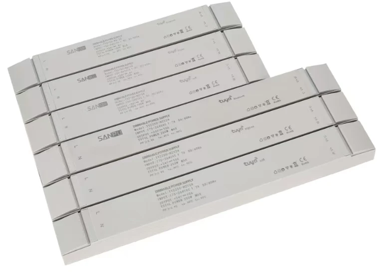
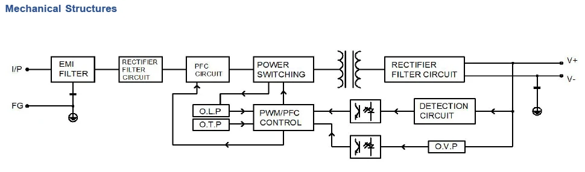
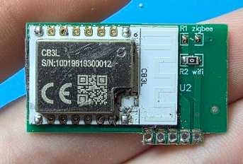
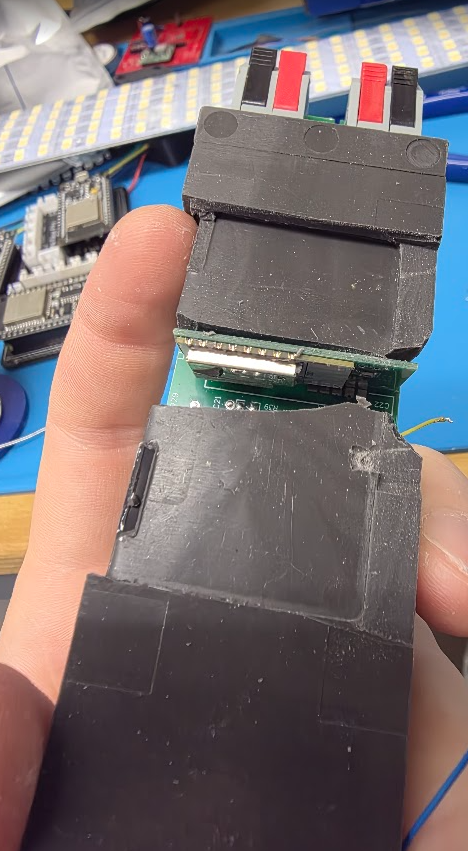
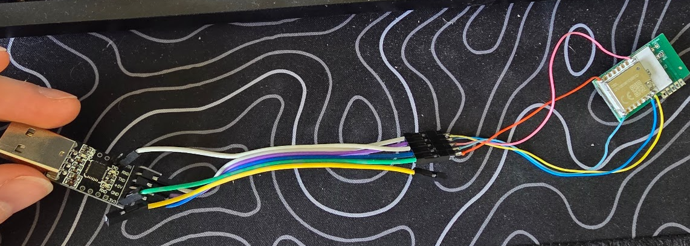

## SANPU TYZ150-W2V24



## General Notes

The SANPU TYZ150-W2V24 is a 24V 150W Tuya WiFi CCT (cold/warm white) LED strip dimming driver.
It is sold on AliExpress as a "Tuya WiFi Smart CCT Dimming Driver / Tunable White LED Switching Power Supply".

The internal module is a CB3L (BK7231N-based), controllable via ESPHome using LibreTiny.

**Specifications:**

| Parameter            | Value                      |
| -------------------- | -------------------------- |
| Input Voltage        | 100–240 VAC, 50/60 Hz      |
| Output Voltage       | 24 V DC                    |
| Rated Power          | 150 W                      |
| Output Current Range | 0–6.25 A per channel       |
| Dimensions           | 280 × 43 × 35 mm           |
| Protocol             | WiFi (Tuya / CB3L / BK72xx)|



## GPIO Pinout

| Pin | Function         |
| --- | ---------------- |
| P6  | Cold White (PWM) |
| P7  | Warm White (PWM) |

## CB3L Module



The TYZ150-W2V24 uses a **Tuya CB3L** Wi-Fi module based on the **Beken BK7231N** MCU.

| Property  | Value                               |
| --------- | ----------------------------------- |
| MCU       | Beken BK7231N                       |
| Frequency | 120 MHz                             |
| Flash     | 2 MiB                               |
| RAM       | 256 KiB                             |
| Voltage   | 3.0 V - 3.6 V                       |
| Wi-Fi     | 802.11 b/g/n                        |
| Bluetooth | BLE 5.1                             |
| I/O       | 12x GPIO, 6x PWM, 2x UART, 1x ADC   |

### CB3L Carrier Board Connector (left to right)

| Connector Pin | MCU Pin     | Function   |
| ------------- | ----------- | ---------- |
| Pin 1         | P7 / PWM1   | Warm White |
| Pin 2         | P6 / PWM0   | Cold White |
| Pin 3         | N/C         | —          |
| Pin 4         | GND         | Ground     |
| Pin 5         | 3V3         | 3.3 V      |

### CB3L UART Pinout (for flashing)

| CB3L Pin  | Connect to             |
| --------- | ---------------------- |
| P10 / RX1 | TX of USB-UART adapter |
| P11 / TX1 | RX of USB-UART adapter |
| CEN       | GND (to reset chip)    |
| 3V3       | 3.3 V                  |
| GND       | GND                    |

## Opening the Unit and Extracting the CB3L

> **Warning:** This device is mains-powered. Always disconnect from mains power
> before opening the enclosure and working on the PCB.

The PCB is encased in silicone potting compound, so extraction takes some patience.

1. **Open the enclosure** — Use a flat-head screwdriver to pop the clips along the
   casing. Once the clips release, work the screwdriver around to lever off the
   bottom plastic cover.
2. **Remove the PCB** — The PCB sits inside the outer casing. Push in on the
   Wago-style connectors at each end and the PCB should drop free.
3. **Cut out the silicone** — Use a knife to carefully cut away the silicone potting
   compound around the board. Work around the heatsink area and remove the single
   screw holding the MOSFET to the heatsink. Once the screw is out and enough
   silicone is cleared, you should be able to separate the heatsink from the silicone
   and PCB entirely, which gives you much better access to the rest of the board.
4. **Free the CB3L module** — Continue cutting away the silicone around the CB3L
   module until it is fully exposed.
5. **Desolder the CB3L** — The module is attached at a single connection point on the
   underside of the PCB, making it straightforward to desolder and remove.



## Flashing

Once the CB3L is removed, solder wires to the UART pads as per the pinout table
above, then connect to a USB-to-TTL serial adapter.



1. Connect the wired CB3L to your USB-UART adapter.
2. Start the flashing process with `ltchiptool`.
3. Repeatedly short CEN to GND (or power-cycle the 3.3 V supply) until flashing begins.
4. After the initial flash, subsequent updates can be done via ESPHome OTA.

Full flashing guide: [ltchiptool user guide](https://docs.libretiny.eu/docs/flashing/tools/ltchiptool/)

## Basic Configuration

```yaml
esphome:
  name: sanpu-tyz150-w2v24
  friendly_name: LED Strip Driver

bk72xx:
  board: cb3l

logger:

api:

ota:
  - platform: esphome

wifi:
  ssid: !secret wifi_ssid
  password: !secret wifi_password
  ap:

captive_portal:

output:
  - platform: libretiny_pwm
    id: output_cold_white
    pin: P6
  - platform: libretiny_pwm
    id: output_warm_white
    pin: P7

light:
  - platform: cwww
    name: "LED Strip"
    cold_white: output_cold_white
    warm_white: output_warm_white
    cold_white_color_temperature: 6500K
    warm_white_color_temperature: 2700K
    constant_brightness: true
    gamma_correct: 1
```
