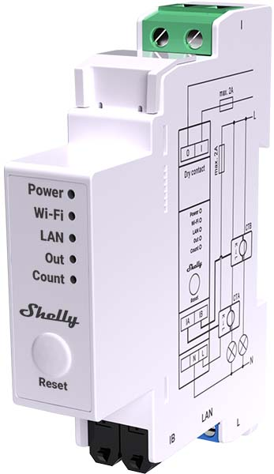
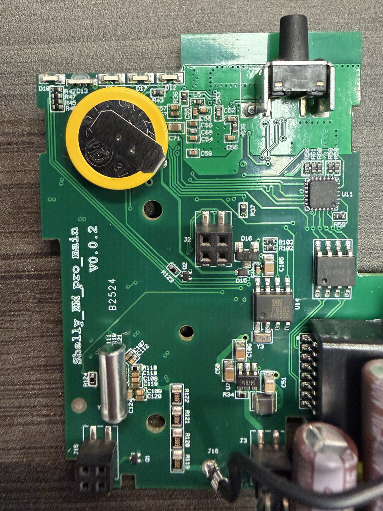
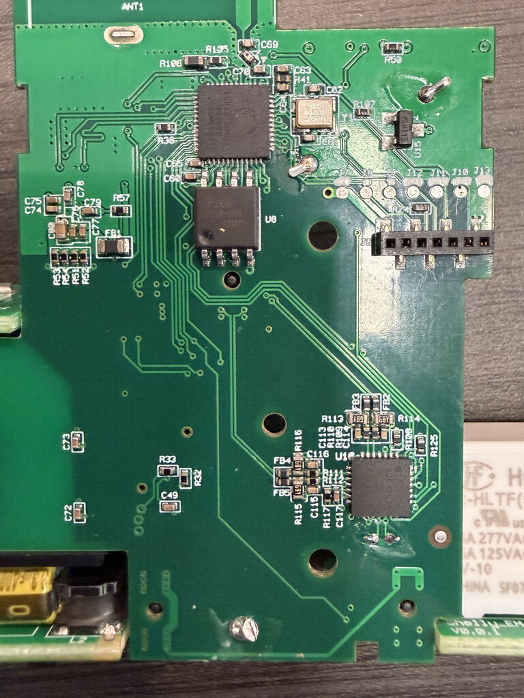

The Shelly Pro EM-50 is a DIN-rail mounted energy monitor with two CT clamp
inputs (0-50A), a dry-contact relay, Ethernet, Wi-Fi, and Bluetooth.

Unlike the Shelly Pro 2 PM which uses SPI, the Pro EM-50 communicates with
the ADE7953 energy metering IC via **I2C**. It also has an AiP8563 RTC
(PCF8563 compatible) on the same I2C bus.



## Board Photos





## Pinout

ESP32-D0WDQ6   | Component
---------------|-------------
GPIO 2         | Relay (dry contact, 2A)
GPIO 4         | ADE7953 IRQ
GPIO 13        | I2C SCL
GPIO 14        | RGB LED (Green, inverted)
GPIO 15        | I2C SDA
GPIO 16        | ADE7953 RESET (active low)
GPIO 17        | LAN8720A CLKIN
GPIO 18        | LAN8720A MDIO
GPIO 19        | LAN8720A TXD0
GPIO 21        | LAN8720A TXEN
GPIO 22        | LAN8720A TXD1
GPIO 23        | LAN8720A MDC
GPIO 25        | LAN8720A RXD0
GPIO 26        | LAN8720A RXD1
GPIO 27        | LAN8720A CRS_DV
GPIO 32        | RGB LED (Blue, inverted)
GPIO 33        | RGB LED (Red, inverted)
GPIO 35        | Reset Button (inverted)
GPIO 36        | NTC Temperature (ADC)

## I2C Devices

Address | Device     | Description
--------|------------|---------------------------
0x38    | ADE7953    | Energy metering IC
0x51    | AiP8563    | Real-time clock (PCF8563 compatible)

## Programming Pinout


Note that the pin pitch is 1.27mm, so standard 2.54mm Dupont cables won't work.

## ADE7953

The ADE7953 is configured for I2C mode on this board (CS and SCLK pins are
tied high on the chip). The reset pin (GPIO16) is active low and must be
driven high for the chip to operate. Defining it as a GPIO `output` with
`inverted: true` is sufficient — the pin is driven high on initialization
and no explicit boot sequence is needed.

The voltage reading requires a calibration multiplier. The value `0.7951` was
determined by comparing against a reference meter at 120V. You may need to
adjust this for your specific unit and voltage.

Current channels A and B correspond to the two CT clamp inputs.

## AiP8563 RTC

The AiP8563 is a PCF8563-compatible real-time clock at I2C address 0x51. It
is supported by the built-in ESPHome `bm8563` component. The RTC maintains
time through power cycles using a coin cell battery on the board.

## Basic Configuration

```yaml
esphome:
  name: shelly-pro-em-50
  friendly_name: Shelly Pro EM-50
  platformio_options:
    board_build.flash_mode: dio

esp32:
  board: esp32dev
  framework:
    type: esp-idf

logger:

api:

ota:
  - platform: esphome

wifi:
  ssid: !secret wifi_ssid
  password: !secret wifi_password
  ap:
    ssid: "Shelly-Pro-EM-50"

captive_portal:

# ethernet:
#   type: LAN8720
#   mdc_pin: GPIO23
#   mdio_pin: GPIO18
#   clk_mode: GPIO17_OUT

i2c:
  sda:
    number: GPIO15
    ignore_strapping_warning: true
  scl: GPIO13

output:
  - platform: gpio
    id: ade7953_reset
    pin:
      number: GPIO16
      inverted: true
```

## Full Configuration

```yaml
esphome:
  name: shelly-pro-em-50
  friendly_name: Shelly Pro EM-50
  platformio_options:
    board_build.flash_mode: dio

esp32:
  board: esp32dev
  framework:
    type: esp-idf

logger:

api:

ota:
  - platform: esphome

wifi:
  ssid: !secret wifi_ssid
  password: !secret wifi_password
  ap:
    ssid: "Shelly-Pro-EM-50"

captive_portal:

# ethernet:
#   type: LAN8720
#   mdc_pin: GPIO23
#   mdio_pin: GPIO18
#   clk_mode: GPIO17_OUT

i2c:
  sda:
    number: GPIO15
    ignore_strapping_warning: true
  scl: GPIO13

output:
  - platform: ledc
    pin:
      number: GPIO33
      inverted: true
    id: led_red
  - platform: ledc
    pin:
      number: GPIO32
      inverted: true
    id: led_blue
  - platform: ledc
    pin:
      number: GPIO14
      inverted: true
    id: led_green
  - platform: gpio
    id: ade7953_reset
    pin:
      number: GPIO16
      inverted: true

switch:
  - platform: gpio
    name: "Relay"
    pin: GPIO2
    id: relay
    restore_mode: ALWAYS_OFF

light:
  - platform: rgb
    name: "Status LED"
    red: led_red
    green: led_green
    blue: led_blue

button:
  - platform: restart
    name: "Restart"
    id: do_restart

binary_sensor:
  - platform: gpio
    id: reset_button
    pin:
      number: 35
      inverted: true
    on_release:
      then:
        button.press: do_restart

sensor:
  - platform: adc
    id: temp_voltage1
    pin: GPIO36
    attenuation: auto
  - platform: resistance
    id: temp_resistance1
    sensor: temp_voltage1
    configuration: DOWNSTREAM
    resistor: 10kOhm
  - platform: ntc
    sensor: temp_resistance1
    name: Temperature
    unit_of_measurement: "°C"
    accuracy_decimals: 1
    icon: "mdi:thermometer"
    calibration:
      b_constant: 3350
      reference_resistance: 10kOhm
      reference_temperature: 298.15K
    on_value_range:
      - above: 90
        then:
          - switch.turn_off: relay
          - button.press: do_restart

  - platform: ade7953_i2c
    irq_pin: GPIO4
    voltage:
      name: "Voltage"
      filters:
        - multiply: 0.7951
    current_a:
      name: "Current A"
      filters:
        - lambda: |-
            if (x <= 0.02) return 0;
            return x;
    current_b:
      name: "Current B"
      filters:
        - lambda: |-
            if (x <= 0.02) return 0;
            return x;
    active_power_a:
      name: "Power A"
      filters:
        - multiply: -1
        - lambda: |-
            if (x <= 0.2) return 0;
            return x;
    active_power_b:
      name: "Power B"
      filters:
        - multiply: -1
        - lambda: |-
            if (x <= 0.2) return 0;
            return x;
    frequency:
      name: "Frequency"

time:
  - platform: bm8563
    id: rtc_time
    address: 0x51
    update_interval: never
  - platform: homeassistant
    on_time_sync:
      then:
        - bm8563.write_time: rtc_time
```
