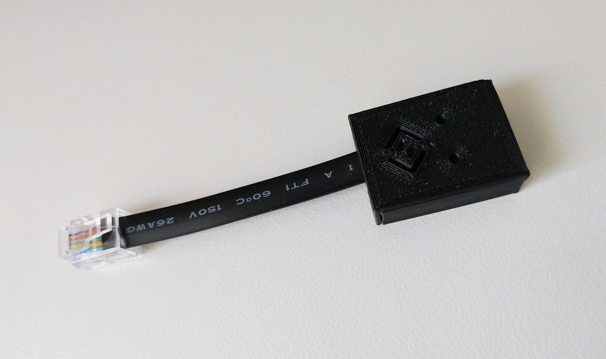
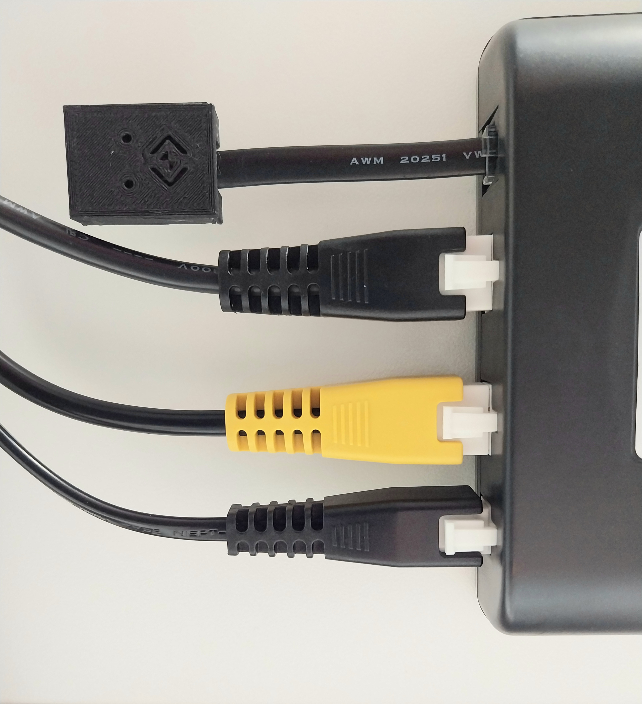
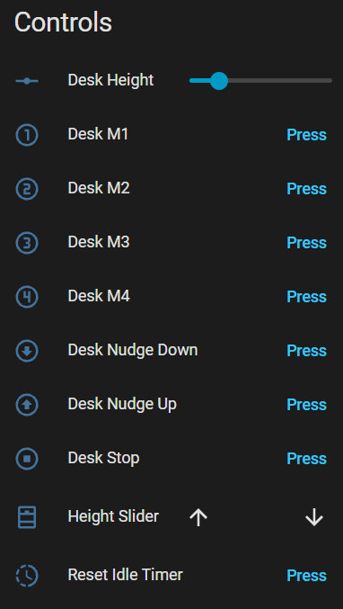
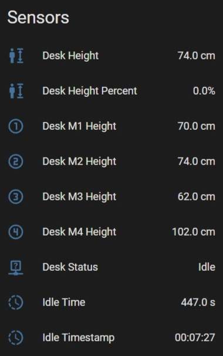

## Description

Use the DeskUp Pro to control your standing desk that has an RJ12 port.

Full Integration with Home Assistant or use it's API from any smart home automation system.

All the existing functionality of the desk's controller is retained.

## Support

- [Shop](https://www.ebay.co.uk/itm/226942026649)
- [Official Documentation](https://smarthomeguys.github.io/DeskUp-Pro-Controller-RJ12/)
- [GitHub](https://github.com/SmartHomeGuys/DeskUp-Pro-Controller-RJ12)
