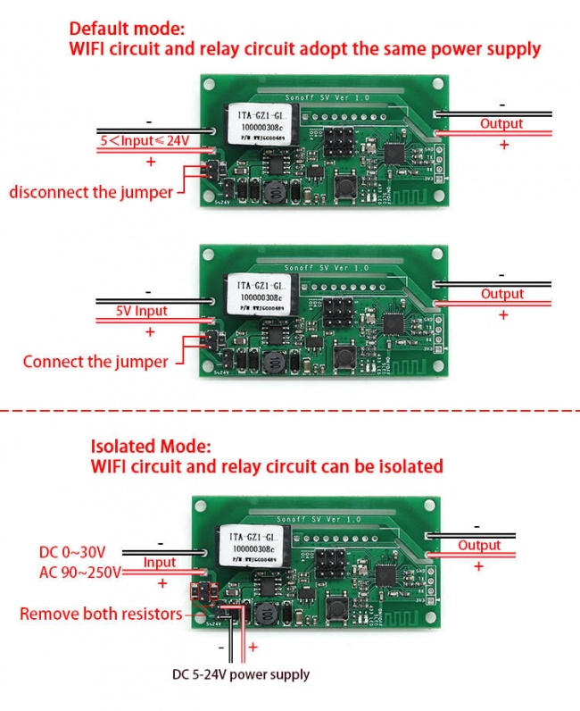

The Sonoff SV is 5-24V DC powered SPST relay board with three GPIOs provided on 3-way headers (3.3V,
GND and the IO).

It has an ESP8266 with 25Q80DVSIG serial flash. Flashing ESPHome can be easily achieved via the
[unpopulated programming header](https://esphome.io/guides/physical_device_connection/#unpopulated-programming-header)
and the button connected to GPIO0.

## GPIO Pinout

| GPIO   | Function |
| ------ | -------- |
| GPIO0  | Button   |
| GPIO12 | Relay and red LED |
| GPIO13 | green LED |
| GPIO4  | available via 3-way header |
| GPIO5  | available via 3-way header |
| GPI014 | available via 3-way header |

## Basic Configuration

```yaml
packages:
  - !include common/common.yaml
  - !include common/wifi.yaml
  - !include common/web_server.yaml

esphome:
  name: sonoff-lv
  friendly_name: Sonoff LV DC switch

esp8266:
  board: esp01_1m

binary_sensor:
  - platform: gpio
    pin:
      number: GPIO0
      mode: INPUT_PULLUP
      inverted: true
    name: "Button"
    on_press:
      - switch.toggle: relay

switch:
  - platform: gpio
    name: "Outlet"
    icon: mdi:power-socket-au
    pin: GPIO12
    id: relay

status_led:
  pin:
    number: GPIO13
```
