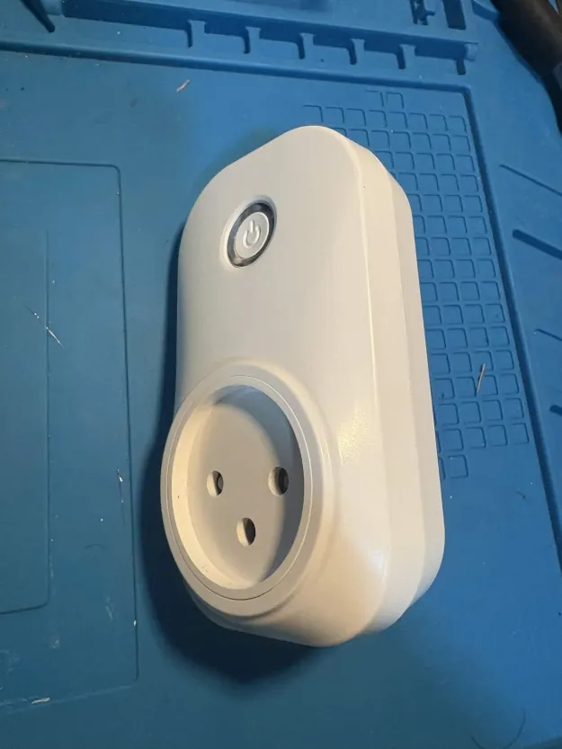
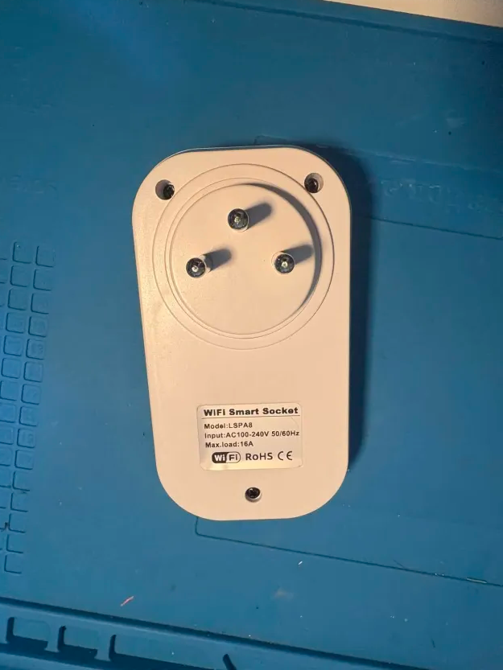
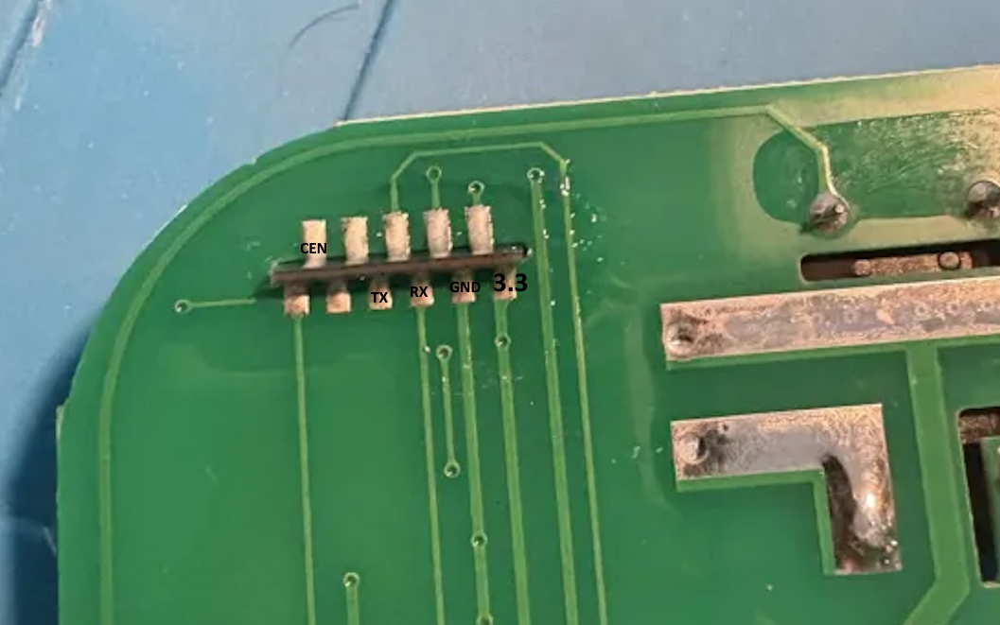
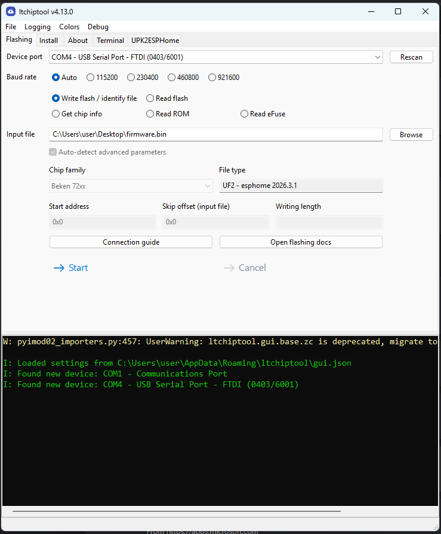

## General Notes

While a specifc model number was not specificed on the exterior, `a8tyv1.3` is written on the board inside.
These plugs are available in various models, with or without energy monitoring and USB ports.

The 16A smart plug with energy monitor is _not_ flashable using tuya-cloudcutter. The main module version on smart life
app is V1.1.23, which is on the known patched firmware list.

Some dissasembly and soldering is requried in order to flash the device via UART.

## Product Images




## Dissasebly and Flashing

There are three external Phillips screws that must be removed to open the device (see image above).
Additionally, two internal screws secure the board to the plastic casing and must also be removed.


The CB2S Wi-Fi module pins are exposed on the underside of the board and are clearly labeled.



Connect the pins to a UART TTL adapter, then hold the CEN pin to GND for a few seconds while
flashing the ESPHome firmware using `itchiptool`.



## GPIO Pinout

| Pin | Function        |
| --- | --------------- |
| P6  | CF1 pin         |
| P7  | CF pin          |
| P8  | Blue LED        |
| P10 | Switch button   |
| P24 | SEL pin         |
| P26 | Relay + Red LED |

## Basic configuration

```yml
# Basic Config
substitutions:
  friendly_name: Socket 16A IL
  device_name: socket-16a-il

esphome:
  name: ${device_name}
  friendly_name: ${friendly_name}

bk72xx:
  board: cb2s

# Enable logging
logger:

# Enable Home Assistant API
api:
  encryption:
    key: !secret api_encryption_key

ota:
  - platform: esphome
    password: !secret ota_password

wifi:
  ssid: !secret wifi_ssid
  password: !secret wifi_password

  # Enable fallback hotspot (captive portal) in case wifi connection fails
  ap:
    ssid: ${friendly_name} Fallback Hotspot
    password: ""

captive_portal:

text_sensor:
  - platform: libretiny
    version:
      name: LibreTiny Version

output:
  - platform: gpio
    id: button_led
    pin: P8
    inverted: true

binary_sensor:
  - platform: gpio
    id: binary_switch
    pin:
      number: P10
      inverted: true
      mode: INPUT_PULLUP
    on_press:
      then:
        - switch.toggle: relay

switch:
  - platform: gpio
    name: ${friendly_name} Relay Switch
    id: relay
    restore_mode: "RESTORE_DEFAULT_OFF"
    pin: P26
    on_turn_on:
      then:
        - output.turn_on: button_led
    on_turn_off:
      then:
        - output.turn_off: button_led

sensor:
  - platform: hlw8012
    model: BL0937
    cf_pin:
      number: P7
      inverted: true
    cf1_pin:
      number: P6
      inverted: true
    sel_pin:
      number: P24
      inverted: true
    current:
      name: ${friendly_name} Current
      filters:
        - multiply: 0.5
    voltage:
      name: ${friendly_name} Voltage
    power:
      name: ${friendly_name} Power
    energy:
      name: ${friendly_name} Energy
    voltage_divider: 800
    current_resistor: 0.001 ohm
    update_interval: 1s
    change_mode_every: 1
```

### Additional notes

This guide was based on the [WHDZO3 guide](/devices/tuya-smart-plug-20a-whdz03/) and adapter to this board.
