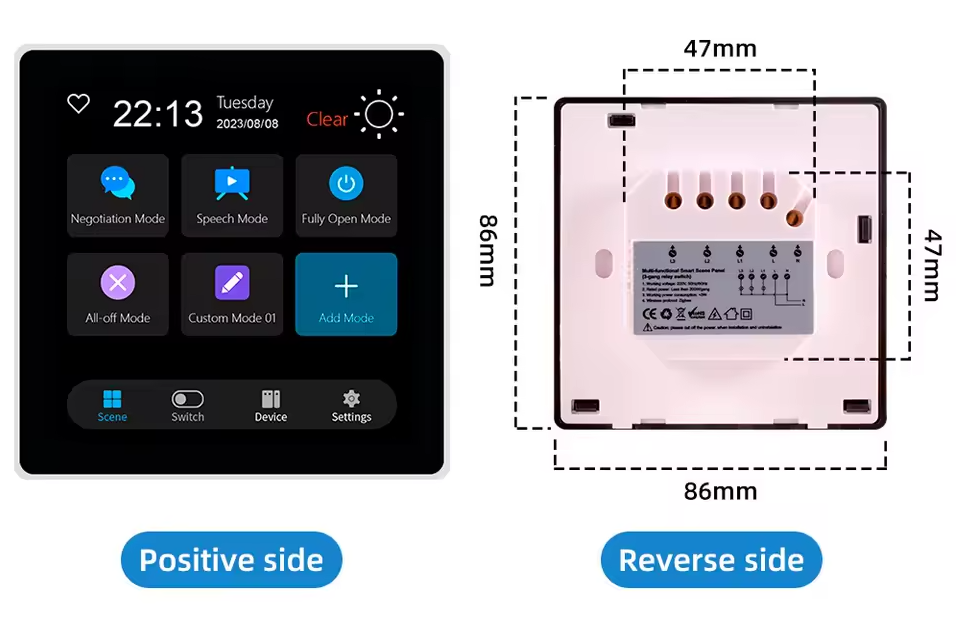
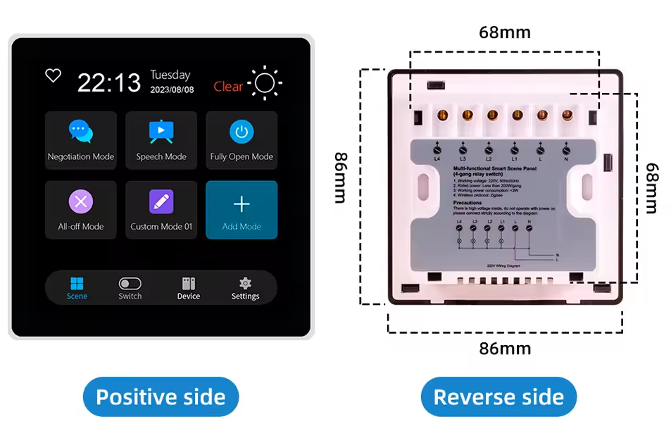
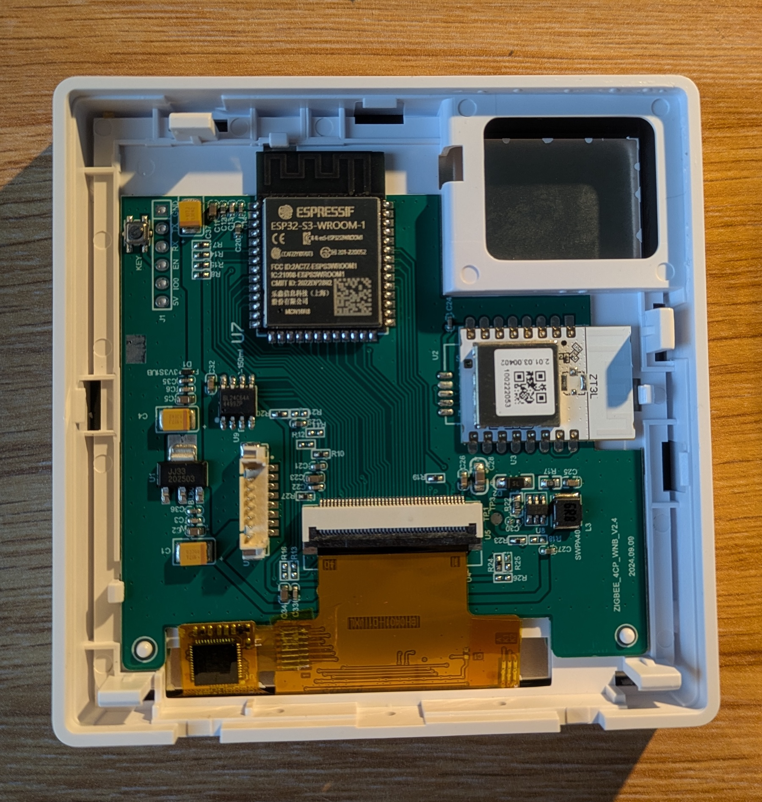
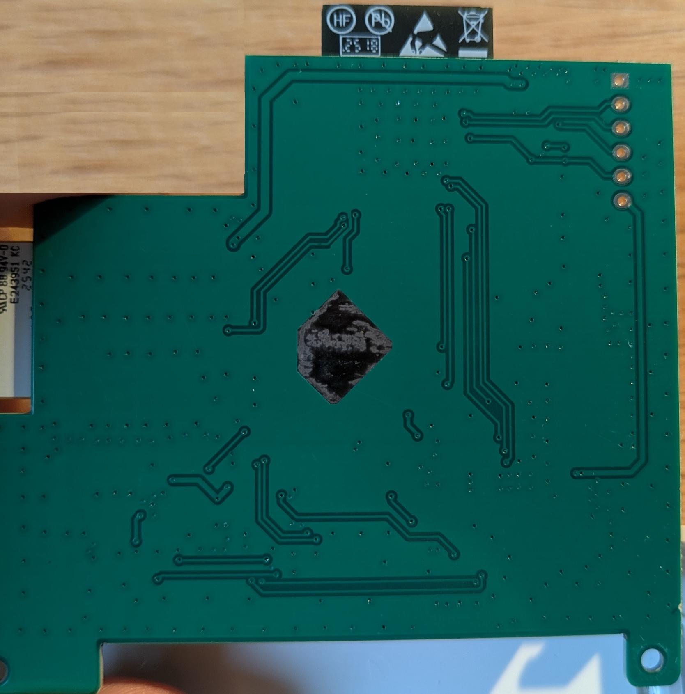
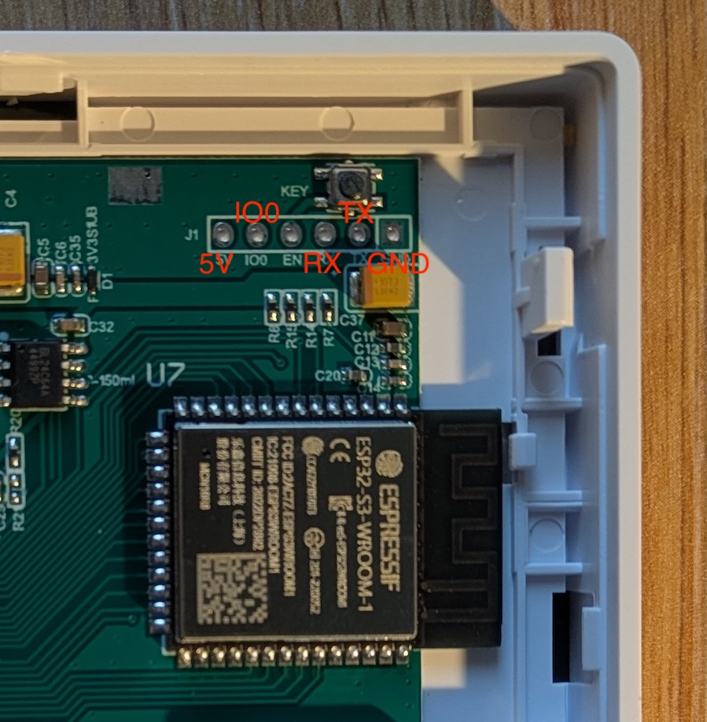

## Product description

Avalible on [AliExpress](https://fr.aliexpress.com/item/1005008670590154.html) at various vendors.

Be careful not to purchase the Tuya T3E Pro version.
The pro version is a Zigbee-only version and does not contain an ESP32 inside.

Two versions are available: a European version compatible with 60mm boxes containing three relays,
and an Asian version with a square box and four relays.

The board also contains a TuYa Zigbee ZT3L module connected to the ESP32 on GPIO 19 (TX of Zigbee module)
and GPIO 20 (RX of module)

[ZT3L Datasheet](https://developer.tuya.com/en/docs/iot/zt3l-module-datasheet?id=Ka438n1j8nuvu) and
[Tuya Zigbee UART Specification](https://developer.tuya.com/en/docs/mcu-standard-protocol/mcusdk-zigbee-uart-protocol?id=Kdg17v4544p37)

[See below](#zigbee-router) for usage.

## Product specs

### EU Version



### Asia Version



| Feature      | Spec                    |
| ------------ | ----------------------- |
| Screen       | st7701s driver 480\*480 |
| Touch screen | gt911                   |
| CPU          | ESP32-S3                |
| Flash        | 16MB                    |
| PSRAM        | 8MB                     |

## Product pinout

These pinouts are valid for version v2.4 of the board.
On other versions, the pinouts for the screen and touchscreen appear to be identical, but the relay pins appear to be different.

### TUYA T3E - Eu version - 3 Gang Relay

| PIN    | Usage                        |
|--------|------------------------------|
| GPIO0  | Red 5 (Screen)               |
| GPIO1  |                              |
| GPIO2  | Relay 3                      |
| GPIO3  | Green 6 (Screen)             |
| GPIO4  | Cs Pin (Screen)              |
| GPIO5  |                              |
| GPIO6  | SCL (Touchscreen)            |
| GPIO7  | SDA (Touchscreen)            |
| GPIO8  | Red 1 (Screen)               |
| GPIO9  | Green 5 (Screen)             |
| GPIO10 | Green 4 (Screen)             |
| GPIO11 | Green 3 (Screen)             |
| GPIO12 | Green 2 (Screen)             |
| GPIO13 | Green 1 (Screen)             |
| GPIO14 | Blue 5 (Screen)              |
| GPIO15 | Blue 1 (Screen) + CLK (spi)  |
| GPIO16 | Red 4 (Screen)               |
| GPIO17 | Red 3 (Screen)               |
| GPIO18 | Red 2 (Screen)               |
| GPIO19 | TX Pin of ZT3L               |
| GPIO20 | RX Pin of ZT3L               |
| GPIO21 | Blue 4 (Screen)              |
| GPIO35 | PSRAM                        |
| GPIO36 | PSRAM                        |
| GPIO37 | PSRAM                        |
| GPIO38 | HSync (Screen)               |
| GPIO39 | HSync (Screen)               |
| GPIO40 | DE (Screen)                  |
| GPI41  | PCLK (Screen)                |
| GPIO42 | Led Backlight (Screen)       |
| GPIO43 | TXD                          |
| GPIO44 | RXD                          |
| GPIO45 | Relay 1                      |
| GPIO46 | Relay 2                      |
| GPIO47 | Blue 3 (Screen)              |
| GPIO15 | Blue 2 (Screen) + MOSI (spi) |

### TUYA T3E - Asia version - 4 Gang Relay

Not available. Open to pull request if you have this module.

## Board Image

### Rev 2.4 TUYA T3E - Eu version - 3 Gang Relay





## Flash Pinout

To enter flash mode, shortly connect IO0 and GND



## Basic Config

```yaml
esphome:
  name: "tuya-t3e-esp32-s3"

esp32:
  variant: esp32s3
  framework:
    type: esp-idf

psram:
  mode: octal
  speed: 80MHz

logger:
  # Default logger hardware_uart on esp32-s3 is wired on the Tuya Zigbee Module
  hardware_uart: UART0

api:
  encryption:
    key: !secret encryption_key

ota:
  - platform: esphome
    password: !secret ota_password
    on_begin: # prevent screen flickering during OTA
      - light.turn_off:
          id: display_backlight
          transition_length: 0s
      - lambda: "id(display_backlight).loop();"

wifi:
  ssid: !secret wifi_ssid
  password: !secret wifi_password

switch:
  - platform: gpio
    name: Relay 1
    pin:
      number: GPIO45
      inverted: false
      ignore_strapping_warning: true
  - platform: gpio
    name: Relay 2
    pin:
      number: GPIO46
      inverted: false
      ignore_strapping_warning: true
  - platform: gpio
    name: Relay 3
    pin:
      number: GPIO2
      inverted: false

output:
  - platform: ledc
    id: backlight_output
    pin: GPIO42
    frequency: 1000Hz
    zero_means_zero: true

light:
  - platform: monochromatic
    name: Backlight
    id: display_backlight
    output: backlight_output
    restore_mode: ALWAYS_ON
    default_transition_length: 1s

spi:
  - id: lcd_spi
    clk_pin:
      number: GPIO15
      allow_other_uses: true
    mosi_pin:
      number: GPIO48
      allow_other_uses: true

i2c:
  id: touchscreen_bus
  sda: GPIO7
  scl: GPIO6

display:
  - platform: st7701s
    id: tft_display
    dimensions:
      width: 480
      height: 480
    #    rotation: 270    #uncomment for placement with down-facing USB socket
    update_interval: never
    auto_clear_enabled: False
    spi_mode: MODE3
    data_rate: 2MHz
    color_order: RGB
    invert_colors: true

    cs_pin:
      number: GPIO4
      allow_other_uses: true

    data_pins:
      red:   [GPIO8, GPIO18, GPIO17, GPIO16, GPIO0]
      green: [GPIO13, GPIO12, GPIO11, GPIO10, GPIO9, GPIO3]
      blue:
        - number: GPIO15
          allow_other_uses: true
        - number: GPIO48
          allow_other_uses: true
        - GPIO47
        - GPIO21
        - GPIO14

    # Control Pins
    de_pin: GPIO40
    vsync_pin: GPIO39
    hsync_pin: GPIO38
    pclk_pin: GPIO41
    pclk_inverted: false

    # Timing (Specific to 480x480 Panels)
    hsync_pulse_width: 8
    hsync_front_porch: 10
    hsync_back_porch: 50
    vsync_pulse_width: 8
    vsync_front_porch: 10
    vsync_back_porch: 20
    pclk_frequency: 12MHz
    reset_pin:
      number: GPIO4
      allow_other_uses: true
    

touchscreen:
  - platform: gt911
    id: tft_touch
    display: tft_display
#    transform:     #uncomment for placement with down-facing USB socket
#      swap_xy: true
#      mirror_x: true

lvgl:
```

## Zigbee Router

To enable the onboard Zigbee Module as a Zigbee router and extend your Zigbee mesh network,
you can use this custom component.
Use the pairing button to pair the module on your zigbee network.

### ESPHome Config

Add the following configuration on your esphome :

```yaml
external_components:
  - source: github://rtorrente/esphome-tuya-zigbee-router

uart:
  id: uart_zigbee
  tx_pin: GPIO20
  rx_pin: GPIO19
  baud_rate: 115200

tuya_zigbee_router:
  uart_id: uart_zigbee
  id: zigbee_router_id

button:
  - platform: template
    name: "Zigbee Module Restart"
    icon: "mdi:restart"
    on_press:
      - tuya_zigbee_router.reset:
          id: zigbee_router_id
  - platform: template
    name: "Zigbee Module Pairing"
    icon: "mdi:restart"
    on_press:
      - tuya_zigbee_router.leave_and_rejoin:
          id: zigbee_router_id

text_sensor:
  - platform: tuya_zigbee_router
    zigbee_status:
      name: "Zigbee Router Status"
```

### Zigbee2Mqtt

As a simple Zigbee router, this module works seamlessly with Zigbee2MQTT or other without any configuration required.
The module will appear as: `TZE200_T-ZB-RT`

#### Optional: External Converters

To avoid unmanaged device warnings, you can configure external converters for Zigbee2MQTT.
Custom converters will be provided to enhance device integration and eliminate unmanaged status.

Refer to the [Z2Mqtt External Converters doc](https://www.zigbee2mqtt.io/advanced/more/external_converters.html)
for integration instructions.

Add the file `external_converters/tuya-zigbee-router.mjs` with the following content :

```javascript
import * as tuya from "zigbee-herdsman-converters/lib/tuya";

export default {
    zigbeeModel: ['TS0601'],
    fingerprint: [...tuya.fingerprint("TS0601", ["_TZE200_T-ZB-RT"])],
    model: "T-ZB-RT",
    vendor: "Tuya",
    description: 'Tuya Zigbee Router from https://github.com/rtorrente/esphome-tuya-zigbee-router',
    extend: [],
};
```
