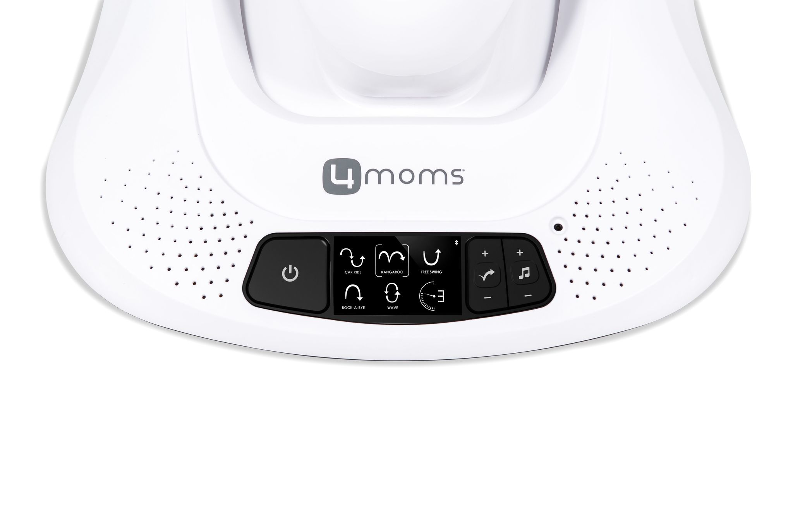

## Product description

We bought a 4moms Mamaroo 4 multi-motion baby swing for our baby and I realized it has built-in bluetooth module. Witch made me thinking if I can reverse-engineer original app to control swing using BLE client.
Luckily there already was a [project](https://github.com/chrisrosset/mamaroo-mqtt) that helped me a bit. I used some tools ([apktool](https://apktool.org/) and [jadx](https://github.com/skylot/jadx)) to decompile android apk file and understand how it works.

Finally I was able to made this config witch lets you fully control your swing using external ESP32 module. Also it should be possible to put it inside the swing and connect to power jack using step-down module.

## Config

```yaml
substitutions:
  name: 4moms-mamaroo-4
  friendly_name: 4moms Mamaroo 4
  device_description: Multi-motion baby swing
  service_uuid: 622d0100-2416-0fa7-e132-2f1495cc2ce0
  characteristic_uuid: 622d0101-2416-0fa7-e132-2f1495cc2ce0
  mac_address: 00:00:00:00:00:00

esphome:
  name: ${name}
  friendly_name: ${friendly_name}
  comment: ${device_description}

esp32:
  board: esp32-c3-devkitm-1
  framework:
    type: arduino

wifi:
  ssid: !secret wifi_ssid
  password: !secret wifi_password

web_server:

ota:
  platform: esphome

logger:
  level: WARN

api:
  encryption:
    key: !secret api_encryption_key

esp32_ble_tracker:
  on_ble_advertise:
    then:
      - lambda: |-
          if (x.get_name().rfind("Blimp", 0) == 0) {
            ESP_LOGI("ble_adv", "New 4moms Mamaroo 4 found");
            ESP_LOGI("ble_adv", "  Name: %s", x.get_name().c_str());
            ESP_LOGI("ble_adv", "  MAC address: %s", x.address_str().c_str());
            ESP_LOGD("ble_adv", "  Advertised service UUIDs:");
            for (auto uuid : x.get_service_uuids()) {
              ESP_LOGD("ble_adv", "    - %s", uuid.to_string().c_str());
            }
          }

ble_client:
  - mac_address: ${mac_address}
    id: mamaroo
    on_connect:
      - ble_client.ble_write:
          id: mamaroo
          service_uuid: ${service_uuid}
          characteristic_uuid: ${characteristic_uuid}
          value: !lambda return {0x43, 0x09};

script:
  - id: write_parameter
    mode: restart
    parameters:
      address: byte
      value: byte
    then:
      - logger.log:
          format: "Sending parameter to address: %d with value: %d..."
          args: ['address', 'value']
          level: VERBOSE
      - ble_client.ble_write:
          id: mamaroo
          service_uuid: ${service_uuid}
          characteristic_uuid: ${characteristic_uuid}
          value: !lambda return {0x43, address, value};
  - id: set_power
    parameters:
      value: bool
    then:
      - script.execute:
          id: write_parameter
          address: 0x01
          value: !lambda 'return value ? 1 : 0;'
  - id: set_is_moving
    parameters:
      value: bool
    then:
      - script.execute:
          id: write_parameter
          address: 0x02
          value: !lambda 'return value ? 1 : 0;'
  - id: set_is_playing
    parameters:
      value: bool
    then:
      - script.execute:
          id: write_parameter
          address: 0x03
          value: !lambda 'return value ? 1 : 0;'
  - id: set_motion
    parameters:
      value: int
    then:
      - script.execute:
          id: write_parameter
          address: 0x04
          value: !lambda 'return std::min(std::max(1, value), 5);'
  - id: set_sound
    parameters:
      value: int
    then:
      - script.execute:
          id: write_parameter
          address: 0x05
          value: !lambda 'return std::min(std::max(0, value), 5);'
  - id: set_speed
    parameters:
      value: int
    then:
      - script.execute:
          id: write_parameter
          address: 0x06
          value: !lambda 'return std::min(std::max(0, value), 5);'
  - id: set_volume
    parameters:
      value: int
    then:
      - script.execute:
          id: write_parameter
          address: 0x07
          value: !lambda 'return std::min(std::max(0, value), 5);'

sensor:
  - platform: uptime
    type: seconds
    name: Uptime
  - platform: ble_client
    id: data
    ble_client_id: mamaroo
    type: characteristic
    service_uuid: ${service_uuid}
    characteristic_uuid: ${characteristic_uuid}
    # notify: true # Notifications are triggered to often and floods MCU
    update_interval: 1000ms
    lambda: |-
      for (uint8_t i = 0; i < x.size(); i++) {
        ESP_LOGV("4moms", "Byte %d: 0x%02X", i, x[i]);
      }
      if (x.size() >= 10) {
        if (x[0] == 0x53) {
          id(power).publish_state(x[5] == 1);
          id(is_moving).publish_state(x[6] == 1);
          id(is_playing).publish_state(x[7] == 1);
          if (id(power).state) {
            id(motion).publish_state(id(motion).at(x[1] - 1).value());
            id(speed).publish_state(x[2]);
            if (x[3] > 0) id(sound).publish_state(id(sound).at(std::min((int) x[3], 5) - 1).value());
            id(volume).publish_state(x[4]);
          }
        }
      }
      return {};

binary_sensor:
  - platform: template
    id: is_moving
    name: Motion
    device_class: moving
  - platform: template
    id: is_playing
    name: Sound
    device_class: sound

switch:
  - platform: template
    id: power
    name: Power
    optimistic: true
    restore_mode: DISABLED
    turn_on_action:
      - script.execute:
          id: set_power
          value: true
      - script.execute:
          id: set_motion
          value: !lambda |-
            auto index = id(motion).active_index();
            return index.has_value() ? index.value() + 1 : 1;
      - script.execute:
          id: set_speed
          value: !lambda 'return id(speed).state;'
      - script.execute:
          id: set_is_moving
          value: !lambda 'return id(speed).state > 0;'
      - script.execute:
          id: set_sound
          value: !lambda |-
            auto index = id(sound).active_index();
            return index.has_value() ? index.value() + 1 : 1;
      - script.execute:
          id: set_volume
          value: !lambda 'return id(volume).state;'
      - script.execute:
          id: set_is_playing
          value: !lambda 'return id(volume).state > 0;'
    turn_off_action:
      - script.execute:
          id: set_power
          value: false

select:
  - platform: template
    id: motion
    name: Motion
    optimistic: true
    options:
      - Car Ride
      - Kangaroo
      - Tree Swing
      - Rock-A-Bye
      - Wave
    icon: mdi:swap-vertical-variant
    set_action:
      - script.execute:
          id: set_motion
          value: !lambda 'return id(motion).index_of(x).value() + 1;'
      - script.execute:
          id: set_is_moving
          value: true
  - platform: template
    id: sound
    name: Sound
    optimistic: true
    options:
      - Rain
      - White Noise
      - Sea ​​Surf
      - Heart Beat
      - AUX
    icon: mdi:music-note-sixteenth
    set_action:
      - script.execute:
          id: set_sound
          value: !lambda 'return id(sound).index_of(x).value() + 1;'
      - script.execute:
          id: set_is_playing
          value: true

number:
  - platform: template
    id: speed
    name: Speed
    optimistic: true
    min_value: 0
    max_value: 5
    step: 1
    icon: mdi:speedometer
    set_action:
      - script.execute:
          id: set_speed
          value: !lambda 'return x;'
      - script.execute:
          id: set_is_moving
          value: !lambda 'return x > 0;'
  - platform: template
    id: volume
    name: Volume
    optimistic: true
    min_value: 0
    max_value: 5
    step: 1
    icon: mdi:volume-high
    set_action:
      - script.execute:
          id: set_volume
          value: !lambda 'return x;'
      - script.execute:
          id: set_is_playing
          value: !lambda 'return x > 0;'
```
