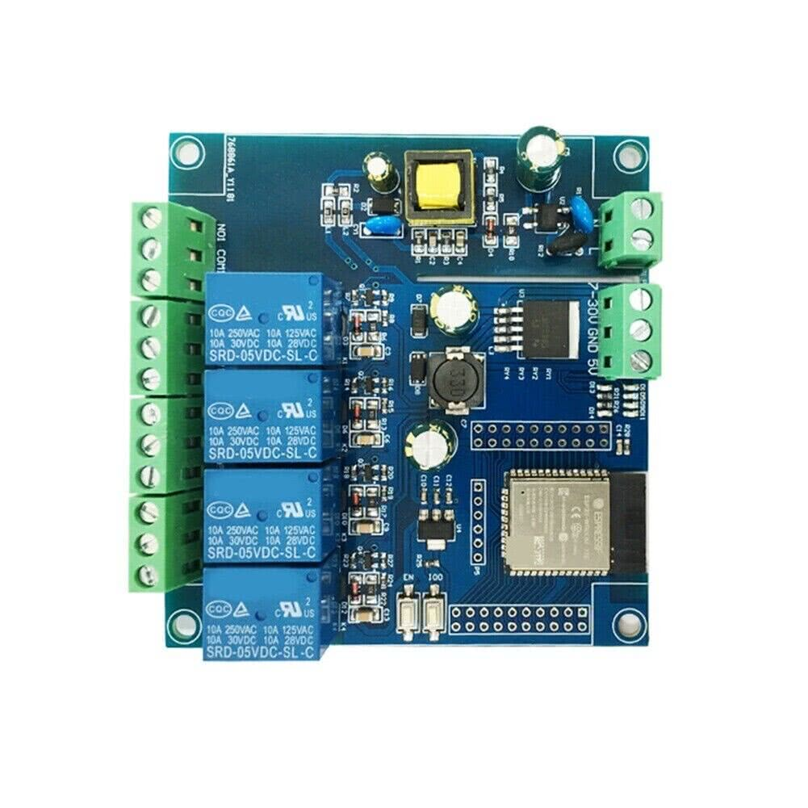
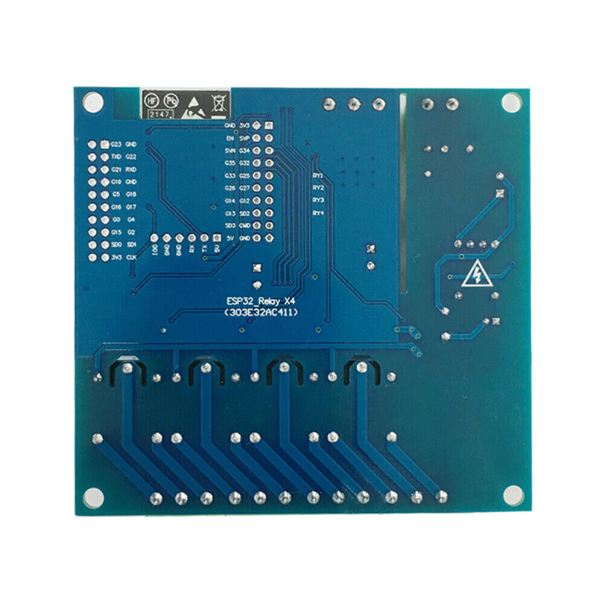

## Product description

This is a 4-relay board with an ESP32-WROOM-E that can be powered from AC mains and vide range of VDC.

Each relay has COM+NO+NC exposed. Product descriptions don't seem to specify maximum load. Each relay supports 10Amp max load, acconding to the label.

The board can be powered either via 120-220VAC, 7-30VDC or 5VDC (separate connectors).

I bought it from: [eBay](https://www.ebay.com/itm/295164946172), but very similar boards are being sold everywhere.

Note: v1.1 of this board is nearly identical except the chip is an ESP32-WROOOM-32E

## Pinout

This board has two double-row headers 10x2 for every GPIO pin on its ESP32 and a single row header for flashing.
Programming can be done with 3.3V connected to 5V pin and GPIO0 connected to GND (via jumper or a push button).
After flasing, if you want to test the board - it has to be powered properly via dedicated connectors, or via 5VDC applied to 5V ping.
If you'll power it up with 3.3V on 5V pin - the MCU will brownout.

### Programming header pinout

| Pin   | Comment                                                 |
| ----- | ------------------------------------------------------- |
| 5V    | Do not use 5V for programming                           |
| TX    | Exposed on board 3.3V level!                            |
| RX    | Exposed on board 3.3V level!                            |
| GND   |                                                         |
| GND   |                                                         |
| GPIO0 | 3.3V level! (Connected to a push button for programing) |

### Internal pinout

| Pin    | Function                      |
| ------ | ----------------------------- |
| GPIO23 | Status LED                    |
| GPIO32 | Relay #1                      |
| GPIO33 | Relay #2                      |
| GPIO25 | Relay #3                      |
| GPIO26 | Relay #4                      |

## Basic Config

```yaml
esphome:
  name: ac-dc-relay-x4
  friendly_name: ac-dc-relay-x4

esp32:
  board: esp32dev
  framework:
    type: arduino

output:
  - platform: gpio
    pin: GPIO23
    id: led
  - platform: gpio
    pin: GPIO32
    id: relay_pin_1
  - platform: gpio
    pin: GPIO33
    id: relay_pin_2
  - platform: gpio
    pin: GPIO25
    id: relay_pin_3
  - platform: gpio
    pin: GPIO26
    id: relay_pin_4

# Define the switches based on the relay pins
switch:
  - platform: output
    id: relay_1
    name: "Relay 1"
    output: relay_pin_1
  - platform: output
    id: relay_2
    name: "Relay 2"
    output: relay_pin_2
  - platform: output
    id: relay_3
    name: "Relay 3"
    output: relay_pin_3
  - platform: output
    id: relay_4
    name: "Relay 4"
    output: relay_pin_4

interval:
  - interval: 1000ms
    then:
      - output.turn_on: led
      - delay: 500ms
      - output.turn_off: led
```
