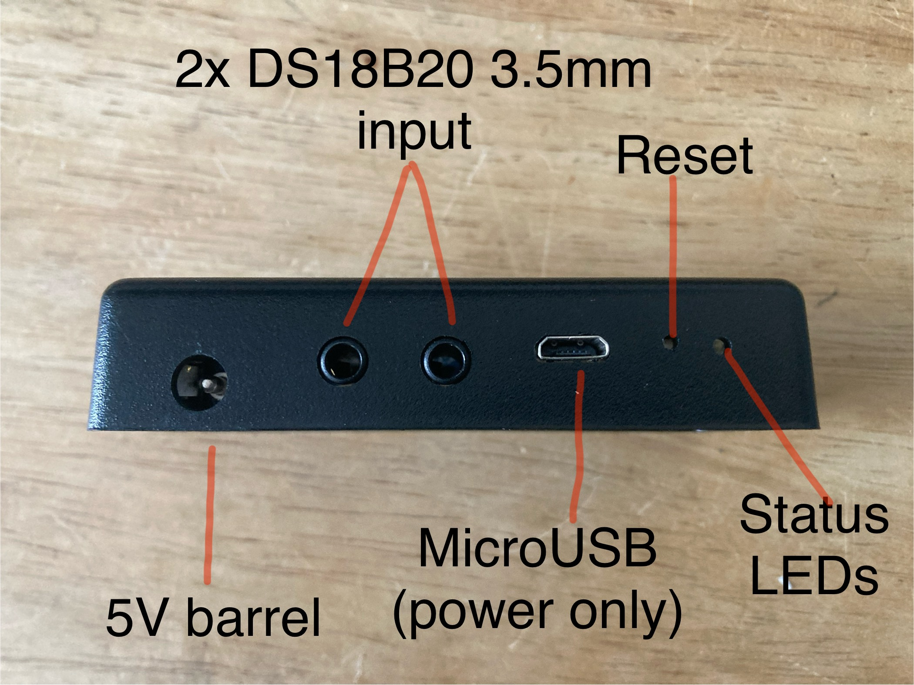
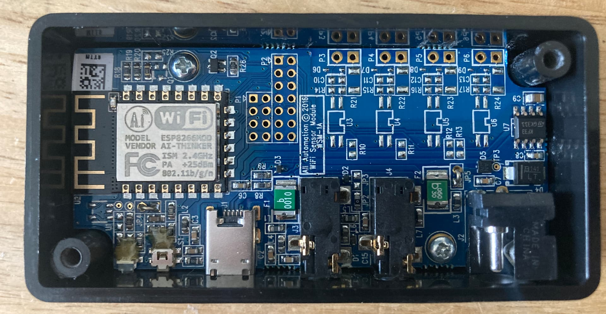

## Product description

The Advanced Detection Solutions Wi-Fi Temperature Monitor (WSM-1A) is a two zone Wi-Fi temperature monitor.
It is designed for use with a proprietary cloud backend but can be repurposed as a generic ESPHome device.
The board uses an ESP8266MOD (ESP-12F chip).

| Input    | Function   |
| ------ | ------------------------------- |
| 2x 3.5mm stereo jack input | DS18B20 one wire thermometer input |
| microUSB port | 5V power input (no data functions) |
| 5V barrel power connector | 5V power input |
| green status LED | Power on status |
| orange LED | GPIO controlable LED |
| reset button | currently unmapped |

The DS18B20 one wire thermometers are connected in series to GPIO2.
The orange LED is connected to GPIO15.
The green LED is always on as long as the board is powered.
Reset button function has not been decoded at time of writing.
Top of WSM-1A
")
Port side of WSM-1A


Two Philips screws on the base of the device release the bottom cover and expose the PCB.

PCB


Two more Philips screws on the board hold the PCB to the case.

## GPIO Pinout

| Pin    | Function                        |
| ------ | ------------------------------- |
| GPIO2  | One-Wire Bus for two DS18B20 Thermometers |
| GPIO15 | Orange LED (HIGH = off, LOW = on) |

## Factory Firmware Notes

If on factory software, holding reset for 5 seconds puts the device into Wi-Fi hotspot mode.
Connecting to the hotspot only allows for connection to another Wi-Fi network.
Once it joins Wi-Fi, orange LED flashes every 5 seconds.
Accesing the device over HTTP reveals a basic HTML page that reports Wi-Fi status only
If Wi-Fi credentials are wrong, status LED turns solid orange.
All other features require a cloud subscription to use on factory firmware.

## ESPHome Flashing

ESPHome is flashed intially using a USB to Serial TTL converter.
Connect the ESP8266 TxD to RxD, RxD to TxD, GND to GND and short FLASH to GND when powering on.
Use ESPHome Web Serial Flasher to initialize.
After uploading YAML code, check logs for the addresses of the DS18B20 thermometers and update YAML as necessary.
This YAML also programs the orange LED to flash if disconnected from Wi-Fi.

## Config

```yaml
esphome:
  name: WSM-1A
  friendly_name: Advanced Detection Solutions Wi-Fi Temperature Monitor (WSM-1A)
  comment: Two zone Wi-Fi temperature monitor

esp8266:
  board: esp01_1m

# Enable logging
logger:
  level: DEBUG

web_server:
  port: 80

# Enable one wire bus for thermometers
one_wire:
  - platform: gpio
    pin: GPIO2

sensor:
# Temperature sensor 1 
  - platform: dallas_temp
    name: Temperature_1
    update_interval: 30s
    address: (FILL IN ONE-WIRE BUS ADDRESS)
    unit_of_measurement: "°C"
    device_class: "temperature"
    accuracy_decimals: 1
    state_class: "measurement"
    icon: "mdi:thermometer"
# Temperature sensor 2
  - platform: dallas_temp
    name: Temperature_2
    update_interval: 30s
    address: (FILL IN ONE-WIRE BUS ADDRESS)
    unit_of_measurement: "°C"
    device_class: "temperature"
    accuracy_decimals: 1
    state_class: "measurement"
    icon: "mdi:thermometer"
# Wifi signal strength
  - platform: wifi_signal
    name: "WiFi Signal Strength"
    unit_of_measurement: "dBm"
    accuracy_decimals: 0
    update_interval: 30s
# Uptime
  - platform: uptime
    type: seconds
    name: Uptime

switch:
# Orange LED switch
  - platform: gpio
    pin: GPIO15
    id: "Orange_LED"
    restore_mode: ALWAYS_OFF

ota:
  - platform: esphome
    password: !secret ota_password

# Enable Home Assistant API
api:
  encryption:
    key: !secret api_encryption_key    

wifi:
  ssid: !secret wifi_ssid
  password: !secret wifi_password
  reboot_timeout: 0s  # Disable automatic reboot
  power_save_mode: none
  fast_connect: true # Trigger when Wi-Fi disconnects
  on_disconnect:
    - logger.log: "Wi-Fi Disconnected! Attempting reconnection..."
    - while:
        condition:
          not:
            wifi.connected:
        then:
          - switch.turn_on: Orange_LED
          - delay: 500ms
          - switch.turn_off: Orange_LED
          - delay: 500ms


  # Enable fallback hotspot (captive portal) in case wifi connection fails
  ap:
    ssid: "WSM-1A Fallback Hotspot"
    password: !secret captive_portal_password

captive_portal:

```
