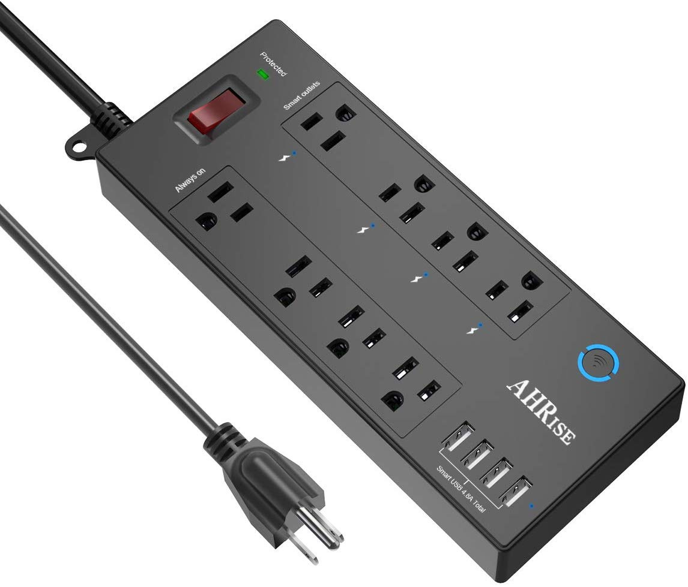

## Product Images



## GPIO Pinout

| Pin    | Function             |
| ------ | -------------------- |
| GPIO04 | Status LED inverted  |
| GPIO05 | Push Button          |
| GPIO12 | Relay 2 not inverted |
| GPIO13 | Relay 1 not inverted |
| GPIO14 | Relay 3 not inverted |
| GPIO15 | Relay 4 not inverted |

## Basic Configuration

```yaml
# Basic Config
---
substitutions:
  displayname: "AHRise Power Strip"
  unique_id: "ahrise_ahr-083"

esphome:
  name: ${unique_id}

esp8266:
  board: esp01_1m
  restore_from_flash: true

# WiFi connection
wifi:
  ssid: !secret wifi_ssid
  password: !secret wifi_password
  ap:

captive_portal:

# Enable logging
logger:

# Enable Home Assistant API
api:
  reboot_timeout: 0s
  encryption:
    key: !secret api_encryption_key

text_sensor:
  - platform: wifi_info
    ip_address:
      name: "${displayname} IP Address"

ota:
  password: !secret ota_password

switch:
  - platform: gpio
    name: "${displayname} Relay 1"
    id: relay1
    pin:
      number: GPIO13
  - platform: gpio
    name: "${displayname} Relay 2"
    id: relay2
    pin:
      number: GPIO12
  - platform: gpio
    name: "${displayname} Relay 3"
    pin:
      number: GPIO14
    id: relay3
  - platform: gpio
    name: "${displayname} Relay 4"
    id: relay4
    pin:
      number: GPIO15
  - platform: restart
    name: "${displayname} Restart"

light:
  # Blue LED PWM
  # GPIO4
  - platform: monochromatic
    name: "${displayname} Blue LED"
    output: output_component_blue

output:
  #Blue LED
  - platform: esp8266_pwm
    id: output_component_blue
    pin: GPIO4
    inverted: yes

# Button & Automation to toggle all switches
# GPIO5

binary_sensor:
  - platform: gpio
    pin: GPIO5
    id: button
    name: "${displayname} Button"
    on_press:
      - switch.toggle: relay1
      - switch.toggle: relay2
      - switch.toggle: relay3
      - switch.toggle: relay4
    internal: True

  # Binary sensor to display the connected status
  - platform: status
    name: "${displayname} Status"
```
