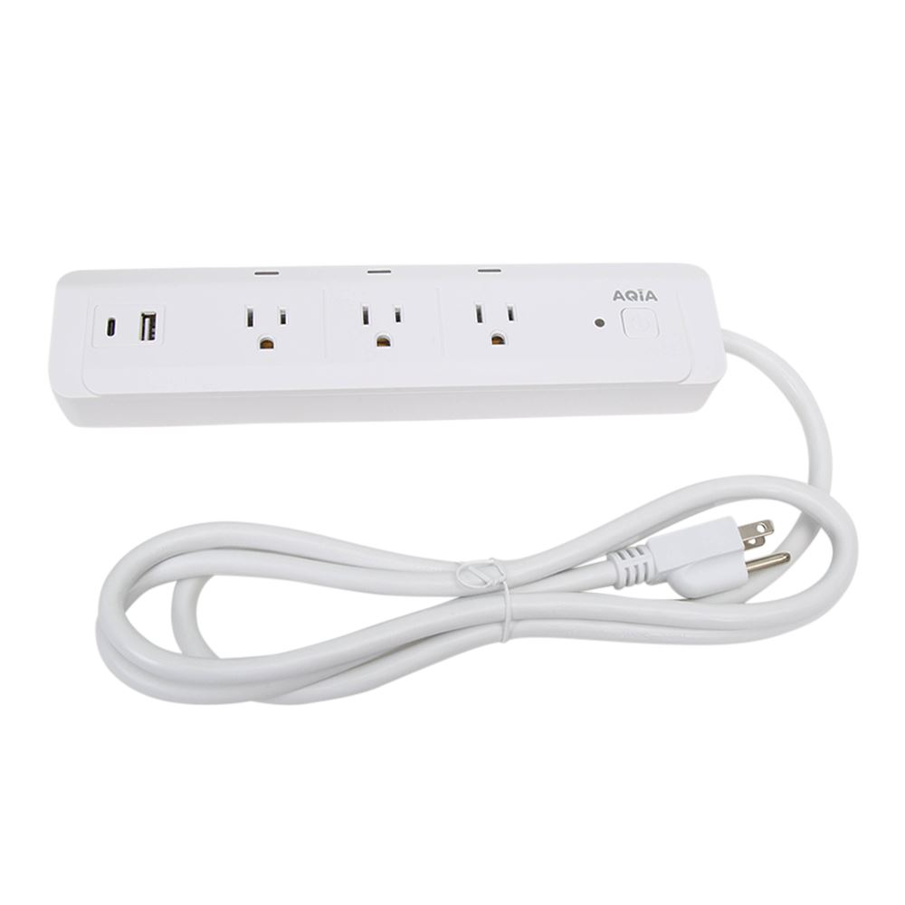

## Description

The AQiA Smart WiFi Power Strip is a three outlet smart power strip, [sold by Micro Center](https://www.microcenter.com/product/665655/aqia-smart-wi-fi-power-strip) and manufactured by IPOTEK (manufacturer part number SK569-WU-AC). The three outlets are independently switchable via software, while the two USB ports are permanently on. Each outlet has an indicator light that is lit when the relay is closed, and cannot be controlled in software. The only physical control on the device is a single power button that has a propensity to get stuck.

Internally the strip is powered by a CB2S module, which uses the BK7231N controller.

## GPIO Pinout

| Pin | Function   |
| --- | ---------- |
| P26 | Outlet 1   |
| P8  | Outlet 2   |
| P24 | Outlet 3   |
| P7  | Button     |
| P10 | Status LED |

## Flashing

This device is not vulnerable to `tuya-cloudcutter` or `tuya-convert`, so the only method of flashing it is by soldering wires to the chip and using `ltchiptool` to overwrite its firmware. I could not find any easily accessible UART pads on the board, and had to solder to the chip itself. [A pinout for this module is available on the LibreTiny site](https://docs.libretiny.eu/boards/cb2s/#pinout). Since the chip is mechanically mounted upside down on the control board, it's worth rotating the image upside down as well so you can be sure you're soldering wires to the correct pads. The chip operates at 3.3v.

During the flashing process in `ltchiptool`, you'll also have to bridge `CEN` to ground briefly. I was able to do so with a regular jumper wire, no soldering required.

## Configuration

Some sections containing required or default ESPHome configuration have been removed. Make sure they're filled out in your config.

```yaml
esphome:
  name: aqia-smart-power-strip
  friendly_name: AQiA Smart Power Strip

bk72xx:
  board: generic-bk7231n-qfn32-tuya

switch:
  - platform: gpio
    id: switch_1
    name: Switch 1
    pin: P26
    on_turn_on:
      then:
        - script.execute: light_status_update
    on_turn_off:
      then:
        - script.execute: light_status_update
  - platform: gpio
    id: switch_2
    name: Switch 2
    pin: P8
    on_turn_on:
      then:
        - script.execute: light_status_update
    on_turn_off:
      then:
        - script.execute: light_status_update
  - platform: gpio
    id: switch_3
    name: Switch 3
    pin: P24
    on_turn_on:
      then:
        - script.execute: light_status_update
    on_turn_off:
      then:
        - script.execute: light_status_update

binary_sensor:
  - platform: gpio
    id: binary_switch_all
    pin:
      number: P7
      inverted: true
      mode: INPUT_PULLUP
    on_press:
      then:
        - if:
            all:
              - switch.is_off: switch_1
              - switch.is_off: switch_2
              - switch.is_off: switch_3
            then:
              - switch.turn_on: switch_1
              - switch.turn_on: switch_2
              - switch.turn_on: switch_3
            else:
              - switch.turn_off: switch_1
              - switch.turn_off: switch_2
              - switch.turn_off: switch_3

light:
  - platform: status_led
    id: light_status
    pin:
      number: P10
      inverted: true

script:
  - id: light_status_update
    then:
      - if:
          all:
            - switch.is_off: switch_1
            - switch.is_off: switch_2
            - switch.is_off: switch_3
          then:
            - light.turn_off: light_status
          else:
            - light.turn_on: light_status
```
