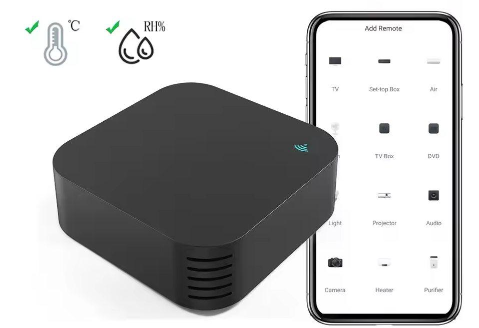

## General Notes

There's two hardware iterations of this particular IR blaster: with and without AHT20 Sensor, and [a simple one one that don't have temperture/humidity sensor](/devices/AVATTO-S06-IR-Remote-no-temp-no-humidity-new-version). Outwardly, both appear identical.

## GPIO Pinout

| Pin    | Function           |
| ------ | ------------------ |
| GPIO8  | Blue Status LED    |
| GPIO26 | Remote Transmitter |
| GPIO7  | Remote Receiver    |
| GPIO6  | Reset Button       |

## Getting it up and running

This device needs very likely to be flashed manually. Tuya-convert didn't worked for me. I have powered the device with
a mobile charger during the flashing procedure, as the used serial cable sets to logic level based on the input voltage.
Which is 3.3V in this case.
To enter a BOOT mode short-circuit the CEN and GND outputs

| Serial | CB3S        |
| ------ | ----------- |
| RX     | TX1         |
| TX     | RX1         |
| RTS    | CEN         |
| 3.3V   | 3.3V        |
| GND    | GND         |


### Flashing

```bash
# Create a backup of the original firmware
esptool.py -p /dev/ttyUSB0 -b 230400 read_flash 0x00000 0x100000 avotta_s06Pro_original_firmware.bin

# Erase the flash
esptool.py -p /dev/ttyUSB0 erase_flash

# Upload the esphome firmware
esptool.py -p /dev/ttyUSB0 write_flash -fs 1MB 0x0 ir_remote.bin
```


## Configuration

```yaml
# Basic Config
---
esphome:
  name: ir_remote

bk72xx:
  board: cb3s

wifi:
  ssid: !secret wifi_ssid
  password: !secret wifi_password
  ap:

captive_portal:

# Enable logging
logger:
  level: DEBUG # Default

# Enable Home Assistant API
api:
  encryption:
    key: !secret api_encryption_key

ota:
  password: !secret ota_password

light:
  - platform: status_led
    name: "Status LED"
    pin: GPIO8

binary_sensor:
  - platform: gpio
    name: "Button"
    pin:
      number: 6
      inverted: true
      mode:
        input: true
        pullup: true

remote_transmitter:
  pin: GPIO26
  carrier_duty_percent: 50%

remote_receiver:
  pin:
    number: GPIO7
    inverted: true
    mode:
      input: true
      pullup: true

uart:
  rx_pin: RX1
  tx_pin: TX1
  baud_rate: 9600

tuya:

sensor:
  - platform: tuya
    sensor_datapoint: 101
    id: temperature
    name: "Temperature"
    unit_of_measurement: "°C"
    accuracy_decimals: 1
    filters:
      - multiply: 0.1
  - platform: tuya
    sensor_datapoint: 102
    id: humidity
    name: "Humidity"
    unit_of_measurement: "%"
    accuracy_decimals: 0
```
