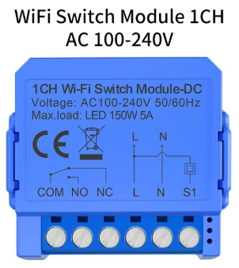
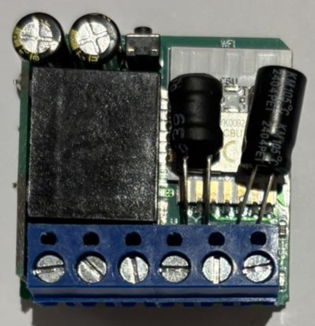
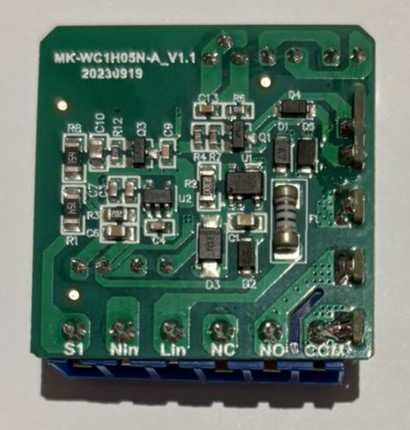

## GPIO Pinout

| Pin    | Function           |
| ------ | ------------------ |
| GPIO6  | Blue Status LED    |
| GPIO8  | Button             |
| GPIO14 | S1 Input           |
| GPIO20 | Relais             |

## Configuration

```yaml
# Basic Config

esphome:
  name: "relais1"
  friendly_name: Relais1

bk72xx:
  board: generic-bk7231n-qfn32-tuya

logger:

api:

ota:
  - platform: esphome

wifi:
  networks:
  - ssid: !secret wifi_ssid
    password: !secret wifi_password
  - ssid: "secondWiFi"
    password: "secondWiFi"

captive_portal:

light:
  - platform: status_led
    internal: true
    name: "State"
    pin:
      number: P6
      inverted: true
    id: led

binary_sensor:
  - platform: gpio
    id: button_onoff
    pin:
      number: P8
      inverted: true
      mode: INPUT_PULLUP
    filters:
     - delayed_on_off: 50ms
    on_press:
      then:
        - switch.toggle: relais
  - platform: gpio
    id: signal_onoff
    pin:
      number: P14
      inverted: true
      mode: INPUT_PULLUP
    filters:
     - delayed_on_off: 50ms
    on_press:
      then:
        - switch.turn_on: relais
    on_release:
      then:
        - switch.turn_off: relais

switch:
  - platform: output
    id: relais
    name: "${friendly_name}"
    output: relayoutput
    on_turn_on:
      then:
        - light.turn_on: led
    on_turn_off:
      then:
        - light.turn_off: led

output:
  - platform: gpio
    id: relayoutput
    pin: P20
```
