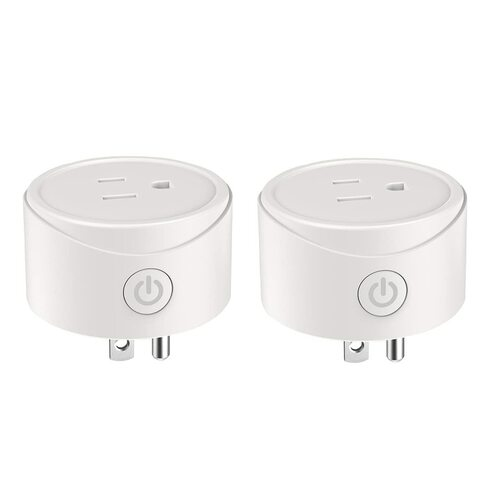

[Amazon Link](https://amzn.to/3ACOgKO)

## Product Image



## General Notes

Model Reference: AWP02L2

Manufacturer: [Avatar](https://www.avatarcontrols.com/)

The [Avatar Smart Mini WiFi Plug](https://shop.avatarcontrols.com/smart-mini-wifi-plug.html) is available at [Amazon.com](https://amzn.to/3ACOgKO). The product is sold under the Round Arc style.

This plug can be converted using [tuya-convert to flash ESPHome](/guides/tuya-convert/) (as of January 2022).

## GPIO Pinout

| Pin    | Function              |
| ------ | --------------------- |
| GPIO2  | Blue LED (inverted)   |
| GPIO13 | Button (input_pullup) |
| GPIO15 | Relay                 |

## Basic Configuration

```yaml
substitutions:
  device_name: avatar_awp02l2
  friendly_name: Avatar AWP02L2

esphome:
  name: "${device_name}"

esp8266:
  board: esp01_1m

wifi:
  ssid: !secret wifi_ssid
  password: !secret wifi_password
  ap:

# Enable logging
logger:

# Enable Home Assistant API
api:

ota:
  password: !secret avatar_1_ota

binary_sensor:
  - platform: gpio
    pin:
      number: GPIO13
      mode: INPUT_PULLUP
      inverted: True
    name: "${friendly_name} Button"
    id: "${device_name}_button"
    on_press:
      - switch.toggle: "${device_name}_relay"
  - platform: status
    name: "${friendly_name} Status"
    id: "${device_name}_status"

switch:
  - platform: gpio
    name: "${friendly_name} Relay"
    id: "${device_name}_relay"
    pin: GPIO15
    on_turn_on:
      - output.turn_on: led
    on_turn_off:
      - output.turn_off: led

output:
  - platform: gpio
    pin: GPIO2
    inverted: true
    id: led

sensor:
  - platform: wifi_signal
    name: "${friendly_name} WiFi signal"
    id: "${device_name}_wifi_signal"
    update_interval: 60s
  - platform: uptime
    name: "${friendly_name} Uptime"
    id: "${device_name}_uptime"
    update_interval: 60s

text_sensor:
  - platform: version
    name: "${friendly_name} ESPHome Version"
    id: "${device_name}_esphome_version"
```
