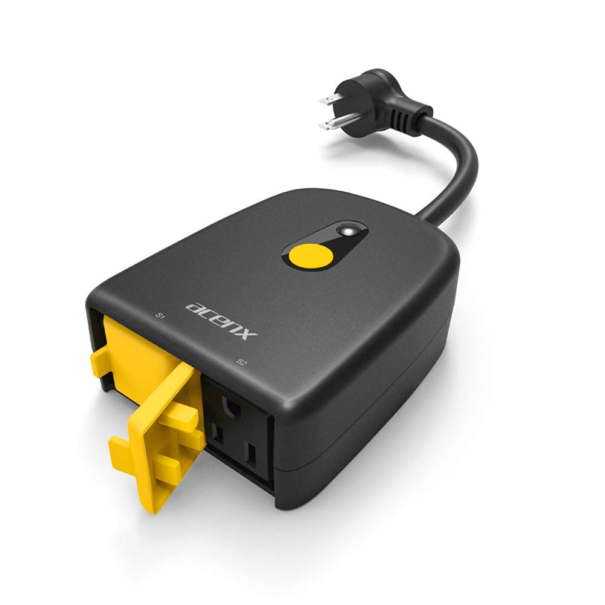

## GPIO Pinout

| Pin    | Function             |
| ------ | -------------------- |
| GPIO04 | Led1i (Blue)         |
| GPIO05 | Led2i (Green)        |
| GPIO12 | Relay1               |
| GPIO13 | Button1              |
| GPIO14 | Relay2               |

The physcal button operates both relays.  Toggle `relay1` using a short press and `relay2` using a long press.  Timing can be adjusted in configuration.  The blue LED is for status and green will be on if either or both relays are on.  The green LED will be off if both relays are off.

## Basic Configuration

```yaml
substitutions:
  device_name: acenx-sop04-us
  friendly_name: Acenx SOP04-US

esphome:
  name: "${device_name}"

esp8266:
  board: esp01_1m

wifi:
  ssid: !secret wifi_ssid
  password: !secret wifi_password
  ap:

# Enable logging
logger:

# Enable Home Assistant API
api:

ota:
  password: !secret ota

binary_sensor:
  - platform: gpio
    pin:
      number: GPIO13
      mode: INPUT_PULLUP
      inverted: yes
    name: "${friendly_name} Button"
    on_click:
      - min_length: 50ms
        max_length: 350ms
        then:
          - switch.toggle: "relay1"
      - min_length: 500ms
        max_length: 1000ms
        then:
          - switch.toggle: "relay2"
  - platform: status
    name: "${friendly_name} Status"

switch:
  - platform: gpio
    name: "${friendly_name} Relay1"
    id: "relay1"
    pin: GPIO12
    inverted: no
    on_turn_on:
      then:
        - output.turn_on: led
    on_turn_off:
      then:
        - if:
            condition:
              - switch.is_off: relay2
            then:
              - output.turn_off: led
  - platform: gpio
    name: "${friendly_name} Relay2"
    id: "relay2"
    pin: GPIO14
    inverted: no
    on_turn_on:
      then:
        - output.turn_on: led
    on_turn_off:
      then:
        - if:
            condition:
              - switch.is_off: relay2
            then:
              - output.turn_off: led

status_led:
  pin:
    number: GPIO04
    inverted: true

output:
  - platform: gpio
    pin: GPIO05
    inverted: true
    id: led

sensor:
  - platform: wifi_signal
    name: "${friendly_name} WiFi signal"
    update_interval: 60s
  - platform: uptime
    name: "${friendly_name} Uptime"
    update_interval: 60s

text_sensor:
  - platform: version
    name: "${friendly_name} ESPHome Version"
```
