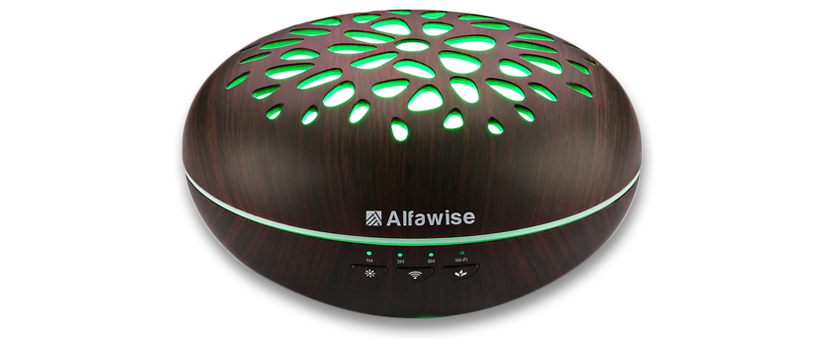
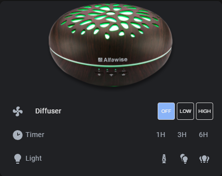

## Alfawise SJ-7 (Essential oil diffuser)



### Updated for ESPHOME 2025.2.0 and later (2025-03-04)

https://esphome.io/guides/contributing#a-note-about-custom-components

### Working

- All essential oil diffuser related controls (ON/OFF; LOW/HIGH; Timer 1H/3H/6H).
- Lava lamp lighting activation, fast/slow color change, I can add stop color change button if needed.
- OTA upgrade.

### Not Working

- Use the light like a classic bulb (just on of off and choose a color).

## Installation

## Flashing

For flashing, you have to solder wires like this:


Use U0TXD, U0RXD, GND (and VCC if you dont want to use the diffuser power supply).

Make sure to ground GPIO0 during boot.

You can use the ESPHome add-on from Home Assistant Community Add-ons

## Basic Configuration

```yaml
external_components:
  - source: github://antibill51/Alfawise_SJ-7_HASSIO/esphome

substitutions:
  name: alfawise
  friendly_name: "alfawise SJ-7"

# ! (START) VALUES TO CHANGE !
  wifi_ssid: !secret wifi_ssid
  wifi_password: !secret wifi_password
  ap_password: "xxx"
  ota_password: xxx
# ! (END) VALUES TO CHANGE !

  #commands
  receive_timer1h: "55:AA:03:1F:09:01:2B"
  receive_timer3h: "55:AA:03:1F:09:02:2C"
  receive_timer6h: "55:AA:03:1F:09:03:2D"
  receive_high: "55:AA:03:1F:07:02:2A"
  receive_low: "55:AA:03:1F:07:01:29"
  receive_lava_lamp: "55:AA:03:1F:02:01:24"
  receive_rainbow_slow: "55:AA:03:1F:0C:01:2E"
  receive_rainbow_fast: "55:AA:03:1F:0C:03:30"
  receive_lava_lamp_on_diff: "55:AA:02:04:01:06"
  receive_diff_on_switch: "55:AA:02:03:01:05"
  receive_light_off_switch: "55:AA:02:04:00:05"
  receive_light_diff_off_esp: "55:AA:02:1F:0E:2E"
  receive_diff_off_esp: "55:AA:03:1F:07:00:28"
  receive_light_off_esp: "55:AA:03:1F:02:00:23"

esphome:
  name: ${name}

  on_boot:
    priority: -100.0
    then:
      - switch.turn_off: power_high
      - lambda: id(${name}_fan).speed = 0;
      - switch.turn_off: lava_lamp
      - switch.turn_on: wifi_blinkin_slow
      - delay: 5s
      - switch.turn_off: wifi_blinkin_slow

esp8266:
  board: esp01_1m
debug:
logger:
  baud_rate: 0
  level: debug
  esp8266_store_log_strings_in_flash: False

ota:
  - platform: esphome  
    password: ${ota_password}

uart:
  id: uart_bus
  tx_pin: GPIO1
  rx_pin: GPIO3
  baud_rate: 9600
  stop_bits: 1
  # debug:
  #   direction: BOTH
  #   dummy_receiver: false
  #   after:
  #     delimiter: "\n"
  #     bytes: 256
  #   sequence:
  #     - lambda: UARTDebug::log_hex(direction, bytes, ':');

wifi:
  ssid: ${wifi_ssid}
  password: ${wifi_password}

  # Enable fallback hotspot (captive portal) in case wifi connection fails
  ap:
    ssid: "${friendly_name} Fallback Hotspot"
    password: ${ap_password}
api:
web_server:
  port: 80

  # Sync time with Home Assistant.
time:
  - platform: homeassistant
    id: homeassistant_time

  - platform: sntp
    on_time:
      # Every 1 seconds
      - seconds: /1
        then:
          - if:
              condition:
                and:
                  - switch.is_off: power_low
                  - switch.is_off: power_high
                  - fan.is_on: ${name}_fan
              then:
                - switch.turn_on: update_fan_speed
              else:
                - if:
                    condition:
                      and:
                        - switch.is_on: power_low
                        - switch.is_off: power_high
                        - or:
                            - lambda: |-
                                if (id(${name}_fan).speed == 2) {
                                  return true;
                                }else{
                                  return false;
                                }
                            - lambda: |-
                                if (id(${name}_fan).speed == 0) {
                                  return true;
                                }else {
                                  return false;
                                }
                    then:
                      - switch.turn_on: update_fan_speed
                    else:
                      - if:
                          condition:
                            and:
                              - switch.is_off: power_low
                              - switch.is_on: power_high
                              - or:
                                  - lambda: |-
                                      if (id(${name}_fan).speed ==1) {
                                        return true;
                                      }else {
                                        return false;
                                      }
                                  - lambda: |-
                                      if (id(${name}_fan).speed == 0) {
                                        return true;
                                      }else {
                                        return false;
                                      }
                          then:
                            - switch.turn_on: update_fan_speed

# Text sensors with UART received information.
text_sensor:
  - platform: uart_readline_custom
    id: uart_readline
    name: ${name} serial
    uart_id: uart_bus
  - platform: wifi_info
    ip_address:
      name: ${name} ip
    ssid:
      name: ${name} ssid
    bssid:
      name: ${name} bssid
  - platform: version
    name: ${name} ESPHome Version

sensor:
  # Uptime sensor
  - platform: uptime
    name: ${name} uptime
    unit_of_measurement: d
    update_interval: 300s
    accuracy_decimals: 1
    filters:
      - multiply: 0.000011574
  # WiFi Signal sensor
  - platform: wifi_signal
    name: ${name} signal
    update_interval: 60s
    accuracy_decimals: 0

output:
  - platform: fake_fan_output
    id: fanoutput

switch:
  - platform: template
    id: timer1h
    name: ${name} Timer 1H
    icon: mdi:timer-sand-empty
    disabled_by_default: false
    optimistic: false
    assumed_state: false
    lambda: |-
      if (id(uart_readline).state == "${receive_timer1h}") {
        return true;
      } else if(id(uart_readline).state == "${receive_timer3h}") {
        return false;
      } else if(id(uart_readline).state == "${receive_timer6h}") {
        return false;
      } else if(id(uart_readline).state == "${receive_light_off_switch}") {
        return false;
      } else if(id(uart_readline).state == "${receive_light_diff_off_esp}") {
        return false;
      } else if(id(uart_readline).state == "${receive_diff_off_esp}") {
        return false;
      } else {
        return {};
      }
    turn_on_action:
      then:
        - if:
            condition:
              and:
                - fan.is_off: ${name}_fan
            then:
              - fan.turn_on:
                  id: ${name}_fan
                  speed: 1
              - delay: 500ms
        - uart.write: [0x55, 0xAA, 0x03, 0x09, 0x01, 0x00, 0x0c]
        - delay: 1h
        - uart.write: [0x55, 0xaa, 0x03, 0x0e, 0x00, 0x00, 0x10]
    turn_off_action:
      then:
        - uart.write: [0x55, 0xaa, 0x03, 0x0e, 0x00, 0x00, 0x10]
  - platform: template
    id: timer3h
    name: ${name} Timer 3H
    icon: mdi:timer-sand-complete
    disabled_by_default: false
    optimistic: false
    assumed_state: false
    lambda: |-
      if (id(uart_readline).state == "${receive_timer3h}") {
        return true;
      } else if(id(uart_readline).state == "${receive_timer1h}") {
        return false;
      } else if(id(uart_readline).state == "${receive_timer6h}") {
        return false;
      } else if(id(uart_readline).state == "${receive_light_off_switch}") {
        return false;
      } else if(id(uart_readline).state == "${receive_light_diff_off_esp}") {
        return false;
      } else if(id(uart_readline).state == "${receive_diff_off_esp}") {
        return false;
      } else {
        return {};
      }
    turn_on_action:
      then:
        - if:
            condition:
              and:
                - fan.is_off: ${name}_fan
            then:
              - fan.turn_on:
                  id: ${name}_fan
                  speed: 1
              - delay: 500ms
        - uart.write: [0x55, 0xAA, 0x03, 0x09, 0x02, 0x00, 0x0d]
        - delay: 3h
        - uart.write: [0x55, 0xaa, 0x03, 0x0e, 0x00, 0x00, 0x10]
    turn_off_action:
      then:
        - uart.write: [0x55, 0xaa, 0x03, 0x0e, 0x00, 0x00, 0x10]
  - platform: template
    id: timer6h
    name: ${name} Timer 6H
    icon: mdi:timer-sand
    disabled_by_default: false
    optimistic: false
    assumed_state: false
    lambda: |-
      if (id(uart_readline).state == "${receive_timer6h}") {
        return true;
      } else if(id(uart_readline).state == "${receive_timer1h}") {
        return false;
      } else if(id(uart_readline).state == "${receive_timer3h}") {
        return false;
      } else if(id(uart_readline).state == "${receive_light_off_switch}") {
        return false;
      } else if(id(uart_readline).state == "${receive_light_diff_off_esp}") {
        return false;
      } else if(id(uart_readline).state == "${receive_diff_off_esp}") {
        return false;
      } else {
        return {};
      }
    turn_on_action:
      then:
        - if:
            condition:
              and:
                - fan.is_off: ${name}_fan
            then:
              - fan.turn_on:
                  id: ${name}_fan
                  speed: 1
              - delay: 500ms
        - uart.write: [0x55, 0xAA, 0x03, 0x09, 0x03, 0x00, 0x0e]
        - delay: 6h
        - uart.write: [0x55, 0xaa, 0x03, 0x0e, 0x00, 0x00, 0x10]
    turn_off_action:
      then:
        - uart.write: [0x55, 0xaa, 0x03, 0x0e, 0x00, 0x00, 0x10]
  - platform: template
    id: power_high
    icon: mdi:fan
    disabled_by_default: true
    optimistic: false
    assumed_state: false
    lambda: |-
      if (id(uart_readline).state == "${receive_high}") {
        return true;
      } else if (id(uart_readline).state == "${receive_diff_on_switch}") {
        return true;
      } else if(id(uart_readline).state == "${receive_light_off_switch}") {
        return false;
      } else if(id(uart_readline).state == "${receive_light_diff_off_esp}") {
        return false;
      } else if(id(uart_readline).state == "${receive_diff_off_esp}") {
        return false;
      } else {
        return {};
      }
    turn_on_action:
      - uart.write: [0x55, 0xAA, 0x03, 0x07, 0x02, 0x00, 0x0B]
    turn_off_action:
      - uart.write: [0x55, 0xaa, 0x03, 0x07, 0x00, 0x00, 0x09]
    on_turn_on:
      - switch.template.publish:
          id: power_low
          state: OFF
    on_turn_off:
      - switch.template.publish:
          id: power_low
          state: OFF

  - platform: template
    disabled_by_default: true
    id: power_low
    icon: mdi:fan
    optimistic: false
    assumed_state: false
    lambda: |-
      if (id(uart_readline).state == "${receive_low}") {
        return true;
      } else if(id(uart_readline).state == "${receive_light_off_switch}") {
        return false;
      } else if(id(uart_readline).state == "${receive_light_diff_off_esp}") {
        return false;
      } else if(id(uart_readline).state == "${receive_diff_off_esp}") {
        return false;
      } else {
        return {};
      }
    turn_on_action:
      - uart.write: [0x55, 0xaa, 0x03, 0x07, 0x01, 0x00, 0x0A]
    turn_off_action:
      - uart.write: [0x55, 0xaa, 0x03, 0x07, 0x00, 0x00, 0x09]
    on_turn_on:
      - switch.template.publish:
          id: power_high
          state: OFF
    on_turn_off:
      - switch.template.publish:
          id: power_high
          state: OFF

  - platform: template
    disabled_by_default: true
    id: wifi_blinkin_slow
    icon: mdi:led-on
    optimistic: true
    assumed_state: true
    turn_on_action:
      - uart.write: [0x55, 0xaa, 0x03, 0x03, 0x03, 0x00, 0x08]
    turn_off_action:
      - uart.write: [0x55, 0xaa, 0x03, 0x03, 0x01, 0x00, 0x06]
  - platform: template
    name: ${name} Lava Lamp
    id: lava_lamp
    icon: mdi:lava-lamp
    optimistic: false
    assumed_state: false
    lambda: |-
      if (id(uart_readline).state == "${receive_lava_lamp}") {
        return true;
      } else if (id(uart_readline).state == "${receive_lava_lamp_on_diff}") {
        return true;
      } else if(id(uart_readline).state == "${receive_light_off_switch}") {
        return false;
      } else if(id(uart_readline).state == "${receive_light_diff_off_esp}") {
        return false;
      } else if(id(uart_readline).state == "${receive_light_off_esp}") {
        return false;
      } else {
        return {};
      }
    turn_on_action:
      - uart.write: [0x55, 0xaa, 0x03, 0x02, 0x01, 0x01, 0x06]
    turn_off_action:
      - uart.write: [0x55, 0xaa, 0x03, 0x02, 0x00, 0x01, 0x05]
    on_turn_on:
      - switch.template.publish:
          id: rainbow_fast
          state: OFF
      - switch.template.publish:
          id: rainbow_slow
          state: OFF
    on_turn_off:
      - switch.template.publish:
          id: rainbow_fast
          state: OFF
      - switch.template.publish:
          id: rainbow_slow
          state: OFF

  - platform: template
    name: ${name} Rainbow Slow
    id: rainbow_slow
    icon: mdi:lightbulb-multiple
    optimistic: false
    assumed_state: false
    lambda: |-
      if (id(uart_readline).state == "${receive_rainbow_slow}") {
        return true;
      } else if(id(uart_readline).state == "${receive_light_off_switch}") {
        return false;
      } else if(id(uart_readline).state == "${receive_light_diff_off_esp}") {
        return false;
      } else if(id(uart_readline).state == "${receive_light_off_esp}") {
        return false;
      } else {
        return {};
      }
    turn_on_action:
      - uart.write: [0x55, 0xaa, 0x03, 0x0c, 0x01, 0x00, 0x0f]
    turn_off_action:
      - uart.write: [0x55, 0xaa, 0x03, 0x02, 0x00, 0x01, 0x05]
    on_turn_on:
      - switch.template.publish:
          id: rainbow_fast
          state: OFF
      - switch.template.publish:
          id: lava_lamp
          state: OFF
    on_turn_off:
      - switch.template.publish:
          id: rainbow_fast
          state: OFF
      - switch.template.publish:
          id: lava_lamp
          state: OFF

  - platform: template
    name: ${name} Rainbow Fast
    id: rainbow_fast
    icon: mdi:lightbulb-group
    optimistic: false
    assumed_state: false
    lambda: |-
      if (id(uart_readline).state == "${receive_rainbow_fast}") {
        return true;
      } else if(id(uart_readline).state == "${receive_light_off_switch}") {
        return false;
      } else if(id(uart_readline).state == "${receive_light_diff_off_esp}") {
        return false;
      } else if(id(uart_readline).state == "${receive_light_off_esp}") {
        return false;
      } else {
        return {};
      }
    turn_on_action:
      - uart.write: [0x55, 0xaa, 0x03, 0x0c, 0x03, 0x00, 0x11]
    turn_off_action:
      - uart.write: [0x55, 0xaa, 0x03, 0x02, 0x00, 0x01, 0x05]
    on_turn_on:
      - switch.template.publish:
          id: lava_lamp
          state: OFF
      - switch.template.publish:
          id: rainbow_slow
          state: OFF
    on_turn_off:
      - switch.template.publish:
          id: lava_lamp
          state: OFF
      - switch.template.publish:
          id: rainbow_slow
          state: OFF

  - platform: template
    disabled_by_default: true
    id: update_fan_speed
    optimistic: True
    turn_on_action:
      then:
        - delay: 500ms
        - if:
            condition:
              and:
                - switch.is_off: power_low
                - switch.is_off: power_high
            then:
              - fan.turn_off: ${name}_fan
            else:
              - if:
                  condition:
                    and:
                      - switch.is_on: power_low
                      - switch.is_off: power_high
                  then:
                    - fan.turn_on:
                        id: ${name}_fan
                        speed: 1
                  else:
                    - if:
                        condition:
                          and:
                            - switch.is_off: power_low
                            - switch.is_on: power_high
                        then:
                          - fan.turn_on:
                              id: ${name}_fan
                              speed: 2
        - switch.turn_off: update_fan_speed

fan:
  - platform: speed
    output: fanoutput
    id: ${name}_fan
    name: "${friendly_name} Fan"

    speed_count: 2
    on_turn_on:
      then:
        - if:
            condition:
              lambda: return (id(${name}_fan).speed == 0);
            then:
              - fan.turn_on:
                  id: ${name}_fan
                  speed: 1
              - switch.turn_on: power_low
            else:
              - if:
                  condition:
                    lambda: return (id(${name}_fan).speed == 1);
                  then:
                    - switch.turn_on: power_low
                  else:
                    - if:
                        condition:
                          lambda: return (id(${name}_fan).speed == 2);
                        then:
                          - switch.turn_on: power_high
        - if:
            condition:
              and:
                - switch.is_off: timer1h
                - switch.is_off: timer3h
                - switch.is_off: timer6h
            then:
              - delay: 500ms
              - switch.turn_on: timer1h
    on_turn_off:
      then:
        - lambda: id(${name}_fan).speed = 0;
        - switch.turn_off: power_low
        - switch.turn_off: power_high
    on_speed_set:
      then:
        - if:
            condition:
              and:
                - lambda: return (id(${name}_fan).speed == 0);
                - or:
                    - switch.is_on: power_low
                    - switch.is_on: power_high
            then:
              - switch.turn_off: power_high
              - switch.turn_off: power_low
            else:
              - if:
                  condition:
                    - lambda: return (id(${name}_fan).speed == 1);
                    - switch.is_off: power_low
                  then:
                    - switch.turn_on: power_low
                  else:
                    - if:
                        condition:
                          - lambda: return (id(${name}_fan).speed == 2);
                          - switch.is_off: power_high
                        then:
                          - switch.turn_on: power_high
              - if:
                  condition:
                    and:
                      - switch.is_off: timer1h
                      - switch.is_off: timer3h
                      - switch.is_off: timer6h
                  then:
                    - delay: 500ms
                    - switch.turn_on: timer1h
captive_portal:
```

## Home Assistant integration

### Lovelace card

For lovelace card, you need this HACS Addons :

- custom:vertical-stack-in-card https://github.com/ofekashery/vertical-stack-in-card
- custom:fan-percent-button-row https://github.com/finity69x2/fan-percent-button-row
- custom:paper-buttons-row https://github.com/jcwillox/lovelace-paper-buttons-row

File diffuser.png need to be in this path : config/www/

## Card config example

```yaml
type: custom:vertical-stack-in-card
cards:
  - type: picture-entity
    entity: switch.schedule_lave_linge
    image: /local/ressources/diffuseur/diffuseur.png
    show_state: false
    show_name: false
    tap_action:
      action: none
    hold_action:
      action: none
    style: |
      ha-card {
        border: none;
      }
  - type: entities
    entities:
      - entity: fan.alfawise_sj_7_fan
        type: custom:fan-percent-button-row
        name: Diffuser
        state_color: true
        isTwoSpeedFan: true
        customSetpoints: true
        reverseButtons: true
        sendStateWithSpeed: false
        lowPercentage: 50
        hiPercentage: 100
        width: 35px
        height: 35px
      - type: custom:paper-buttons-row
        buttons:
          - layout: icon|name
            icon: mdi:clock-time-two
            name: Timer
            style:
              button:
                width: 150%
                justify-content: left
            tap_action:
              action: none
          - entity: switch.alfawise_timer_1h
            layout: name
            name: 1H
            style:
              button:
                width: 17%
          - entity: switch.alfawise_timer_3h
            layout: name
            name: 3H
            style:
              button:
                width: 17%
          - entity: switch.alfawise_timer_6h
            layout: name
            name: 6H
            style:
              button:
                width: 17%
      - type: custom:paper-buttons-row
        buttons:
          - layout: icon|name
            icon: mdi:lightbulb
            name: Light
            style:
              button:
                width: 150%
                justify-content: left
            tap_action:
              action: none
          - entity: switch.alfawise_lava_lamp
            layout: icon
            style:
              button:
                width: 15%
          - entity: switch.alfawise_rainbow_slow
            layout: icon
            style:
              button:
                width: 15%
          - entity: switch.alfawise_rainbow_fast
            layout: icon
            style:
              button:
                width: 15%
    style: |
      ha-card {
        border: none;
        margin-top: -2%;
      }
```

### Lovelace card screenshot



## Original firmware

I have put a backup of the original firmware, and I also modified the AMA HOME APK but only for reconnect the original firmware to Wifi, ssg360 seems down.

https://github.com/antibill51/Alfawise_SJ-7_HASSIO/tree/master/Original%20firmware
