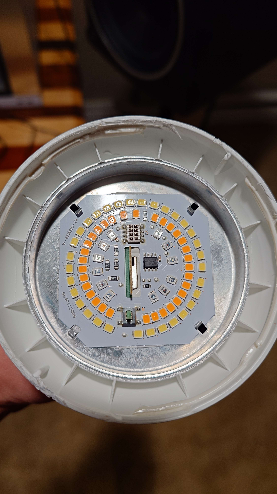

[Amazon Link](https://amzn.to/4flQsK3)

## Flashing With Cloudcutter

1. [Setup tuya-cloudcutter](https://github.com/tuya-cloudcutter/tuya-cloudcutter)
1. Create an Esphome configuration and download the version compiled for cloudcutter.
1. Place the bin file in the custom firmware directory for cloudcutter.
1. Start the cloudcutter process
1. Choose firmware version 2.9.16 (doule check your version in the Tuya app!)
1. When prompted, choose the custom firmware you just compiled.

## Images



## Links

[WB3L Information](https://docs.libretiny.eu/boards/wb3l/)

[Amazon Product Page](https://amzn.to/4flQsK3)

[Esphome Discord Discussion](https://discord.com/channels/429907082951524364/1297343211836280906/1297343213148835881)

## Configuration

```yaml
api:
  encryption:
    key: !secret api_key

ota:
  - platform: esphome
    password: !secret ota_password

wifi:
  ssid: !secret wifi_ssid
  password: !secret wifi_password
  ap:
    ssid: "Bar-Pendant-Left"
    password: !secret hotspot_password

substitutions:
  name: bar-pendant-left
  device: bar_pendant_left
  friendly_name: Bar Pendant Left

esphome:
  name: ${name}
  friendly_name: ${friendly_name}
  on_boot:
    priority: 600
    then:
      - light.turn_on:
          id: ${device}
          brightness: 100%
          color_brightness: 0%
          color_temperature: 2200K

bk72xx:
  board: wb3l

debug:
  update_interval: 30s

logger:

captive_portal:

text_sensor:
  - platform: debug
    device:
      name: Device Info
    reset_reason:
      name: Reset Reason
  - platform: libretiny
    version:
      name: LibreTiny Version

button:
  - platform: restart
    name: Restart

sensor:
  - platform: uptime
    device_class: duration
    name: Uptime

output:
  - platform: libretiny_pwm
    id: output_red
    pin: P8
  - platform: libretiny_pwm
    id: output_green
    pin: P24
  - platform: libretiny_pwm
    id: output_blue
    pin: P26
  - platform: libretiny_pwm
    id: output_white_brightness
    pin: P7
  - platform: libretiny_pwm
    id: output_white_temp
    pin: P6
    inverted: True

light:
  - platform: rgbct
    name: Light
    id: ${device}
    color_interlock: True
    red: output_red
    green: output_green
    blue: output_blue
    color_temperature: output_white_temp
    white_brightness: output_white_brightness
    cold_white_color_temperature: 6200K
    warm_white_color_temperature: 2000K
```
