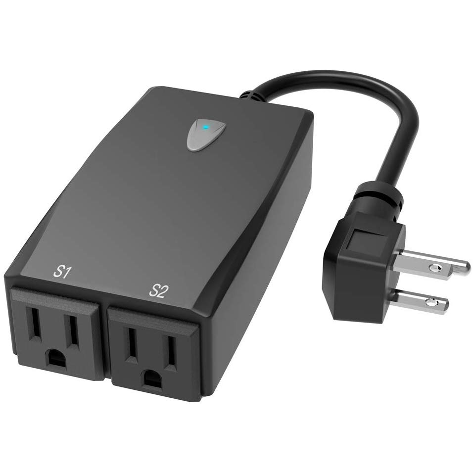

[Amazon Link](https://amzn.to/3XyT5Ag)

All information provided is from [Iprak](https://github.com/iprak) documentation.

The device has 2 indicator LEDs under the button and 2 indiviually controllable outlets.
[FCC filing](https://fccid.io/2AKBP-X13/)
[Tasmato](https://templates.blakadder.com/aoycocr_X13.html) wiki mentioned that it might not be able to use Tuya-Convert.

## Product Image



## GPIO Pinout

The GPIO pinout was learned from [Iprak](https://github.com/iprak/esphome/blob/master/Instructions/Aoycocr-x13.md) documentation.
The ESP module is ESP8266-S3 and the [FCC filing](https://fccid.io/2AKBPESP8266-S3/Users-Manual/User-Manual-3594791) provided the pins

1. EN
2. TOUT
3. GPIO12
4. GPIO14
5. GPIO13
6. GPIO15
7. GPIO0
8. GPIO2
9. GPIO4
10. GPIO 5
11. RX
12. TX
13. VCC
14. GND

The pins are on alternate sides:

```us

1  3  5  7  9  11  13
2  4  6  8  10 12  14

```

The GPIOs being used are:

* LED#1:GPIO0, inverted
* LED#2:GPIO2, inverted
* Button:GPIO13
* Relay1:GPIO15
* Relay2:GPIO12

## Basic Configuration

The below YAML template is from [Iprak](https://github.com/iprak/esphome/blob/master/x13.yaml) documentation.

```yaml

substitutions:
  devicename: aoycocr_x13
  proper_devicename: Aoycocr X13

esphome:
  name: $devicename

esp8266:
  board: esp01_1m
  arduino_version: espressif8266@2.6.2

wifi:
  ssid: !secret wifi_ssid
  password: !secret wifi_password
  ap:


captive_portal:
logger:
api:
ota:

# https://tasmota.github.io/docs/Components/
# https://templates.blakadder.com/aoycocr_X13.html

binary_sensor:
  - platform: gpio
    pin:
      number: GPIO13
    id: button
    on_press:
     - switch.toggle: relay1
     - switch.toggle: relay2

  - platform: status
    name: $devicename

switch:
  - platform: gpio
    name: "$devicename 1"
    pin: GPIO15
    id: relay1
    icon: "mdi:floor-lamp"
    #Led2 represents switch 1
    on_turn_on:
      - output.turn_on: led2
    on_turn_off:
      - output.turn_off: led2

  - platform: gpio
    name: "$devicename 2"
    pin: GPIO12
    id: relay2
    icon: "mdi:floor-lamp"

output:
  - platform: gpio
    pin: GPIO0
    id: led2
    inverted: yes

status_led:
  pin:
    number: GPIO2
    inverted: yes

```
