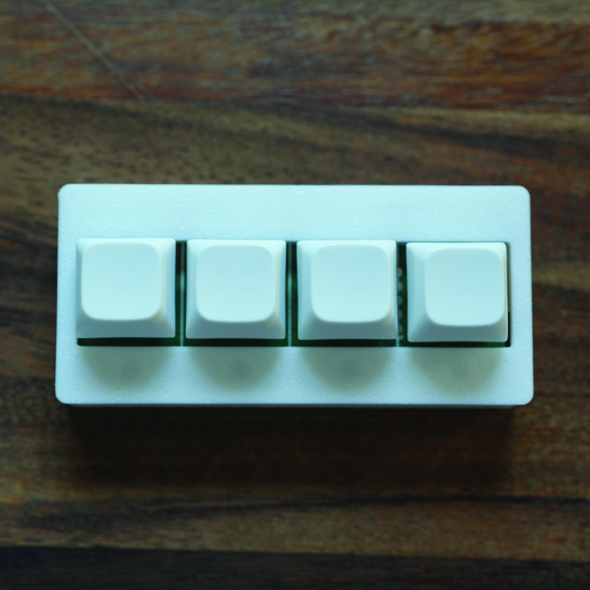
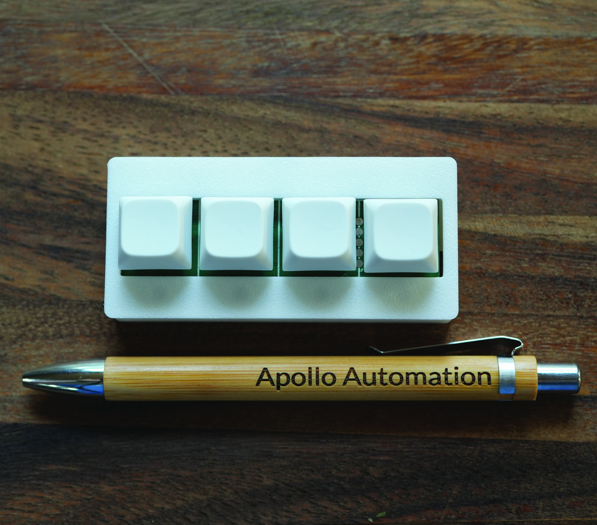

## Description

Meet the Apollo BTN-1 Macro Deck! A versatile, customizable control device that's perfect for creators, streamers, and smart home enthusiasts.

This compact powerhouse features four mechanical Cherry MX-compatible hot-swappable buttons with LEDs both under and in front of each key for clear visual feedback. Want to change the feel? Just swap the switches - no soldering required!

**The modular magic:**

- 4 hot-swappable Cherry MX buttons with dual LED feedback
- Large top attachments: e-ink display for status updates, NFC reader/emitter
- Side attachments: extra buttons, rotary dials, OLED screens, LED matrices, sensor mezzanines
- USB-C or battery powered for desktop or portable use
- Wi-Fi connectivity for wireless control and smart home integration

**Perfect for:**

- Streamers controlling OBS, lighting, and audio
- Smart home enthusiasts creating custom automation triggers
- Content creators with personalized macro workflows
- Industrial automation and IoT projects
- Anyone who wants tactile control over their digital world

The BTN-1's modular design means it grows with your needs. Start simple with four buttons, then add an e-ink display to show system stats, or attach an NFC reader for contactless controls. The possibilities are endless!

Want to trigger your "going live" scene with one button? Done. Need a physical volume knob that actually feels premium? Add a rotary dial. Want to monitor your room's CO2 levels while streaming? Pop in a sensor mezzanine.

It's like having a Swiss Army knife for your digital workspace, but way cooler and infinitely more customizable.

## Technical Specifications

- **Buttons**: 4 Cherry MX-compatible hot-swappable switches
- **LEDs**: Dual LED system (under-key and front indicator LEDs)
- **Modular Attachments**:
  - Top: E-ink display, NFC reader/emitter
  - Side: Additional buttons, rotary dials, OLED displays, LED matrices, sensor mezzanines
- **Power**: USB-C or battery powered
- **Connectivity**: Wi-Fi for wireless control and smart home integration
- **Compatibility**: Cherry MX switches, macro software, home automation platforms
- **Form Factor**: Compact desktop footprint with sturdy enclosure
- **Board**: ESP32-based
- **Use Cases**: Streaming control, smart home automation, macro programming, IoT projects

## Quickstart

1. Connect the BTN-1 via USB-C or power on with battery.
2. Connect to "Apollo BTN1 Hotspot".
3. Input WiFi credentials.
4. In Home Assistant, look at discovered devices.
5. Customize button functions and add modular attachments as needed.

## Links

- [Shop](https://apolloautomation.com/products/btn-1-macro-deck)
- [GitHub](https://github.com/ApolloAutomation/BTN-1)
- [Wiki](https://wiki.apolloautomation.com/)
- [Discord](https://dsc.gg/ApolloAutomation)
- [YouTube](https://www.youtube.com/@ApolloAutomation)

## Product Images

