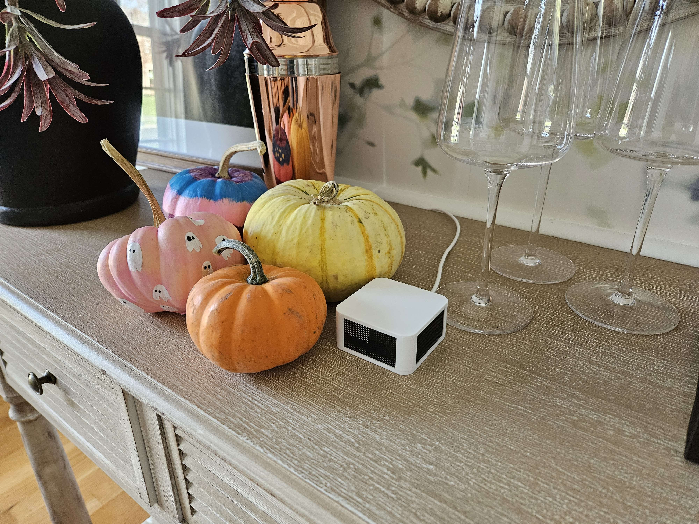
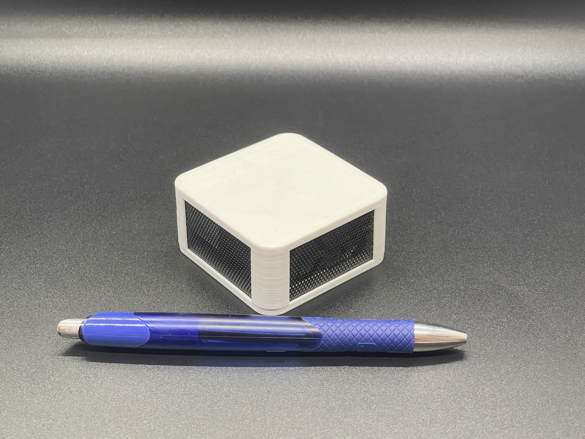

## Description

The Apollo Automation AIR-1 is an air quality sensor with the following features:

- SEN55: PM1, PM2.5, PM4, PM10, VOC, NOx, Temperature, and Humidity. 10-year sensor life.
- SCD40 CO2 Sensor.
- MiCS-4514 from DFRobot: CO (Carbon Monoxide), C2H5OH (Alcohol), H2, NO2, NH3 (Ammonia), and CH4 (Methane).
- RGB Pixel x3.
- Bluetooth tracking and Bluetooth proxy.
- GPIO Expansion: I2C, power, and GPIO pins exposed.

## Quickstart

1. Plug in the AIR-1.
2. Connect to "AIR1 Hotspot".
3. Input WiFi credentials.
4. In Home Assistant, look at discovered devices.

## Links

- [Shop](https://apolloautomation.com/products/air-1)
- [EU Distributor](https://opencircuit.shop/brand/apollo-automation)
- [GitHub](https://github.com/ApolloAutomation/AIR-1)
- [Wiki](https://wiki.apolloautomation.com/)
- [Discord](https://discord.gg/mMNgQPyF94)
- [YouTube](https://www.youtube.com/@ApolloAutomation)

## Product Images

