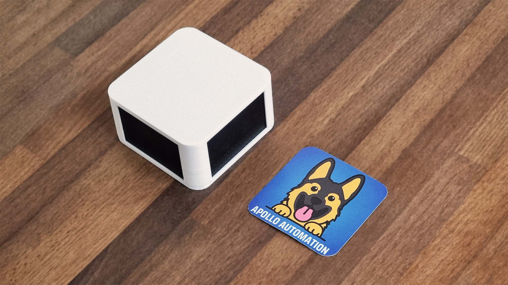

The Apollo Automation AIR-1 is an air quality sensor with the following features:

- SEN55 PM1, PM2.5, PM4, PM10, VOC, NOx, Temperature and Humidity
- SCD40 CO2 Sensor
- MiCS-4514 From DFRobot CO (Carbon Monoxide), C2H5OH (Alcohol), H2, NO2, NH3 (Ammonia) and CH4 (Methane)
- RGB Pixel x3

[Shop](https://shop.apolloautomation.cloud/products/air-1)

[GitHub](https://github.com/ApolloAutomation/AIR-1)

[Wiki](https://wiki.apolloautomation.cloud/)

[Discord](https://discord.gg/mMNgQPyF94)

[YouTube](https://www.youtube.com/@ApolloAutomation)

