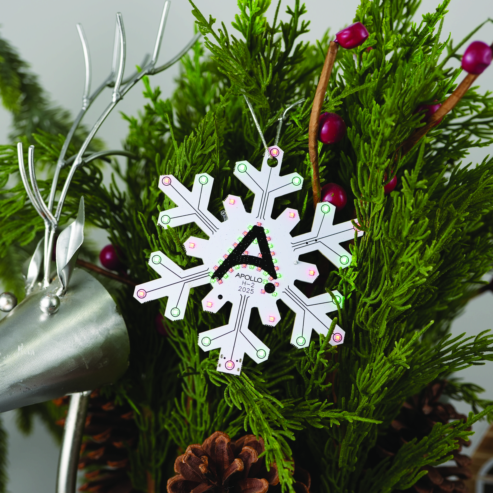
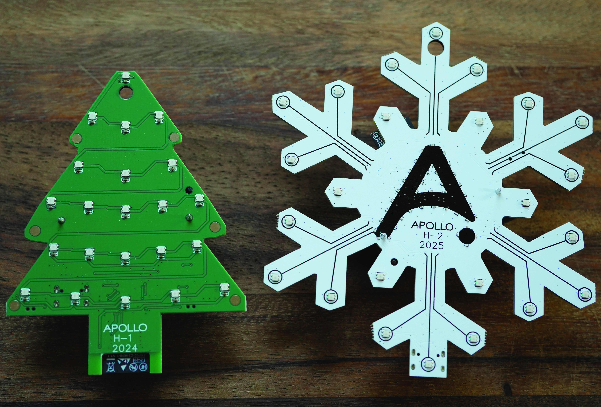

## Description

Meet the Apollo H-2 Holiday Ornament! Year two of our awesome charity ornament series!

This isn't your grandma's tree decoration. We packed 24 individually addressable RGB LEDs into this little beauty, so it lights up like a tiny disco ball when you want it to. Press any of the 4 buttons and boom, a different light shows with matching tunes courtesy of the built-in piezo buzzer. It's like having a mini concert on your Christmas tree!

**The fun stuff:**

- 24 RGB LEDs that dance to your command
- 4 buttons = 4 different light shows + songs
- Built-in piezo buzzer for holiday jams
- Rechargeable battery (16340/RC CR123A)
- Bluetooth tracking and proxy
- QR code that takes you to our year in review page

**The feel-good stuff:**

This is our second annual charity ornament, so you're not just decorating your tree, you're helping make the holidays brighter for others too. ALL PROFITS from every Apollo H-2 Holiday Ornament sold go directly to the following incredible charities:

- **CASA of Lexington** - These amazing volunteers advocate for children in the family court system who've experienced abuse or neglect, making sure their voices are heard and their best interests come first.

Every ornament you buy helps fund real change while adding some tech-savvy sparkle to your holidays. Win-win!

Want to show it off at your holiday party? Go for it. Want to geek out over the Bluetooth tracking and proxy capabilities? We're here for it. Want to just enjoy pretty lights while it plays festive tunes? Perfect.

It's techy enough for the smart home enthusiasts but simple enough that anyone can enjoy the light show. Plus, that QR code is like a little time capsule of what we've been up to this year.

## Quickstart

1. Plug in the H-2.
2. Connect to "Apollo H2 Hotspot".
3. Input WiFi credentials.
4. In Home Assistant, look at discovered devices.

## Links

- [Shop](https://apolloautomation.com/products/apollo-h-2-annual-holiday-ornament)
- [GitHub](https://github.com/ApolloAutomation/H-1)
- [Wiki](https://wiki.apolloautomation.com/)
- [Discord](https://dsc.gg/ApolloAutomation)
- [YouTube](https://www.youtube.com/@ApolloAutomation)

## Product Images

