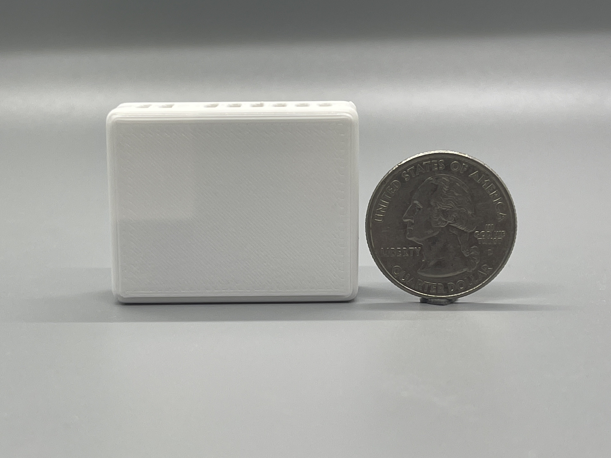
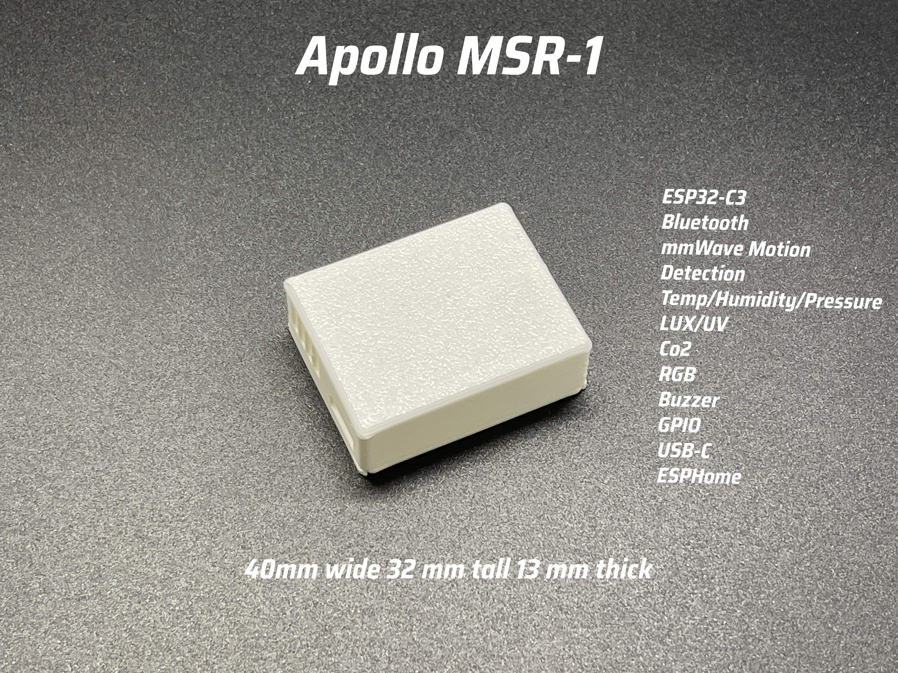

## Description

The Apollo Automation MSR-1 is a mmWave CO2 multisensor with the following features:

- HLK-LD2410B+BLE 24GHz Human Presence mmWave Radar Sensor Module.
- LTR-390UV LUX and UV Sensor.
- BME280 Temperature, Humidity, and Pressure Sensor.
- SCD-40 CO2 Sensor.
- RGB Pixel.
- Piezo Buzzer.
- Bluetooth tracking and Bluetooth proxy.
- Exposed GPIO: I2C, power, and GPIO pins exposed.

## Quickstart

1. Plug in the MSR-1.
2. Connect to "MSR1 Hotspot".
3. Input WiFi credentials.
4. In Home Assistant, look at discovered devices.

## Links

- [Shop](https://apolloautomation.com/products/multisensor-mk1)
- [GitHub](https://github.com/ApolloAutomation/MSR-1)
- [Wiki](https://wiki.apolloautomation.com/)
- [Discord](https://discord.gg/mMNgQPyF94)
- [YouTube](https://www.youtube.com/@ApolloAutomation)

## Product Images

