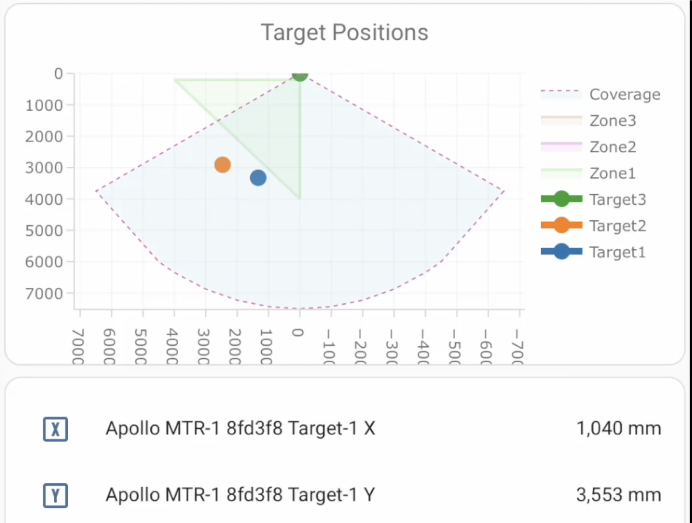

## Description

The Apollo Automation MTR-1 is a multi-target radar sensor with the following features:

- LD2450 Multi-target radar sensor.
- LTR-390UV LUX and UV Sensor.
- DPS310 Temperature and Pressure Sensor.
- SCD-40 CO2 Sensor.
- RGB Pixel.
- Piezo Buzzer.
- GPIO Expansion: I2C, power, and GPIO pins exposed.

## Quickstart

1. Plug in the MTR-1.
2. Connect to "MTR1 Hotspot".
3. Input WiFi credentials.
4. In Home Assistant, look at discovered devices.

## Links

- [Shop](https://apolloautomation.com/products/mtr-1)
- [EU Distributor](https://opencircuit.shop/brand/apollo-automation)
- [GitHub](https://github.com/ApolloAutomation/MTR-1)
- [Wiki](https://wiki.apolloautomation.com/)
- [Discord](https://discord.gg/mMNgQPyF94)
- [YouTube](https://www.youtube.com/@ApolloAutomation)

## Product Images

