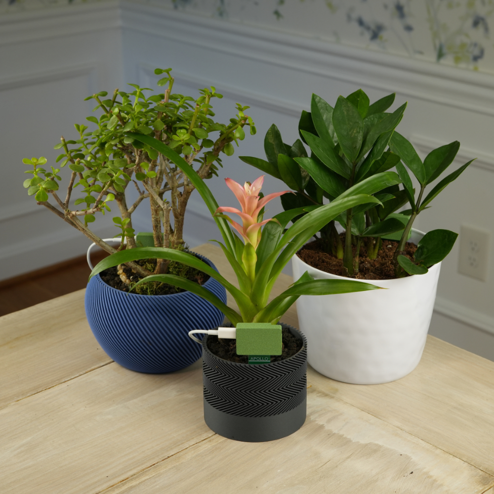
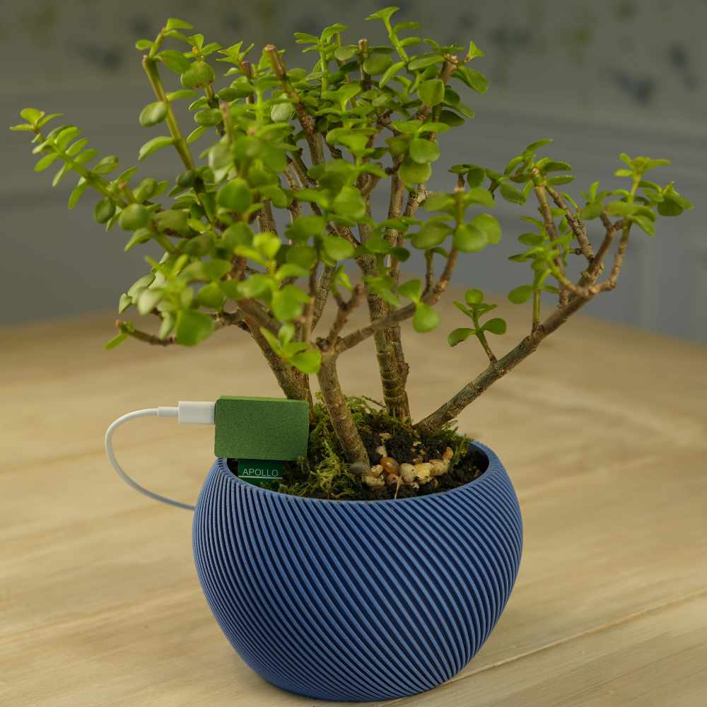
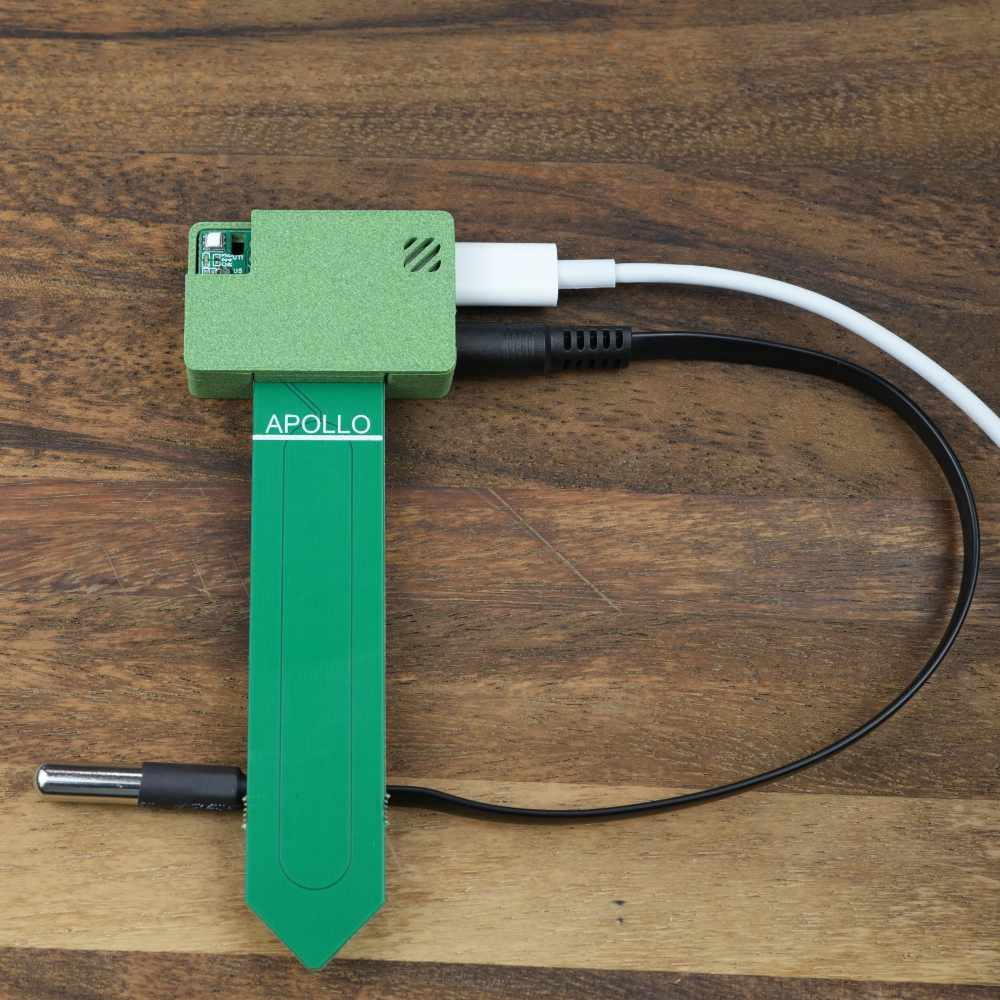

## Description

The Apollo Automation PLT-1 is a plant quality sensor with the following features:

- LTR390 UV: UV Index, LUX
- AHT20: Air temperature and humidity
- Capacitive pre calibrated soil moisture sensor with conformal coating for long life span
- DS18B20: Waterproof soil temperature probe
- RGB Pixel: Notify you of the status of the plant
- Buzzer: Can play beeps, and RTTTL tones
- Bluetooth tracking and Bluetooth proxy

## Quickstart

1. Plug in the PLT-1.
2. Connect to "PLT1 Hotspot".
3. Input WiFi credentials.
4. In Home Assistant, look at discovered devices.

## Links

- [Shop](https://apolloautomation.com/products/plt-1-ultimate-plant-sensor-for-home-assistant)
- [GitHub]([https://](https://github.com/ApolloAutomation/PLT-1))
- [Wiki](https://wiki.apolloautomation.com/)
- [Discord](https://dsc.gg/ApolloAutomation)
- [YouTube](https://www.youtube.com/@ApolloAutomation)

## Product Images

