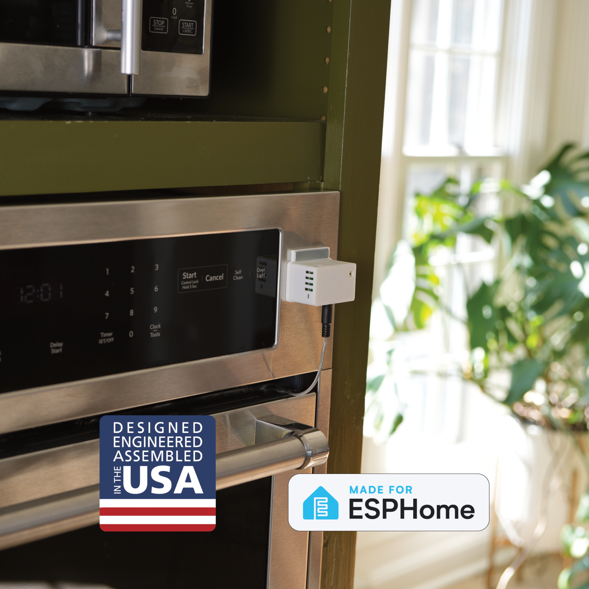

## Description

The Apollo Automation TEMP-1 ( battery and non battery version ) is a temperature sensor with the following features:

- AHT30: Temperature and humidity sensor on the board
- Temperature probe, different variants:
  - 1.5m waterproof flat cable DS18B20: Great for fridges, freezers, fish tanks, hot tubs. Max 85°C 185°F
  - 20cm / 7.8 inch waterproof flat cable DS18B20: Great for fridges, freezers, fish tanks, hot tubs. Max 85°C 185°F
  - 1m / 40 inch stainless steel food safe probe with NTC sensor: Great for grills, ovens, or other high temperature needs Max 350°C 662°F
- RGB Pixel: Notify you of the status
- Buzzer: Can play beeps, and RTTTL tones when outside a specified temperature range
- Bluetooth tracking and Bluetooth proxy
- Battery version available

## Quickstart

1. Plug in the TEMP-1.
2. Connect to "TEMP1 Hotspot".
3. Input WiFi credentials.
4. In Home Assistant, look at discovered devices.

## Links

- [Shop](https://apolloautomation.com/products/temp-1-temperature-probe-for-home-assistant?utm_source=esphome&utm_medium=social)
- [GitHub](https://github.com/ApolloAutomation/TEMP-1)
- [Wiki](https://wiki.apolloautomation.com/)
- [Discord](https://dsc.gg/ApolloAutomation)
- [YouTube](https://www.youtube.com/@ApolloAutomation)

## Product Images

