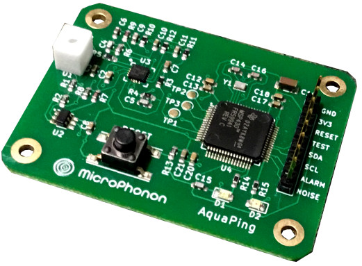
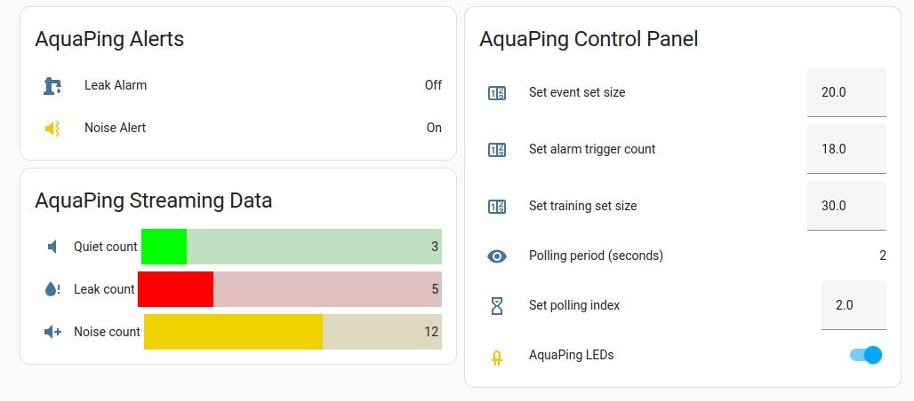

The AquaPing is a smart sensor that has been designed to listen for very weak, high frequency acoustics that may accompany a pressurized plumbing leak.  It is best deployed as a stand-off sensor similar to a smoke alarm -- no contact with plumbing is needed. It can also detect leaks behind walls. The target application is signaling the onset of water leaks, but users are encouraged to experiment with pressurized gases, refrigerants, and steam.

Production was funded with a campaign at [Crowd Supply](https://www.crowdsupply.com/microphonon/aquaping) where sensor boards can be purchased. This is an open-source hardware project to allow the community to verify that it is physically impossible to use this device to eavesdrop on conversations. Privacy is therefore assured.

The sensor is highly configurable. Two-way communication is via an I2C interface that is used to retrieve sensor data and also set monitoring parameters. Two interrupt lines alert to potential leaks and/or the presence of anomalous noise. Noise mitigation is addressed with mechanical, analog, and digital filtering combined with statistical analysis that takes place entirely on the edge. Design and configuration details are provided in a 9-page user manual in the linked repository.

Implementation with an ESP8266 module in Home Assistant requires the custom firmware file named *aquaping.h*. It is placed in the config/esphome/ directory and listed as an *include* in the yaml file (see below). The repository also contains a custom dashboard file with cards to display streaming data, alerts, and a control panel.



``` yaml
esphome:
  name: esphome-web-959f0c
  friendly_name: ESPHome Web 959f0c
  libraries:
    - "Wire"
  includes:
    - aquaping.h

esp8266:
  board: d1_mini
    
# OTA flashing
ota:
  - platform: esphome

wifi: # Your Wifi network details
  
# Enable fallback hotspot in case wifi connection fails  
  ap:

# Enabling the logging component
logger:

# Enable Home Assistant API
api:

binary_sensor:
- platform: gpio
  pin: D3
  name: "AquaPing Noise Alert"
  id: noise
  icon: "mdi:volume-vibrate"

- platform: gpio
  pin: D4
  name: "AquaPing Leak Alert"
  id: leak
  icon: "mdi:water-pump"
  
# Not all of the retrieved data is displayed
sensor:
- platform: custom
  lambda: |-
    auto aquaping = new AquaPing();
    App.register_component(aquaping);
    return {aquaping->quiet_count,aquaping->leak_count,aquaping->noise_count,aquaping->polling_period,aquaping->event_array_size,aquaping->trigger_threshold,aquaping->background_array_size};

  sensors:
  - name: "Quiet Count Display"
  - name: "Leak Count Display"
  - name: "Noise Count Display"
  - name: "Polling Period Display"  
  - name: "Event Size Display"
  - name: "Trigger Threshold Display"
  - name: "Background Set Size Display"

number:
  - platform: template
    name: "Event array size"
    optimistic: true
    min_value: 10
    max_value: 255
    initial_value: 20
    step: 1
    mode: box
    id: event_input
    icon: "mdi:counter"

  - platform: template
    name: "Alarm trigger size"
    optimistic: true
    min_value: 10
    max_value: 255
    initial_value: 18
    step: 1
    mode: box
    id: trigger_input
    icon: "mdi:counter"

  - platform: template
    name: "Background array size"
    optimistic: true
    min_value: 10
    max_value: 255
    initial_value: 30
    step: 1
    mode: box
    id: background_input
    icon: "mdi:counter"

  - platform: template
    name: "Polling period"
    optimistic: true
    min_value: 1
    max_value: 9
    initial_value: 2
    step: 1
    mode: box
    id: polling_input
    icon: "mdi:timer-sand"
  

switch:
  - platform: template
    name: "LED Switch"
    restore_mode: ALWAYS_ON #8266 ignores this
    id: led
    icon: "mdi:led-outline"
    optimistic: true
```
