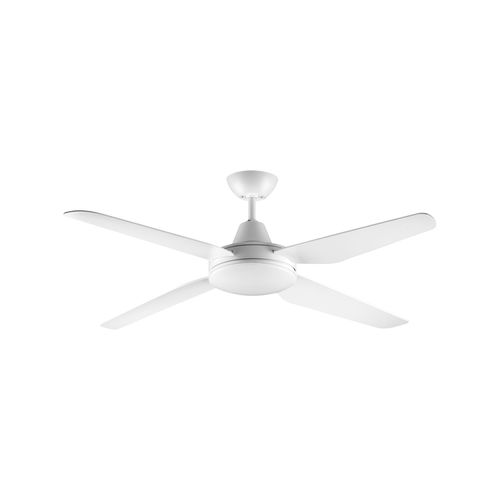
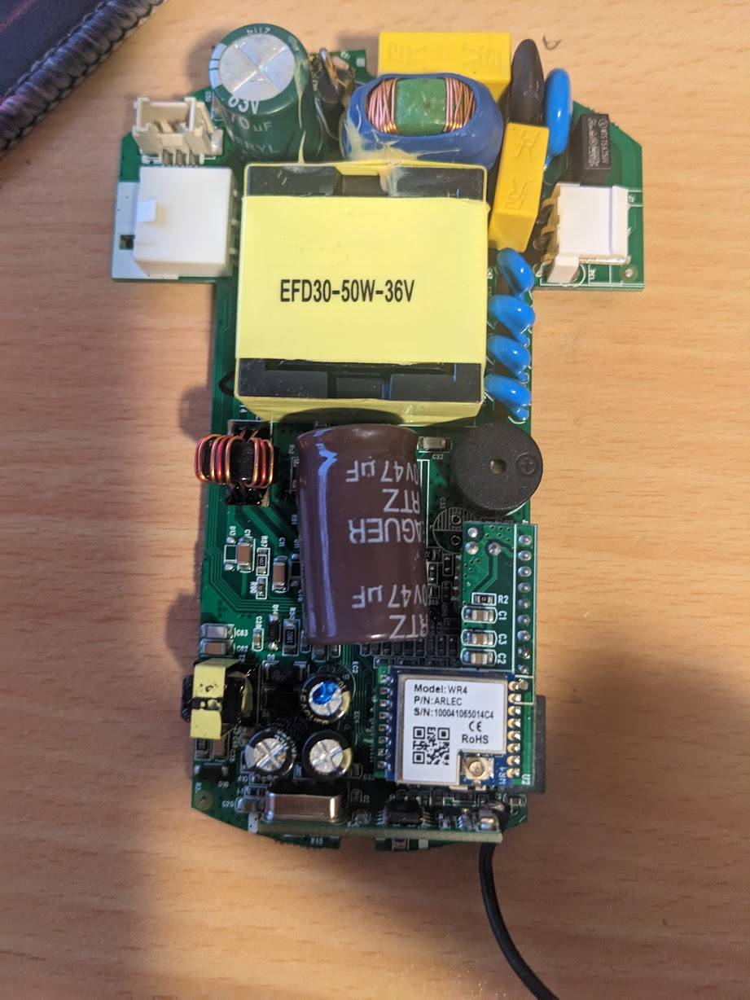
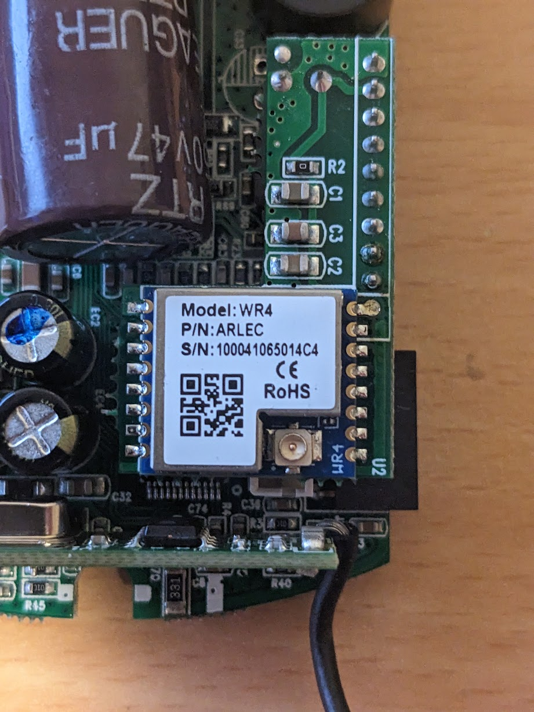

The Arlec DCF4002 ceiling Fan+Light combo, marketed as the "Smart Madrid" model by Arlec is part of the [Grid Connect ecosystem](https://grid-connect.com.au/) and is sold at Bunnings in Australia and New Zealand.

The device comes with a Tuya WR4 module which uses the Realtek RTL8710BN, and uses a Tuya MCU for device control.  


The RTL8710BN is mounted on a daughterboard on pin headers, which allows for easy removal and reflashing without needing a soldering iron.


Alternatively, you can replace the WR4 with an ESP8266 module, soldered to the appropriate Power, GND, and UART pins of the daughterboard.

For reflashing the RTL8710, the LibreTiny Chip Tool [ltchiptool](https://github.com/libretiny-eu/ltchiptool) can be used to reflash the board via its UART pins which are exposed via the pin header. Details on the reflashing procedure are available here: https://docs.libretiny.eu/docs/platform/realtek-ambz/#flashing

We recommend peforming the following steps for reflashing:

- Open the ESPHome Add-On Dashboard
- Click "New Device" in the bottom-right corner
- Click Continue
- Enter a name for the device and click Next
- Click on any of the device types
- On the next screewn, click SKIP. Do not click Install
- When the device is listed in the dashboard, click Edit
- Paste in the YAML config from this page
- Click Save
- Click Install
- Select the "Manual Download" option
- Download the UF2 version of the file and Flash using ltchiptool

## Basic Configuration

### For WR4 RTL8170BN module

```yaml
esphome:
  name: Arlec-fanlight
  friendly_name: Arlec Fan+Light

rtl87xx
  board: generic-rtl8710bn-2mb-468k

# Disable Serial Logging so the Tuya MCU functions
logger:
  baud_rate: 0
    
# OTA flashing
ota:
  - platform: esphome

wifi: # Your Wifi network details
  
# Enable fallback hotspot in case wifi connection fails  
  ap:

# Enable Home Assistant API
api:

# UART pins for RTL8170BN might need to be changed to RX1/TX1 for Tuya MCU.  It depends on how ESPHome and LibreTiny map these pins, but note that the WR4 has pins PA22 and PA18, along with PA29 and PA30 (often referreed to as A_XX e.g. A_29).
uart:
  rx_pin: RX
  tx_pin: TX
  baud_rate: 9600  # This is a common baud rate for Tuya devices

# Configure the Tuya component and ignore the datapoints not used in this configuration (e.g. sleep timer)
tuya:
  ignore_mcu_update_on_datapoints:
    - 102
    - 103

# Fan configuration
fan:
  - platform: tuya
    name: "Ceiling Fan"
    id: ceiling_fan
    switch_datapoint: 1
    speed_datapoint: 3
    direction_datapoint: 4
    speed_count: 6

# Light configuration
light:
  - platform: tuya
    name: "Light"
    id: ceiling_fan_light
    switch_datapoint: 9
    dimmer_datapoint: 10
    min_value: 10
    max_value: 100
    color_temperature_datapoint: 11
    color_temperature_max_value: 100
    color_temperature_invert: false
    cold_white_color_temperature: 6493 K
    warm_white_color_temperature: 4065 K
```

### If WR4 is replaced with ESP8266

It is critical that you disable serial logging as per the YAML provided here.  If you do not do this, the Tuya MCU spits out gibberish and is not recognised by ESPHome.

```yaml
esphome:
  name: Arlec-fanlight
  friendly_name: Arlec Fan+Light

esp8266:
  board: esp01_1m

# Disable Serial Logging so the Tuya MCU functions
logger:
  baud_rate: 0

api:

ota:

wifi:
  ssid: !secret wifi_ssid
  password: !secret wifi_password

  # Enable fallback hotspot (captive portal) in case wifi connection fails
  # This config assumes you have defined a shared password in the ESPHome secrets file.
  ap:
    ssid: "Arlec-Fanlight"
    password: !secret wifi_ap_password

captive_portal:

uart:
  rx_pin: RX
  tx_pin: TX
  baud_rate: 9600  # This is a common baud rate for Tuya devices

# Configure the Tuya component and ignore the datapoints not used in this configuration (e.g. sleep timer)
tuya:
  ignore_mcu_update_on_datapoints:
    - 102
    - 103

# Fan configuration
fan:
  - platform: tuya
    name: "Ceiling Fan"
    id: ceiling_fan
    switch_datapoint: 1
    speed_datapoint: 3
    direction_datapoint: 4
    speed_count: 6

# Light configuration
light:
  - platform: tuya
    name: "Light"
    id: ceiling_fan_light
    switch_datapoint: 9
    dimmer_datapoint: 10
    min_value: 10
    max_value: 100
    color_temperature_datapoint: 11
    color_temperature_max_value: 100
    color_temperature_invert: false
    cold_white_color_temperature: 6493 K
    warm_white_color_temperature: 4065 K
```
