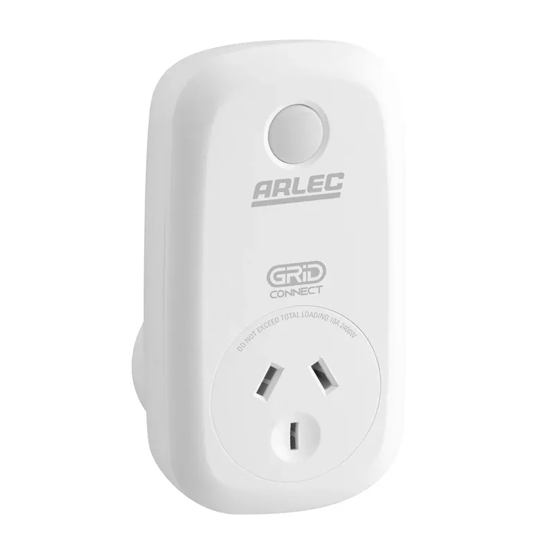

Arlec Grid Connect products are a Tuya-based smart devices
sold by Bunnings and Kmart respectively in Australia.  This configuration is valid for when the device has been converted to use an ESP8266 or is an older model that was sold with the ESP8266 from factory.



## Basic Configuration

``` yaml
substitutions:
  name: arlec_pc190ha
  friendly_name: Arlec Smart Plug

esphome:
  name: ${name}

esp8266:
  board: esp01_1m

# OTA flashing
ota:
  - platform: esphome

wifi: # Your Wifi network details
  
# Enable fallback hotspot in case wifi connection fails  
  ap:

# Enabling the logging component
logger:

# Enable Home Assistant API
api:


binary_sensor:
  - platform: gpio
    pin:
      number: 14
      mode:
        input: true
        pullup: true
      inverted: true
    name: "${friendly_name} Button"
    on_press:
      - switch.toggle: relay

switch:
  - platform: gpio
    id: blue_led
    pin:
      number: GPIO4
      inverted: true

  - platform: gpio
    id: red_led
    pin:
      number: GPIO13
      inverted: true

  - platform: gpio
    name: "${friendly_name} Power"
    pin: GPIO12
    id: relay
    on_turn_on:
      # Turn off red LED to show blue when turned on
      - switch.turn_off: red_led
      - switch.turn_on: blue_led
    on_turn_off:
      # Turns on the red LED once the plug is turned off
      - switch.turn_off: blue_led
      - switch.turn_on: red_led
```
