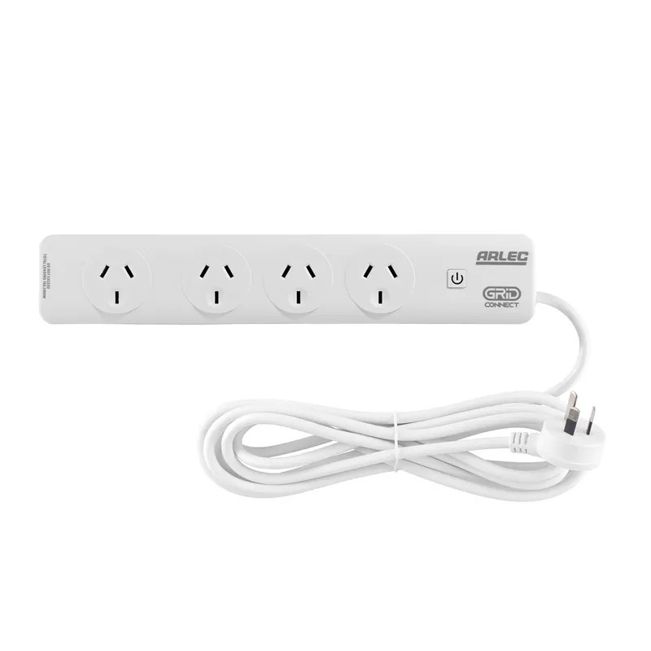

The Arlec PB4KSHA power board is part of the [Grid Connect ecosystem](https://grid-connect.com.au/) and is sold at Bunnings in Australia and New Zealand.
It has four sockets but all are controlled as a group via a single relay.

The controller board is a Tuya WB2S which ues a BK7231T chip.

## BK7231 Pinout

| Pin | Function                |
| ----| ----------------------- |
| P6  | LED (Inverted: true)    |
| P11 | Button                  |
| P26 | Relay 1                 |

## Getting it up and running

### LibreTiny Chip Tool

As Tuya has closed most vulnerabilities, Tuya-Convert cannot be used to flash ESPHome onto these devices.  The LibreTiny Chip Tool ([ltchiptool](https://github.com/libretiny-eu/ltchiptool)https://github.com/libretiny-eu/ltchiptool) can be used to reflash the board via its UART pins.  You may completely remove the chip from the board to do this or solder wires to the relevant pins in-place. Reflashing via UART using ltchiptool is covered in this guide on YouTube for [installing ESPHome on a Tuya Beken BK7231 w/ltchiptool](https://www.youtube.com/watch?v=t0o8nMbqOSA), however we recommend peforming the following steps:

- Open the ESPHome Add-On Dashboard
- Click "New Device" in the bottom-right corner
- Click Continue
- Enter a name for the device and click Next
- Click on any of the device types
- On the next screewn, click SKIP.  Do ***not*** click Install
- When the device is listed in the dashboard, click Edit
- Paste in the YAML config from this page
- Click Save
- Click Install
- Select the "Manual Download" option
- Download the UF2 version of the file and Flash using ltchiptool

## Basic Configuration

```yaml
esphome:
  name: upk2esphome-bk7231t
bk72xx:
  board: generic-bk7231t-qfn32-tuya

# OTA flashing
ota:
  - platform: esphome

wifi: # Your Wifi network details
  
# Enable fallback hotspot in case wifi connection fails  
  ap:

# Enabling the logging component
logger:

# Enable Home Assistant API
api:

text_sensor:
  - platform: libretiny
    version:
      name: LibreTiny Version

binary_sensor:
  - platform: gpio
    id: binary_switch_1
    pin:
      number: P11
      inverted: false
      mode: INPUT_PULLUP
    on_press:
      then:
        - switch.toggle: switch_1

switch:
  - platform: gpio
    id: switch_1
    name: Relay 1
    pin: P26
    on_turn_on:
      - light.turn_off: relay_status_led  # Invert LED state
    on_turn_off:
      - light.turn_on: relay_status_led   # Invert LED state

output:
  - platform: gpio
    pin: P6
    id: relay_status_led_output

light:
  - platform: binary
    output: relay_status_led_output
    id: relay_status_led
```
