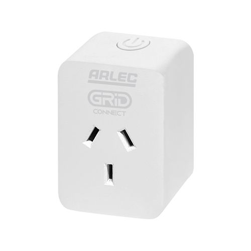

The Arlec PC191HA power plug is part of the [Grid Connect ecosystem](https://grid-connect.com.au/) and is sold at Bunnings in Australia and New Zealand.  
These are available in White (PC191HA) or Black (PC191BKHA), and in 4-packs of White and Black - which are identical.  
It is compact, easily fitting side-by-side in double wall sockets.  

The Arlec Grid Connect Smart Plug In Socket With Energy Meter uses a WB2S module with BK7231T chip (a variant of bk72xx) and is supplied with Tuya firmware.  
As at the time of writing, they can be flashed without disassembly or soldering [using cloudcutter](#Using-Cloudcutter).  

### Series 2 Info

From approx. May 2023 Bunnings is now selling "series 2" units, which *may* use a CB2S module. These are clearly labelled as series 2 in bottom right corner of the box, and on the unit, however these is no external indication of what module is inside. It appears the only way to tell is based on the Tuya firmware version. Best to match the firmware versions with the cloudcutter profiles:

- v1.1.8: CB2S
- v1.3.5: WB2S

**Update 11 August 2024:** Bunnings are now selling "Series 3" units with the same part number (PC191HA, or PC191BKHA for the black units). These continue to use the CB2S module but are loaded with Tuya firmware version 1.1.17 which isn't vulnerable to the Cloudcutter exploit. Additionally, the PCB design has been changed, and the GPIO configuration has subsequently changed - see the GPIO pinout table for the Series 3 unit below.

Bunnings also have similar-looking Arlec Grid Connect variations:
     - PC192HA with USB,
     - PCTH01HA with Temperature And Humidity Sensor,
     - PC287HA Twin Socket with Energy Meter and Surge Protection,
     - PC193HA Multi-Function Socket With USB
I have NOT looked at any of these variations to find out if they are similar to PC191HA.  

## GPIO Pinout

| Pin | Function                             |
| --- | ------------------------------------ |
| P6  | (PWM0) Relay                         |
| P7  | (PWM1) BL0937 CF pin                 |
| P8  | (PWM2) BL0937 CF1 pin                |
| P24 | (PWM4) BL0937 SEL pin                |
| P26 | (PWM5) LED                           |
| P10 | (RXD1) Wifi LED (hidden inside unit) |
| P11 | (TXD1) Button                        |

## GPIO Pinout - Series 3

| Pin | Function                             |
| --- | ------------------------------------ |
| P6  | (PWM0) BL0937 CF1 pin                |
| P7  | (PWM1) BL0937 CF pin                 |
| P8  | (PWM2) Relay                         |
| P10 | (RXD1) Wifi LED (hidden inside unit) |
| P11 | (TXD1) Button                        |
| P24 | (PWM4) BL0937 SEL pin                |
| P26 | (PWM5) LED                           |

## Getting it up and running

### Using Cloudcutter

Cloudcutter is a tool that simplifies flashing Tuya-based devices. It allows you to flash the firmware over Wi-fi, eliminating the need to physically open the device.  
Follow [these instructions](https://github.com/tuya-cloudcutter/tuya-cloudcutter) to flash your Arlec PC1914HA device using Cloudcutter.  
After that, you can use ESPHome's OTA functionality to make any further changes.  

### Series 3 - flashing the CB2S module manually

The case is ultrasonic-welded shut. With a spudger, blade, or other thin-edged tool you can pry it open (there will be some cosmetic damage). There will also be some silicone holding everything together which can be overcome with some effort. The CB2S module is soldered in a thru-hole configuration on the top edge of the main board. Refer to the [CB2S datasheet](https://developer.tuya.com/en/docs/Document/cb2s-module-datasheet) for its pinout, you'll need a USB to TTL serial adapter and a soldering iron. It's best to remove the module from the main board, as the serial adapater's 3.3V power supply probably isn't enough for the module to boot with peripherals attached. Flash with [ltchiptool](https://github.com/libretiny-eu/ltchiptool) or similar.

### Note on Power Monitoring

Power measurement uses the BL0937 chip, which is similar to HLW8012 except CF and CF1 are inverted.  
I found that setting current_resistor to give an accurate Amperage does NOT also give the correct Wattage, so instead I calculate current from power and voltage.  

### After firmware update

After a firmware update the device will reboot, but using the OLD firmware.  
To activate the new firmware you will have to disconnect the device from power for a while.  
When you reconnect the device it may activate the new firmware (which could take a couple of minutes) before connecting to Wi-fi.  If it does not, simply power it off for a longer time (I have waited >6 hours powered off for one of these pesky devices to activate firmware).  

## Basic Configuration

```yaml
# Basic Config
substitutions:
  device_name: "arlec_PC191HA_1"
  name: "ARLEC PC191HA 1"

esphome:
  name: ${device_name}
  comment: ${name}

bk72xx:
  board: wb2s
  framework:
    version: dev

wifi:
   ssid: !secret wifi_ssid
   password: !secret wifi_password
   ap:

logger:

api:
  encryption:
    key: "api_encryption_key"

ota:
  password: "ota_password"

#
# PC191HA basic switch operation - button, relay and LED
#
    # button is momentary on - shows "on" in HA except for the moment the button is being pressed
    # LED should have same on/off state as the relay.  
    # there is also a wifi_LED, but it is not seen from outside the case

binary_sensor:    # the button
  - platform: gpio
    pin: P11
    name: ${device_name} button
    id: button
    device_class: window
    # when button is pressed, toggle the switch on/off
    on_press:
      then:
        - switch.toggle: relay

switch:          # the relay
  - platform: gpio
    pin: P6
    name: ${name}
    id: relay
    restore_mode: always off   # default when power is turned on
    icon: mdi:power-socket-au
    # synchronise the LED with the relay
    on_turn_on:
      then:
        - output.turn_on: button_led
    on_turn_off:
      then:
        - output.turn_off: button_led

output:        # the light in the button
  - platform: gpio
    id: button_led
    pin: P26
#    restore_mode: always off   # default when power is turned on

#
# PC191HA sensors - power monitoring and wifi signal
#
sensor:
  - platform: wifi_signal         # report wi-fi signal strength from this end
    name: $name WiFi Signal
    id:   ${device_name}_wifi_signal
    update_interval: 30s    # how often to report wifi signal strength

    # PC191HA includes a BL0937 chip for measuring power consumption
    #     and BL0937 is a variation of hlw8012, but using inverted SEL pin functionality
  - platform: hlw8012
    model: BL0937     # note that the model must be specified to use special calculation parameters
    sel_pin:          # I believe that cf_pin reports either Voltage or Current depending on this select pin
      inverted: true  # determine whether true reports Voltage
      number: P24
    cf_pin:           # current or voltage (ele_pin: 7)
      inverted: true  # the logic of BL0937 is opposite from HLW8012
      number: P7
    cf1_pin:          #  Power (vi_pin: 8)
      inverted: true  # the logic of BL0937 is opposite from HLW8012
      number: P8

    update_interval: 15s      # How often to measure and report values

    # PC191HA measures and returns Voltage OR Current according to the value of sel_pin,
    #   but it can change the value of sel_pin periodically  
    initial_mode: "VOLTAGE"       # reports VOLTAGE or CURRENT
    change_mode_every: 4          # how many times to report before swapping between
        #   reporting Voltage or Current. Note that the first value reported should be ignored as inaccurate

    # Adjust according to the actual resistor values on board to calibrate the specific unit
    voltage_divider:  775     # LOWER VALUE GIVES LOWER VOLTAGE
    current_resistor: 0.0009  # HIGHER VALUE GIVES LOWER WATTAGE

    #
    # how the power monitoring values are returned to ESPHome
    #

    voltage:
      name: $name Voltage
      id:   ${device_name}_voltage
      unit_of_measurement: V
      accuracy_decimals: 1
      filters:
        - skip_initial: 2
    power:
      name: $name Power
      id:   ${device_name}_power
      unit_of_measurement: W
      accuracy_decimals: 2
      filters:
        - skip_initial: 2

    # power should simply be current x voltage -- except that the pc191ha doesn't follow that formula.  
    # Setting current_resistor to give an accurate Amperage does NOT also give the correct Wattage
    # so here I calculate current from power and voltage

  - platform: template  
    name: $name Current
    id:   ${device_name}_current
    unit_of_measurement: A
    accuracy_decimals: 2
    update_interval: "30s"
    lambda: |-
      return (id(${device_name}_power).state / id(${device_name}_voltage).state);
    filters:  
      - skip_initial: 2

  - platform: uptime
    name: $name Uptime
    id:   ${device_name}_uptime
    update_interval: "30s"

```

## Series 3 Configuration

```yaml
# Basic Config
substitutions:
  device_name: "arlec_PC191HA_1"
  name: "ARLEC PC191HA 1"

esphome:
  name: ${device_name}
  comment: ${name}

bk72xx:
  board: cb2s
  framework:
    version: dev

wifi:
   ssid: !secret wifi_ssid
   password: !secret wifi_password
   ap:

logger:

api:
  encryption:
    key: "api_encryption_key"

ota:
  password: "ota_password"

#
# PC191HA basic switch operation - button, relay and LED
#
    # button is momentary on - shows "on" in HA except for the moment the button is being pressed
    # LED should have same on/off state as the relay.  
    # there is also a wifi_LED, but it is not seen from outside the case

binary_sensor:    # the button
  - platform: gpio
    pin: P11
    name: ${device_name} button
    id: button
    device_class: window
    # when button is pressed, toggle the switch on/off
    on_press:
      then:
        - switch.toggle: relay

switch:          # the relay
  - platform: gpio
    pin: P8
    name: ${name}
    id: relay
    restore_mode: always off   # default when power is turned on
    icon: mdi:power-socket-au
    # synchronise the LED with the relay
    on_turn_on:
      then:
        - output.turn_on: button_led
    on_turn_off:
      then:
        - output.turn_off: button_led

output:        # the light in the button
  - platform: gpio
    id: button_led
    pin: P26
#    restore_mode: always off   # default when power is turned on

#
# PC191HA sensors - power monitoring and wifi signal
#
sensor:
  - platform: wifi_signal         # report wi-fi signal strength from this end
    name: $name WiFi Signal
    id:   ${device_name}_wifi_signal
    update_interval: 30s    # how often to report wifi signal strength

    # PC191HA includes a BL0937 chip for measuring power consumption
    #     and BL0937 is a variation of hlw8012, but using inverted SEL pin functionality
  - platform: hlw8012
    model: BL0937     # note that the model must be specified to use special calculation parameters
    sel_pin:          # I believe that cf_pin reports either Voltage or Current depending on this select pin
      inverted: true  # determine whether true reports Voltage
      number: P24
    cf_pin:           # current or voltage (ele_pin: 7)
      inverted: true  # the logic of BL0937 is opposite from HLW8012
      number: P7
    cf1_pin:          #  Power (vi_pin: 8)
      inverted: true  # the logic of BL0937 is opposite from HLW8012
      number: P6

    update_interval: 15s      # How often to measure and report values

    # PC191HA measures and returns Voltage OR Current according to the value of sel_pin,
    #   but it can change the value of sel_pin periodically  
    initial_mode: "VOLTAGE"       # reports VOLTAGE or CURRENT
    change_mode_every: 4          # how many times to report before swapping between
        #   reporting Voltage or Current. Note that the first value reported should be ignored as inaccurate

    # Adjust according to the actual resistor values on board to calibrate the specific unit
    voltage_divider:  775     # LOWER VALUE GIVES LOWER VOLTAGE
    current_resistor: 0.0009  # HIGHER VALUE GIVES LOWER WATTAGE

    #
    # how the power monitoring values are returned to ESPHome
    #

    voltage:
      name: $name Voltage
      id:   ${device_name}_voltage
      unit_of_measurement: V
      accuracy_decimals: 1
      filters:
        - skip_initial: 2
    power:
      name: $name Power
      id:   ${device_name}_power
      unit_of_measurement: W
      accuracy_decimals: 2
      filters:
        - skip_initial: 2

    # power should simply be current x voltage -- except that the pc191ha doesn't follow that formula.  
    # Setting current_resistor to give an accurate Amperage does NOT also give the correct Wattage
    # so here I calculate current from power and voltage

  - platform: template  
    name: $name Current
    id:   ${device_name}_current
    unit_of_measurement: A
    accuracy_decimals: 2
    update_interval: "30s"
    lambda: |-
      return (id(${device_name}_power).state / id(${device_name}_voltage).state);
    filters:  
      - skip_initial: 2

  - platform: uptime
    name: $name Uptime
    id:   ${device_name}_uptime
    update_interval: "30s"

```

## ESP8266 configuration

The BK7231 module is not suitable for devices which must remain powered after OTA or any reboot cycle, as these modules have no capability to keep power applied during a reboot.  Replacing the WB2S or CB2S modules with an ESP8285 based module resolves this issue, and any ESP-02S form factor module will suffice, with the most commonly available modules being the Tuya TYWE2S.  The ESP8285 also uses a more standardised configuration for power monitoring, without needing any of the complexity applied in the BK7231 configuration related to the BL0937 chip.

The BL0937 calibration values were validated using a CCI Power-Mate monitoring a heat gun pulling 1800 watts.

```yaml
esphome:
  name: device-name
  friendly_name: Friendly Device Name

esp8266:
  board: esp8285
  early_pin_init: False # Required to ensure the power does not trip out after OTA or reboot

wifi:
   ssid: !secret wifi_ssid
   password: !secret wifi_password
   ap:

captive_portal:

logger:
  baud_rate: 0

api:
  encryption:
    key: "api_key"

ota:
  platform: esphome
  password: "ota_password"

binary_sensor:
  - platform: gpio
    pin: GPIO1
    name: button
    id: button
    device_class: window
    on_press:
      then:
        - switch.toggle: relay

switch:
  - platform: gpio
    pin: GPIO13
    name: "Power Switch"
    id: relay
    restore_mode: ALWAYS_ON   # Change as per your needs
    icon: mdi:power-socket-au
    on_turn_on:
      then:
        - output.turn_on: button_led
    on_turn_off:
      then:
        - output.turn_off: button_led
  - platform: restart
    name: "Restart"

output:
  - platform: gpio
    id: button_led
    pin: GPIO14

sensor:
  - platform: hlw8012
    voltage_divider: 1540 # Verified using CCI Power-Mate
    current_resistor: 0.00102 # Verified using CCI Power-Mate
    model: BL0937
    sel_pin:
      number: GPIO12
      inverted: true
    cf_pin: GPIO4
    cf1_pin: GPIO5
    current:
      name: "Current"
      filters:
        - multiply: 0.902 # Verified using CCI Power-Mate
    voltage:
      name: "Voltage"
    power:
      name: "Power"
    energy:
      name: "Energy"
    update_interval: 5s
```

## References

- https://www.elektroda.com/rtvforum/topic3944452.html - breakdown of PC191HA and discussion, including about series 2
- https://templates.blakadder.com/arlec_PC191HA.html   - TASMOTA definition, which advises to replace the WB2S module
- https://community.home-assistant.io/t/energy-consumption-and-arlec-grid-connect-tuya-smart-plug/335508/55
- https://community.home-assistant.io/t/kickstart-bk7231t-to-esphome-add-on/701658 - Discussion about series 2 containing different modules
