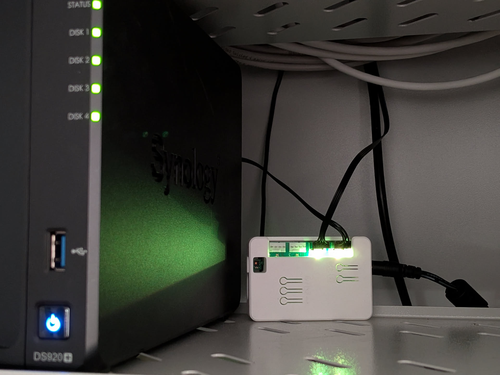
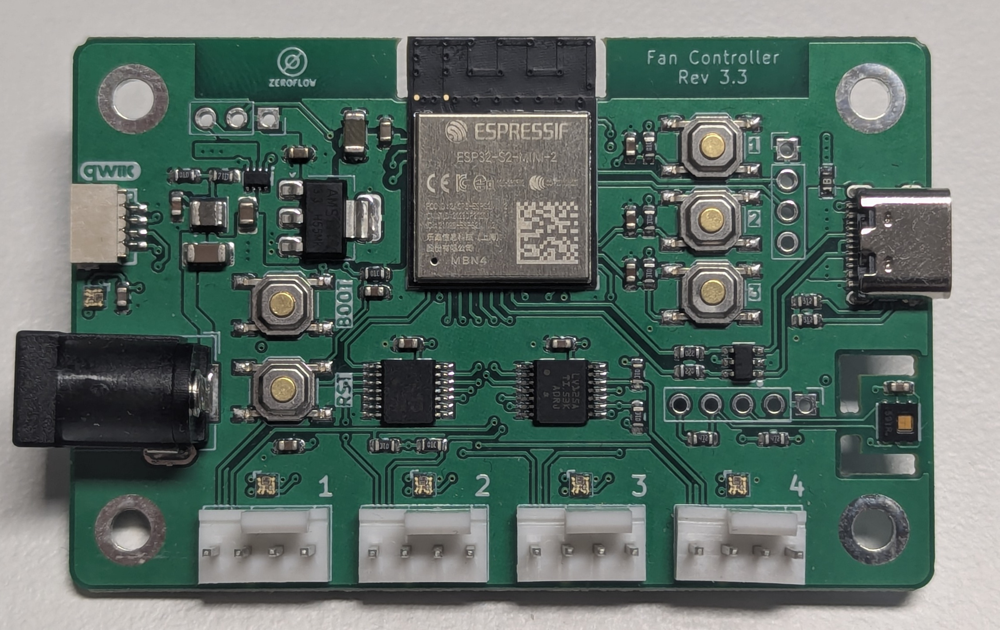

## Description

The Arthofer Engineering WiFi Fan Controller is a 4-channel PWM fan controller with the following features:

- 4× PWM Fan Outputs with RPM monitoring
- Supports standard 12V 4-pin PWM fans
- 12V DC Barrel Input (5.5x2.1mm)
- Low power operation: 0.25W typical, 0.07W deep sleep
- Integrated HDC1080 Temperature & Humidity Sensor
- RGB Status LEDs for board and fan ports (Rev 3.x)
- Qwiic Expansion Port for easy sensor additions
- I2C Expansion Port (2.54mm Header)
- 5V NeoPixel Output Port
- 3 User Buttons for custom functions
- GPIO Expansion Pads (2.54mm SMD Header)
- USB-C for programming (Rev 2.0+)

## Quickstart

1. Plug in the Fan Controller.
2. Connect to "fancontroller-*" WiFi hotspot.
3. Input WiFi credentials.
4. In Home Assistant, look at discovered devices.

## Links

- [Shop](https://www.elecrow.com/wifi-fancontroller1.html)
- [GitHub](https://github.com/zeroflow/wifi-fancontroller)
- [Product Page](https://fancontroller.arthofer.dev/)

## Product Images

