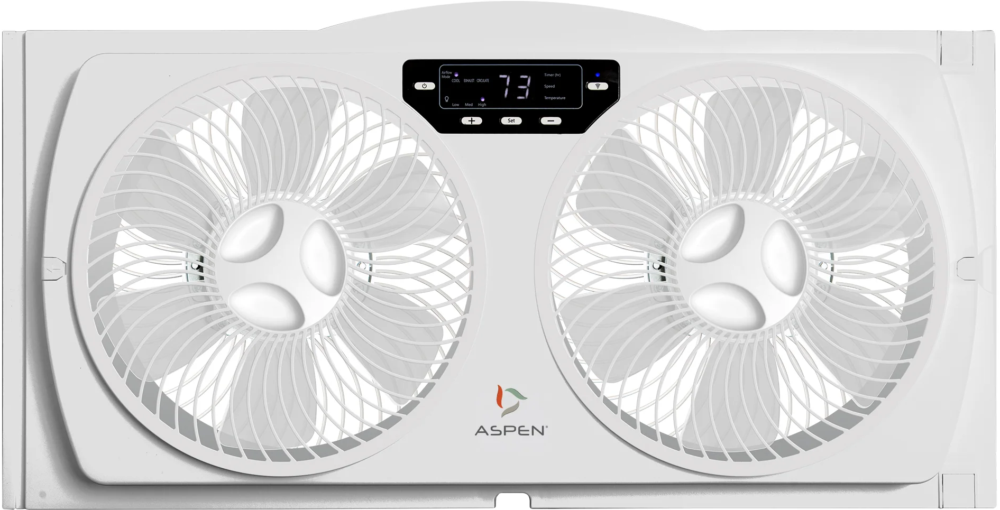

The Aspen ASP-200 Smart Window Fan is a Tuya-based device with a WR1 module (which uses a RTL8710BN chip). The WR1 must be removed and replaced with a ESPHome-compatible chip. Features of the fan include intake/exhaust/circulate modes, three speeds, built-in temperature sensor, and removable grills and blades for easy cleaning.

But, there's a catch. The WR1 module has a 1.5mm pin pitch, compared to the 2.0mm pitch of the ESP-12 modules. I recommend using an ESP-12L, as it has the necessary pins pulled up internally, so it only requires connecting VCC, GND, TX, and RX from the ESP-12L to the PCB.

You will have to get creative when connecting the new board to the main PCB. I ended up hot-gluing the ESP-12L module to the WR1 footprint upside down, then using some short lengths of 23ga solid wire from some scrap CAT-6 cable to connect the ESP's pins to the original pads on the WR1 footprint - be very careful if you try using the original pads, as they are very easy to lift off.

[Manufacturer Link](https://www.theaspen.com/products/asp-200)



## Basic Configuration

```yaml
substitutions:
  device_name: asp-200
  device_name_u: asp_200
  friendly_name: "ASP-200 Window Fan"

esphome:
  name: ${device_name}
  friendly_name: ${friendly_name}

esp8266:
  board: esp12e
  restore_from_flash: TRUE

wifi:
  ssid: !secret wifi_ssid
  password: !secret wifi_password
  use_address: ${device_name}

  ap:
    ssid: "${friendly_name}"
    password: !secret esphome_ap_password

captive_portal:

# Enable Home Assistant API
api:
  # https://esphome.io/components/api
  password: !secret api_password

ota:
  # https://esphome.io/components/ota
  password: !secret ota_password

# Enable Web server.
web_server:
  port: 80

logger:
  baud_rate: 0

uart:
  rx_pin: GPIO3
  tx_pin: GPIO1
  baud_rate: 9600

tuya:

fan:
  - platform: tuya
    name: ${friendly_name}
    switch_datapoint: 1
    speed_datapoint: 3
    speed_count: 3

switch:
  - platform: tuya
    name: "${friendly_name} Power"
    switch_datapoint: 1
    id: "${device_name_u}_power_switch"

select:
  - platform: tuya
    name: "${friendly_name} Speed"
    id: "${device_name_u}_speed"
    enum_datapoint: 3
    optimistic: true
    options:
      0: Low
      1: Medium
      2: High
  - platform: tuya
    name: "${friendly_name} Mode"
    id: "${device_name_u}_mode"
    enum_datapoint: 2
    optimistic: true
    options:
      0: Intake
      1: Exhaust
      2: Circulate

```

## Tuya Datapoints

```
Tuya:
  Datapoint 19: int value (value: 68)
  Datapoint 1: switch (value: OFF)
  Datapoint 3: enum (value: 0)
  Datapoint 102: enum (value: 2)
  Datapoint 8: bitmask (value: 0)
  Datapoint 2: enum (value: 0)
  Datapoint 101: switch (value: OFF)
  Datapoint 18: int value (value: 0)
  Product: '{"p":"gggmgplbesjv8gbx","v":"1.0.0","m":0}'
```