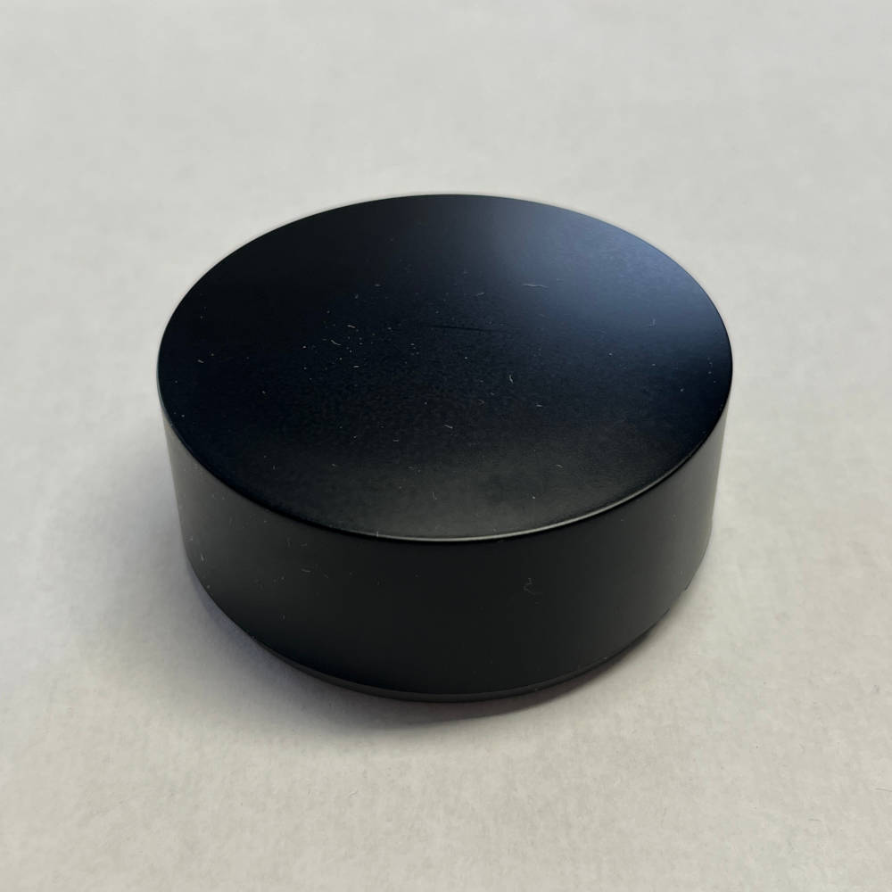
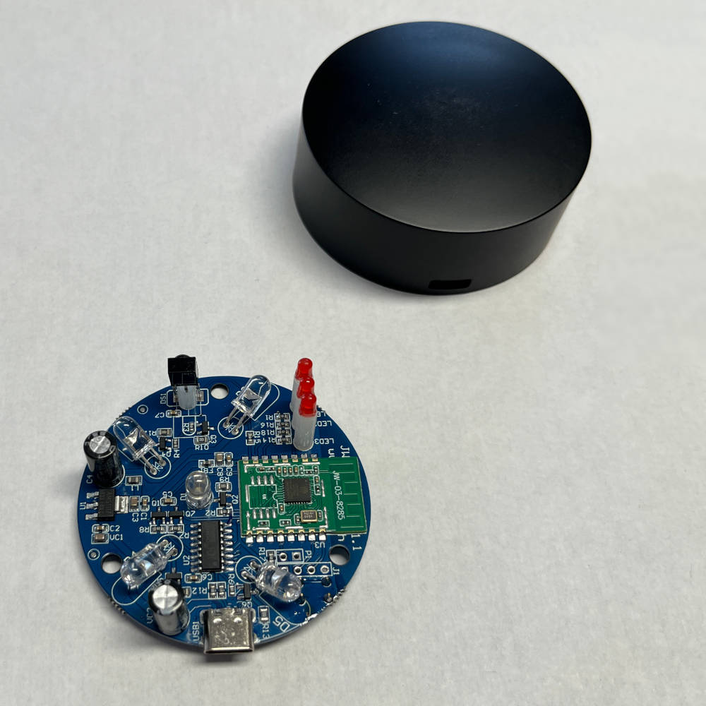

This is an IR receiver and transmitter that is shipped with Tasmota installed by the manufacturer.

**Manufacturer product page:** [Athom AR-01 Tasmota IR Controller](https://www.athom.tech/blank-1/tasmota-ir-controller)





## Flashing

This device can be flashed by making a serial connection using the USB-C port.

I did not test this, but there is what looks to be pads for a serial connection. I would also guess that this could be flashed from the default Tasmota web interface.

## GPIO Pinout

| Pin    | Component |
| --- | --- |
| GPIO0 | Button |
| GPIO4 | IR transmitter |
| GPIO5 | IR receiver |
| GPIO12 | LED3 (top) |
| GPIO13 | LED2 (middle) |

## Configuration

```yaml
esp8266:
  board: esp8285
  restore_from_flash: true

remote_receiver:
  pin:
    number: GPIO5
    inverted: true
  dump: all # Dumps received codes to logs.

remote_transmitter:
  pin:
    number: GPIO4
  carrier_duty_percent: 50%

output:
  - platform: gpio
    pin: GPIO12
    id: gpio_12
  - platform: gpio
    pin: GPIO13
    id: gpio_13

switch:
  - name: "Top LED"
    id: led_top
    platform: output
    output: gpio_12
  - name: "Middle LED"
    id: led_middle
    platform: output
    output: gpio_13

binary_sensor:
  - platform: gpio
    pin:
      number: GPIO0
      mode:
        input: true
      inverted: true
    name: Bottom Button
    on_press:
      then:
        - switch.toggle:
            id: led_middle
        - delay: 2s
        - switch.toggle:
            id: led_top
```

## Using the Device

[ESPHome documentation on receiving and sending codes](https://esphome.io/guides/setting_up_rmt_devices#remote-setting-up-infrared).

The IR codes received may be parsed by several of the codecs. Just pick one of them to use. While testing, it may be helpful to change `dump: all` to just the protocol your IR remote uses, to make reading the codes easier.

In my ESPHome configuration, I ended up with a fair amount of template buttons where each one sends out an IR code using the appropriate `remote_transmitter.transmit_xxxx` action.
