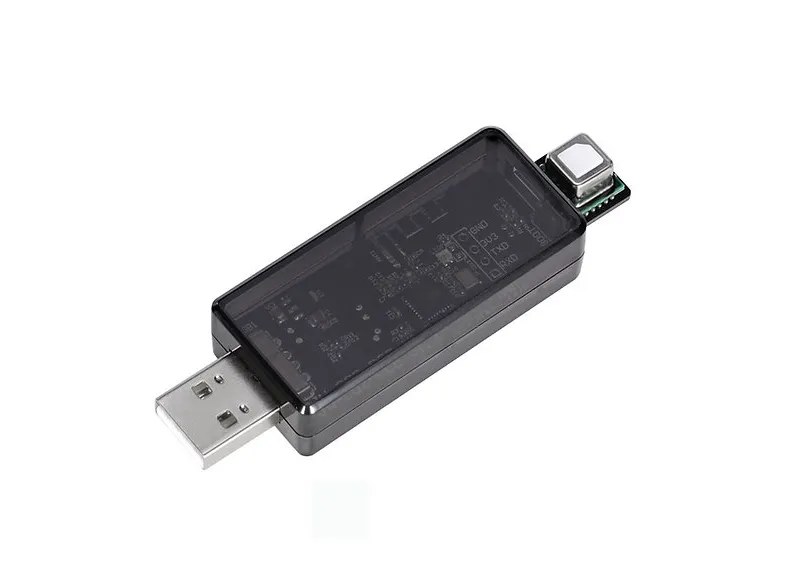

Maker: https://www.athom.tech

## Available from

- [Athom](https://www.athom.tech/blank-1/co2-sensor)
- [Aliexpress](https://www.aliexpress.com/item/1005009637969636.html)
- [Discord](https://discord.gg/tHdBmXCwRj)

## Description

- Built-in Sensirion's SCD40 sensor.

## Note

Can flash firmware directly via USB.

## GPIO Pinout

| Pin    | Function            |
| ------ | ------------------- |
| GPIO9  | Button              |
| GPIO21 | WS2812              |
| GPIO10 | SDA                 |
| GPIO8  | SCL                 |
