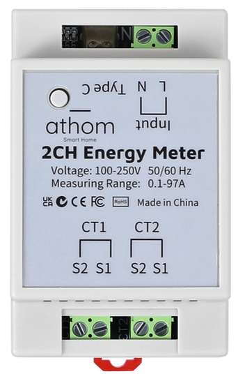

Maker: https://www.athom.tech/
Product page: https://www.athom.tech/blank-1/2-ch-energy-meter-made-for-esphome

Also on Aliexpress, available pre-flashed with ESPHome or Tasmota.

## GPIO Pinout

| Pin    | Function   |
| ------ | ---------- |
| GPIO7  | bl0906_tx  |
| GPIO8  | bl0906_rx  |
| GPIO9  | button     |
| GPIO10 | led        |

## Basic Configuration

The [Latest configuration](https://github.com/athom-tech/esp32-configs/blob/main/athom-energy-monitor-x2.yaml)
can be found on Athom's GitHub repo.
