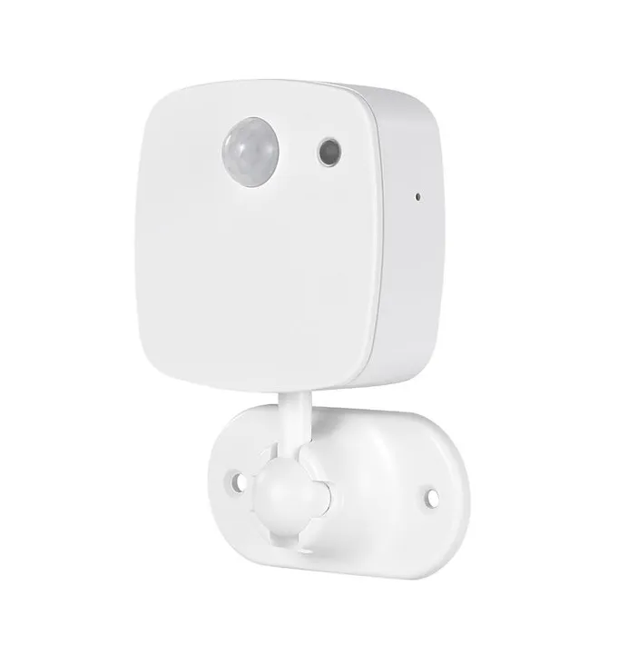
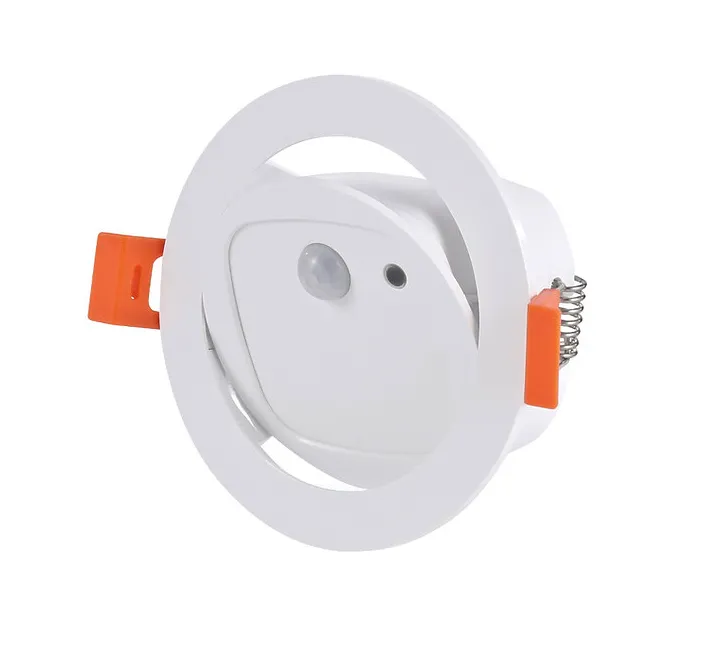

Maker: https://www.athom.tech

## Available from

- [Athom](https://www.athom.tech/blank-1/human-presence-sensor-1)
- [Aliexpress](https://www.aliexpress.com/item/1005009681860183.html)
- [Discord](https://discord.gg/tHdBmXCwRj)

## Description

- Human presence radar sensor.
- Built-in ambient light sensor.
- Support ceiling installation and angle adjustment.

## Note

Built-in CH340C serial port chip, connect the Type-C data cable to flash the firmware directly (the attached Type-C cable has no data cable, you need to prepare the Type-C data cable to flash the firmware)

## GPIO Pinout

| Pin    | Function            |
| ------ | ------------------- |
| GPIO9  | Button              |
| GPIO3  | Pir Output          |
| GPIO5  | Radar RX            |
| GPIO4  | Radar Output        |
| GPIO8  | Radar TX            |
| GPIO2  | LedLink             |
| GPIO18 | SDA                 |
| GPIO19 | SCL                 |
