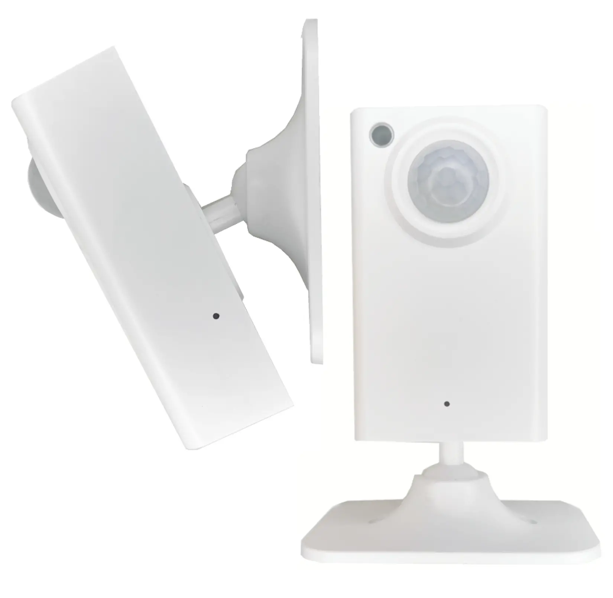

Maker: https://www.athom.tech/

## Available from

[Athom](https://www.athom.tech/blank-1/human-presence-sensor)
[Aliexpress](https://www.aliexpress.com/item/3256805586518763.html)

## Note

Built-in CH340C serial port chip, connect the Type-C data cable to flash the firmware directly (the attached Type-C cable has no data cable, you need to prepare the Type-C data cable to flash the firmware)

## GPIO Pinout

| Pin    | Function            |
| ------ | ------------------- |
| GPIO0  | Button              |
| GPIO12 | Pir Output          |
| GPIO13 | Radar RX            |
| GPIO14 | Radar Output        |
| GPIO15 | Radar TX            |
| GPIO16 | LedLink             |

## Basic Configuration

```yaml
substitutions:
  name: "athom-presence-sensor"
  friendly_name: "presence sensor"
  room: ""
  device_description: "mmwave radar human presence sensor"
  project_name: "Athom Technology.Presence Sensor"
  project_version: "1.0"

esphome:
  name: "${name}"
  friendly_name: "${friendly_name}"
  name_add_mac_suffix: true
  project:
    name: "${project_name}"
    version: "${project_version}"

esp8266:
  board: esp8285
  restore_from_flash: true

preferences:
  flash_write_interval: 1min

# Enable logging
logger:

api:

ota:

mdns:
  disabled: false

web_server:
  port: 80

wifi:
  ap: {}

captive_portal:

dashboard_import:
  package_import_url: github://athom-tech/athom-configs/athom-presence-sensor.yaml

light:
  - platform: status_led
    name: "Status LED"
    id: led
    pin: GPIO16
    disabled_by_default: true
    entity_category: config

i2c:
  sda: GPIO4
  scl: GPIO5
  scan: true

uart:
  tx_pin: GPIO15
  rx_pin: GPIO13
  baud_rate: 115200
  # debug:
  #   direction: BOTH
  #   dummy_receiver: true
  #   after:
  #     delimiter: "\n"
  #   sequence:
  #     - lambda: UARTDebug::log_string(direction, bytes);


binary_sensor:
  - platform: status
    name: "Status"

  - platform: gpio
    pin:
      number: GPIO0
      mode: INPUT_PULLUP
      inverted: true
    name: "Button"
    disabled_by_default: true
    on_multi_click:
      - timing:
          - ON for at least 4s
        then:
          - button.press: factory_reset_device

  - platform: gpio
    pin:
      number: GPIO14
      mode:
        input: true
        pullup: true
    name: "Pir Sensor"
    id: pir
    filters:
      - delayed_on: 50ms
      - delayed_off: 10s
    device_class: motion
    on_press:
      then:
        - light.turn_on: led

  - platform: gpio
    pin:
      number: GPIO12
      mode:
        input: true
        pullup: true
    name: "mmWave Sensor"
    id: mmwave
    filters:
      - delayed_on: 50ms
    device_class: motion
    on_release:
      then:
        - light.turn_off: led


  - platform: template
    name: "Occupancy"
    id: occupancy
    device_class: occupancy
    lambda: |-
      if ( id(mmwave).state and id(pir).state) {
        return true;
      }
      else if (id(mmwave).state == 0) {
        return false;
      }
      else {
        return id(occupancy).state;
      }

sensor:
  - platform: uptime
    name: "Uptime Sensor"

  - platform: wifi_signal
    name: "WiFi Signal Sensor"
    update_interval: 60s

  - platform: bh1750
    name: "Light Sensor"
    address: 0x23
    update_interval: 5s

switch:
  - platform: template
    name: "mmWave Status"
    id: "mmwave_sensor"
    internal: true
    entity_category: config
    optimistic: true
    restore_mode: DISABLED
    turn_on_action:
      - uart.write: "sensorStart\r\n"
    turn_off_action:
      - uart.write: "sensorStop\r\n"


number:
  - platform: template
    name: Farthest Detection          #Value range: 1.9 ~ 12m  Default: 6
    id: Farthest_Detection
    entity_category: config
    min_value: 1.9
    max_value: 12
    initial_value: 6
    optimistic: true
    step: 0.1
    restore_value: true
    unit_of_measurement: m
    mode: slider
    set_action:
      - switch.turn_off: mmwave_sensor
      - delay: 500ms
      - uart.write: !lambda
          std::string ranges = "setRange 1.8 " + str_sprintf("%.1f",id(Farthest_Detection).state) + "\r\n";
          return std::vector<uint8_t>(ranges.begin(), ranges.end());
      - delay: 500ms
      - uart.write: "saveConfig\r\n"
      - delay: 500ms
      - switch.turn_on: mmwave_sensor


  - platform: template
    name: Maintain Sensitivity                 #Value range: 0 ~ 9   Default Maintain sensitivity: 7    Default Trigger sensitivity: 5
    id: Maintain_Sensitivity
    entity_category: config
    min_value: 0
    max_value: 9
    initial_value: 7
    optimistic: true
    step: 1
    restore_value: true
    mode: slider
    set_action:
      - switch.turn_off: mmwave_sensor
      - delay: 500ms
      - uart.write: !lambda
          std::string sensitivitys = "setSensitivity " + str_sprintf("%.0f",id(Maintain_Sensitivity).state) + " " + str_sprintf("%.0f",id(Trigger_Sensitivity).state) + "\r\n";
          return std::vector<uint8_t>(sensitivitys.begin(), sensitivitys.end());
      - delay: 500ms
      - uart.write: "saveConfig\r\n"
      - delay: 500ms
      - switch.turn_on: mmwave_sensor


  - platform: template
    name: Trigger Sensitivity     #Value range: 0 ~ 9   Default Maintain sensitivity: 7    Default Trigger sensitivity: 5
    id: Trigger_Sensitivity
    entity_category: config
    min_value: 0
    max_value: 9
    initial_value: 5
    optimistic: true
    step: 1
    restore_value: true
    mode: slider
    set_action:
      - switch.turn_off: mmwave_sensor
      - delay: 500ms
      - uart.write: !lambda
          std::string sensitivityss = "setSensitivity " + str_sprintf("%.0f",id(Maintain_Sensitivity).state) + " " + str_sprintf("%.0f",id(Trigger_Sensitivity).state) + "\r\n";
          return std::vector<uint8_t>(sensitivityss.begin(), sensitivityss.end());
      - delay: 500ms
      - uart.write: "saveConfig\r\n"
      - delay: 500ms
      - switch.turn_on: mmwave_sensor


  - platform: template
    name: Detection Delay      #Confirmation delay      Value range: 0 ～ 100  default 0.050 seconds.
    id: Detection_Delay
    entity_category: config
    min_value: 0.1
    max_value: 60
    initial_value: 0.1
    optimistic: true
    step: 0.1
    restore_value: true
    unit_of_measurement: seconds
    mode: slider
    set_action:
      - switch.turn_off: mmwave_sensor
      - delay: 500ms
      - uart.write: !lambda |-
          std::string detections = "setLatency " + str_sprintf("%.1f",id(Detection_Delay).state) + " " + str_sprintf("%.0f",id(Fading_Time).state) + "\r\n";
          return std::vector<uint8_t>(detections.begin(),detections.end());
      - delay: 500ms
      - uart.write: "saveConfig\r\n"
      - delay: 500ms
      - switch.turn_on: mmwave_sensor

  - platform: template
    name: Fading Time           #Fade-out delay        Value range: 0.5 ～ 1500, default 15 seconds.
    id: Fading_Time
    entity_category: config
    min_value: 1
    max_value: 300
    initial_value: 15
    optimistic: true
    step: 1
    restore_value: true
    unit_of_measurement: seconds
    mode: auto
    set_action:
      - switch.turn_off: mmwave_sensor
      - delay: 500ms
      - uart.write: !lambda |-
          std::string fadings = "setLatency " + str_sprintf("%.1f",id(Detection_Delay).state) + " " + str_sprintf("%.0f",id(Fading_Time).state) + "\r\n";
          return std::vector<uint8_t>(fadings.begin(), fadings.end());
      - delay: 500ms
      - uart.write: "saveConfig\r\n"
      - delay: 500ms
      - switch.turn_on: mmwave_sensor


  - platform: template
    name: Blockade Time                  #Configure block time        Value range: 1 ～ 255, default 1 seconds.
    id: Blockade_Time
    entity_category: config
    min_value: 1
    max_value: 255
    initial_value: 1
    optimistic: true
    step: 1
    restore_value: true
    unit_of_measurement: seconds
    mode: slider
    set_action:
      - switch.turn_off: mmwave_sensor
      - delay: 500ms
      - uart.write: !lambda
          std::string blockades = "setInhibit " + str_sprintf("%.0f",x) + "\r\n";
          return std::vector<uint8_t>(blockades.begin(), blockades.end());
      - delay: 500ms
      - uart.write: "saveConfig\r\n"
      - delay: 500ms
      - switch.turn_on: mmwave_sensor

button:
  - platform: factory_reset
    name: Restart with Factory Default Settings
    id: Reset
    entity_category: config
    internal: true
  - platform: template
    name: "Reset device"
    id: "factory_reset_device"
    entity_category: config
    on_press:
      - switch.turn_off: mmwave_sensor
      - delay: 500ms
      - uart.write: "resetCfg\r\n"
      - delay: 1s
      - switch.turn_on: mmwave_sensor
      - button.press: Reset

  - platform: restart
    name: Restart_esp
    id: restart_esp
    entity_category: config
    internal: true
  - platform: template
    name: "Restart_mmWave"
    id: "restart_mmwave"
    entity_category: config
    internal: true
    on_press:
      - uart.write: "resetSystem\r\n"

  - platform: template
    name: Restart device
    entity_category: config
    on_press:
      - button.press: restart_mmwave
      - delay: 1s
      - button.press: restart_esp

text_sensor:
  - platform: wifi_info
    ip_address:
      name: "IP Address"
    ssid:
      name: "Connected SSID"
    mac_address:
      name: "Mac Address"

time:
  - platform: sntp
    id: my_time
```
