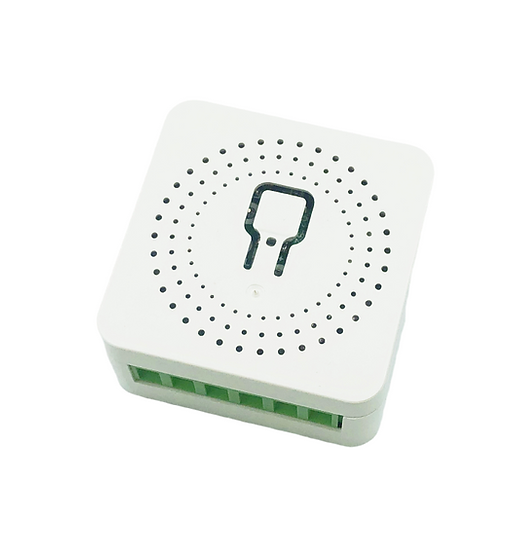

Maker: https://www.athom.tech/
Product page: https://www.athom.tech/blank-1/esp32c3-3-way-relay-for-esphome

Also on Aliexpress, available pre-flashed with ESPHome or Tasmota.

## Description

Mini relay switch with built-in power monitoring

Maximum support current 10A

## GPIO Pinout

| Pin    | Function   |
| ------ | ---------- |
| GPIO3  | Button     |
| GPIO4  | Switch     |
| GPIO6  | Relay      |
| GPIO7  | Led        |
| GPIO20 | CSE7766 RX |

## Basic Configuration

The [Latest configuration](https://github.com/athom-tech/esp32-configs/blob/main/athom-mini-relay-v2.yaml)
can be found on Athom's GitHub repo.
