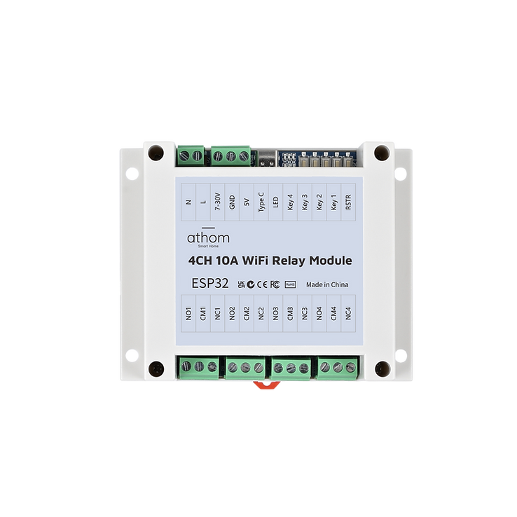

Maker: https://www.athom.tech/
Product page: https://www.athom.tech/blank-1/4ch-inching-self-lock-relay-for-esphome

Also on Aliexpress, available pre-flashed with ESPHome or Tasmota.

## Description

A 2-relay board with an ESP32-WROOM-32E.

Built-in RF433 receiving module

Onboard buttons to control each relay

Built-in CH340 serial port chip, can realize arbitrary programming

Each relay has COM/NO/NC terminals and is rated for a 10A max load.

The board can be powered either via 7-30 VDC or 5 VDC (separate terminals and Type-C).

## GPIO Pinout

| Pin    | Function   |
| ------ | ---------- |
| GPIO36 | Button1    |
| GPIO39 | Button2    |
| GPIO34 | Button3    |
| GPIO35 | Button4    |
| GPIO27 | Relay1     |
| GPIO14 | Relay2     |
| GPIO12 | Relay3     |
| GPIO13 | Relay4     |
| GPIO15 | Led        |
| GPIO16 | RF33       |

## Basic Configuration

The [Latest configuration](https://github.com/athom-tech/esp32-configs/blob/main/athom-4ch-relay-board.yaml)
can be found on Athom's GitHub repo.
